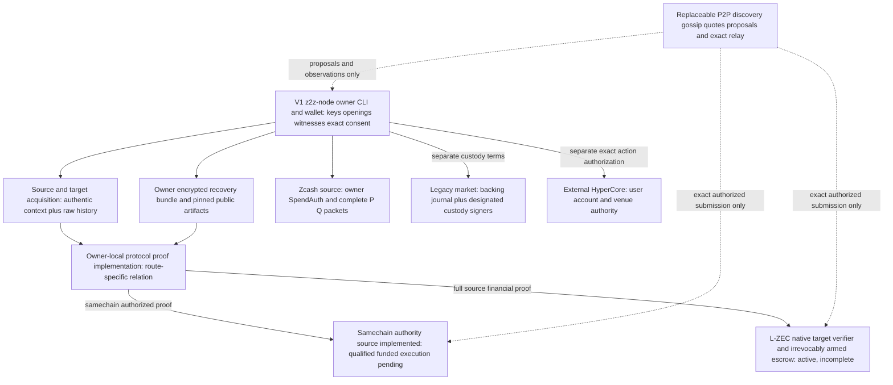
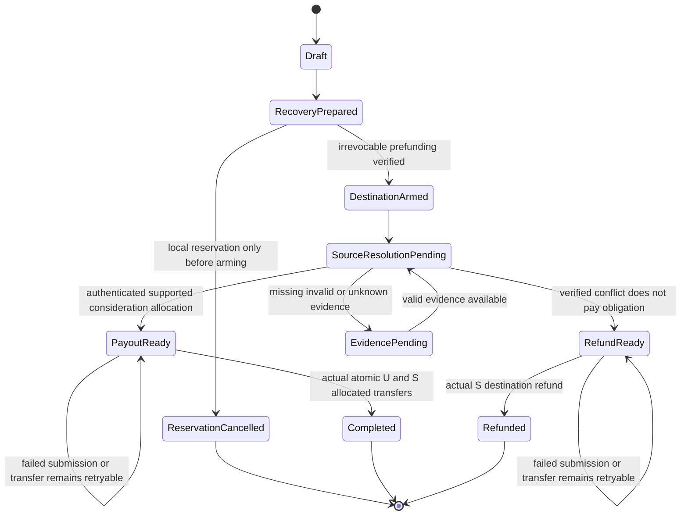

# Ziquid / future Z2Z — system architecture

**Latest release precedence — 2026-10-06:** [R1–R10](Z2Z-V1-ROADMAP.md#active-approved-release--one-protected-native-zec-route-2026-10-06) and [§7.0's approved decision](#approved-release-decision--2026-10-06) govern the one-route native-ZEC→ETH/four-screen release. The owner selected bilateral privacy with explicit disclosure and investigation of a different native construction. Older samechain-first/CLI-only, strict-GD2-as-release-gate and selected-P/Q wording below is retained baseline/provenance, not a current mechanism selection. No alternative financial construction or custody/trust change is approved; retained loss prevention and independent both-role recovery remain mandatory.

**Architecture basis, 2026-10-02; V1 P2P consolidation 2026-10-06.** Ziquid is the existing implementation/repository base; **Z2Z is a future product name**, not a namespace/package/repository rename. Active V1 targets an owner-operated **P2P network** and the `z2z-node` CLI for discovery, gossip, bilateral samechain trading and local proving—not a centralized backend. [§3.5](#v1-samechain-testnet) defines that path; the [V1 implementation brief](Z2Z-V1-IMPLEMENTATION-SYSTEM-PROMPT.md), [delivery matrix](V1-DELIVERY-MATRIX.md), [roadmap](Z2Z-V1-ROADMAP.md) and [architecture decisions](V1-ARCHITECTURE-DECISIONS.md) own its scope. The [redesign spec](superpowers/specs/2026-10-02-z2z-server-independent-architecture-design.md) retains earlier route-authority design provenance, not a mandatory hosted V1 topology. This documentation consolidation and the V1 plan grant **no implementation, deployment, signing, submission or funds authorization**.

**Current implementation is incomplete.** The approved [native design](superpowers/specs/2026-10-01-native-protocol-implementation-design.md) and [plan](history/plans/2026-10-01-native-protocol-implementation.md) retain full validating source proofs, proportional allocation and one real note per obligation. **The first passing journey is samechain bilateral settlement with P2P discovery.** Native ZEC (L-ZEC, M1–M5/S1–S7) is an **active, first-class lane in parallel**, required for project completion and not V2. L-HEVM, L-SOL, L-NEAR and X.CROSSCHAIN are active in the same way (§3.5). Only standing maker/offline fills, GUI, Intents/1Click and mainnet are V2. [NATIVE-IMPLEMENTATION-STATUS](NATIVE-IMPLEMENTATION-STATUS.md) owns evidence and counts. Separate samechain owner consumers, the canonical Solidity codec/tree and the four-mutator authority with internally constructed real SP1 now exist, alongside offline HyperCore proposals. A scoped independent financial source review reports no actionable findings; that is not a full audit and not certificate or funded qualification. **Native crosschain composed financial proofs and private order discovery remain Open/Blocked** per [BLOCKERS](BLOCKERS.md).

**Historical integration / active SQL hold; V1 durable storage unresolved:** the [2026-10-03 integration design](superpowers/specs/2026-10-03-z2z-implementation-integration-design.md) and [archived executing plan](history/plans/2026-10-03-z2z-implementation-integration.md) retain prior implementation approval and cutover provenance; their centralized/standing-maker scope is not the active V1 scope. **Active SQL is PostgreSQL-only:** native inventory and market ledger use separate configured schemas and money authorities under shared transport/schema policy. SQL targets compiled only; **no local SQL tests**, and [SQL-VERIFICATION](SQL-VERIFICATION.md) remains NOT RUN pending a private user-provisioned URI and authorized isolated scope. [V1 per-node durable storage](V1-P2P-STORAGE-DECISION.md) remains **UNRESOLVED**; a bounded volatile advertisement cache cannot replace prepared intents, reservations, authorized bytes or `Submitted/Unknown` records. No SQLite/hybrid choice, operational migration or reset follows from P2P design. Existing SQLite journals/sidecars and sibling Kerb operational stores remain unchanged. Proving/resource-run and new secret-bearing recovery approval holds also remain binding.

| Document owner | Authority |
|---|---|
| [PRODUCT](PRODUCT.md), [CONSOLIDATION](CONSOLIDATION.md) | Product scope, route decisions, consolidation and provenance. |
| **This document**, [MODULES](MODULES.md), [functional specs](README.md#3-functional-specs) | System behavior; conceptual responsibility/interface/package map; detailed native contracts. |
| [SERVER-INDEPENDENCE](SERVER-INDEPENDENCE.md) | Recovery data/bundle requirements, stage-specific manual rights and company-off acceptance drills. This document does not define a competing bundle format. |
| [BLOCKERS](BLOCKERS.md), [native status](NATIVE-IMPLEMENTATION-STATUS.md) | Release enablement/closure, respectively observed implementation evidence and missing capabilities. |
| [Server-independence research](research/SERVER-INDEPENDENCE-RESEARCH.md), [crosschain/market research](research/CROSSCHAIN-MARKET-RESEARCH.md), [settlement research](research/SETTLEMENT-RESEARCH.md) | Attributed primary-source observations, vendor claims, reasoning and open constructions—not implemented interfaces or runtime passes. |
| [Kerb archive](imports/kerb/README.md), [pre-redesign architecture](history/2026-10-02-pre-redesign-ARCHITECTURE.md), [snapshot manifest](history/2026-10-02-pre-redesign-MANIFEST.json) | Dated evidence/history with unchanged manifests. The docs import did not re-exercise source results; subsequent destination source migration and scoped non-SQL evidence belong to current [status](NATIVE-IMPLEMENTATION-STATUS.md), not retroactive archive certification. |

Evidence vocabulary: **Observed/Verified source** means source was read, not that a route ran; **Verified vendor API / on-chain observation** retains its exact retrieval date and scope; **vendor claim** is not independent validation; **Proposed** means a construction/behavior to qualify; **Unresolved/Blocked** names missing capability; **[INFERENCE]** distinguishes reasoning from observed results. The dated E1–E21 register is retained at [evidence](#evidence).

## 1. System contract and domain model

**Product hierarchy:** Z2Z is the proposed DEX. Its own **P2P order market is a core product function**, not an external integration or a synonym for custody: users submit asset/quantity/limit, discovery proposes counterparties/fills, owners authorize terms, and the selected asset route settles and reconciles remaining rights. RFQ quotes are another price/counterparty-discovery mechanism inside the DEX. Samechain/native crosschain workflows below are settlement constructions, not replacements for the order market. External HyperCore spot is a separately chosen venue; pool/LP lanes remain distinct. Samechain-first V1 delivery does not claim a completed decentralized/private market, retire native/V2 obligations, waive GD2 or merge incompatible financial authorities.

The product helps an owner obtain an actual asset/position, not merely a proof, message, balance display or alert. **V1 uses owner-local CLI/runtime/proving, replaceable peers and independently selected chain access; no mandatory hosted backend, shared order database, paid VPS or remote private-witness prover.** Later hosted UI/API, discovery, matcher, indexer and relay may automate permitted work but must not be the exclusive permission to exercise an existing qualifying proof-controlled money right. An owner with the required secrets, authentic state/history, usable artifacts, compute and chain access must be able to inspect, prove and submit that permitted action without a new company signature or login. Zero paid infrastructure does not eliminate gas, hardware, storage or electricity costs.

This is **authorization independence from Ziquid**, not unconditional autonomy. It does not manufacture a willing counterparty, reverse a final source payment, recover lost secrets, force transaction inclusion, overcome issuer freezes or provide finite completion during chain/data/prover failure. A route must separately qualify funds safety, authorization independence, data/prover availability, inclusion/finality and liquidity/matching liveness. Legacy custody and external-venue routes retain their different authority classes; they are not silently relabeled autonomous.

### 1.1 Terms that must not be collapsed

| Term | Meaning |
|---|---|
| **Execution domain / exact asset** | A named network and state/transfer authority: Ironwood pool, a target ledger deployment, a Core account, an EVM contract/native balance, or an SPL mint/token program. Ticker equality is not asset equivalence. |
| **Owner capability** | The secret/witness/authorization and unconsumed protocol right needed for a specific action. Membership, an operator ACK or a caller-supplied owner label is not a proven capability. |
| **Backed samechain note** | Proposed deployment-scoped right over an actual asset controlled in that execution domain. It is not synthetic native ZEC or global crosschain credit. |
| **Native funded obligation** | An irrevocably armed destination asset allocation tied to the approved source P/Q/history/classification relation. It is not a cancelable samechain order. |
| **Order / fill proposal** | Exact owner-authorized terms, and a candidate agreement under them. A matcher proposal is not entitlement or transfer authority. |
| **Legacy credit / hold / entitlement** | Custody-backed liability, exclusive reservation, and allocated liability portion. These require backing and spend authority; SQL validity does not make native ZEC spendable by the claimant. |
| **Observation / proof / verified financial fact** | Acquired bytes or venue/node claim; evidence for a particular relation; target acceptance of that exact relation/context/consumption policy. No generic `verified` bit promotes one into another. |
| **Terminal transfer** | Correct actual asset effects under the selected finality policy. Submission, credit, receipt, proof registration and `Unknown/EvidencePending` are not completed delivery. |

### 1.2 Architectural choice

The proposed default is **owner-local secrets and proof generation + immutable funded rules and exact-asset authority in the qualified domain + replaceable discovery/matching/relay modules**. One modular native workspace remains the packaging base. There is no selected universal vault, rollup, sequencer, chain, new cryptographic primitive or private omnibus crosschain balance.

A custodial global ledger plus user-submitted proofs fails company-off native execution if the company alone controls ZEC signers. A new crosschain rollup adds bridge/source verification, forced-exit, data, prover and upgrade assumptions rather than supplying concealed hostile-input witnesses. The [redesign alternatives](superpowers/specs/2026-10-02-z2z-server-independent-architecture-design.md#2-three-considered-approaches) explain these rejected defaults. This choice does **not** prove samechain ownership/ciphertext composition, the full private market or native fair exchange.

## 2. System shape

The diagram is a **proposed authority/data flow**, not current topology or route support. The first passing branch is owner-operated `z2z-node` → owner-local proof → samechain authority. Native Ironwood (L-ZEC) is an active parallel lane. Legacy custody and external venues remain distinct lanes. Automated CLI orchestration and direct manual execution cross the same validating interfaces; the manual path is not a trusted fallback.

**Three authority layers stay distinct:** source spending/ownership; proof-controlled target rights; optional operational work. A destination proof verifier cannot sign a Zcash SpendAuth or recover an unavailable opening. Zoss library acquisition sits under caller-owned source/data work, not above the financial validator; its separately optional quorum messaging is non-money. Neither hosted discovery nor a registry is required to exercise already funded qualifying rights.

The product can present several routes without making them fungible or atomic across domains. Core↔EVM within one L1 still has asynchronous transfer/action semantics; Solana/EVM atomic transactions do not span Zcash. No automatic public-Zcash, custodian, external-spot or timeout fallback may replace an intent's privacy/authority contract.

## 3. Route, authority and trust matrix

| Route / state of design | Actual asset control and final validator | Required owner/manual path | Trust/data assumptions and dependency |
|---|---|---|---|
| **L-ZEC native shielded Ironwood ZEC → local EVM native asset; approved, active, incomplete** | U authorizes source ZEC; S prefunds destination. DEX target verifier/escrow must enforce source facts, context, one-note obligation and fixed allocation/transfer. | S holds locally proved complete Q without U FVK/spend key; U retains independent payout witness. Either actor can obtain eligible evidence/prove/submit without Ziquid relayer. No armed timer/cancel. | Full valid history, complete classifier/independent hostile-T witnesses, actual source excess-return authority, private uniqueness, local resources and actual escrow remain blocking; [§7](#settlement). Samechain qualification does not close S1–S7. Wrapped ZEC never substitutes. |
| **V1 samechain proof-controlled notes/atomic bilateral exchange; authority source implemented, public testnet/funded target unqualified** | `SamechainAuthority` fixes token/program/chain and constructs actual SP1; four mutators implement receipt/expected journals/root-count/index/NF and ordered atomic effects. | Both owners online for fresh exact-packet consent per fill; full/partial proceeds/remainder, authentic sync, genuine proofs and complete cold-restore/company-off execution required. No company-only root/signature gate in source. | Base Sepolia is only a candidate; independently qualify exact assets/program/verifier/deployment/resources. Gossip signatures and root existence are not backing. Genuine success/rollback lifecycle remains NOT RUN; GD2 FAIL; [§3.5](#v1-samechain-testnet), [§5](#samechain). |
| **Migrated Solana↔Ironwood custody-market safety core; incomplete** | Actual public legacy-SPL target requires three business-authorizer ACKs; native ZEC still needs its separately designated custody spend capability, effect checks and backing journal. | Existing SPL actions follow actual target authority; native ZEC payout needs authorized custody signers/data. | Destination SBF/ELF and synthetic SPL transfers are exercised, not SQL-backed combined settlement, source payment, owner-ZK or strict privacy. Company-exclusive/unavailable custody is not operator-independent or crosschain atomicity; [§4.1](#41-market-accounting-custody-và-user-proof-intake--proposed). |
| **Hyperliquid assets in P2P, direction A; unqualified proposal** | Depends on the exact Core account, EVM native balance/contract or other qualified custody leg. | Pair-specific owner authority/exit and separate crosschain recovery, or samechain primitive only for actual programmable-domain backing. | No asset/pair/bridge chosen; Core/EVM/Solana/Ironwood balances and HYPE/native/ERC20/spot identities differ. Inherits relevant matching/privacy/custody gates, not B's liquidity. |
| **External HyperCore spot, direction B; offline exact proposal implemented** | User/master or actually constrained delegated signer and HyperCore order/account rules, not Ziquid P2P matcher. | Offline native order/cancel preparation and information reads exist; direct per-action user signing, submission, nonce fences and venue reconciliation remain missing. | Public venue; requested cap is not enforced, no reservation/signer/submit readiness. Chain/issuer/account/API/node rules remain; generic agent permission is not spot-only, cancel/Unknown not fill/no-effect; [§6.1](#hypercore). |
| **Public Solana swap/LP; deferred** | Exact Raydium pool/program and owner wallet, issuer/token/bridge authorities. | Owner builds/signs direct protocol transactions, reads positions, exits according to actual pool rules. | Public effects, backing/controller/depth and per-instruction limits must qualify; E1/E4–E7/E19, [§5.4](#public-venue). |
| **Optional 1Click provider route; deferred** | Exact quoted provider/custody/bridge route and user originator, not the native proof relation. | Provider-specific status/refund/recovery where available; no invented forced exit. | ZEC docs are transparent-only; provider/terms/fees/recovery assumptions, E2/E3/E18/E19; [§6.2](#provider-route). |
| **Agents / ZSA venue; deferred/future** | Actual enforced delegation or source consensus/client/asset order authority. | Direct owner/revoke/exit interfaces where the selected mechanism grants them. | No authority from backend policy; ZSA activation/client/liquidity and order semantics remain separate; [§8](#agent). |

**Not money routes:** user-submitted proof intake changes the evidence producer, not custody, verifier relation, claimant authorization or backing. Zoss shared libraries change common implementation reuse; optional message receipts prove selected quorum acceptance, not payment/refund rights. They do not widen this matrix's financial permissions.

### 3.5 V1 Samechain Testnet Path

**Required delivery, not exercised support:** the **first passing journey** (owner Z1) is samechain. Base Sepolia is its **engineering default, not owner-approved**. Two owner-operated `z2z-node` CLI users discover counterparties over P2P (a neutral lane beacon, then a direct RFQ), authorize genuine full and partial fills, receive actual testnet assets, survive restart and recover independently with company services unavailable. **Passing it does not complete the project.** The following obligations are **active, run in parallel, and are first-class, not V2**:

- **L-ZEC:** native ZEC, central to the whole pipeline, with unchanged M1–M5/S1–S7 source-validity, net-classification, excess-return and recovery obligations. Wrapped or bridged ZEC never substitutes.
- **L-HEVM:** HyperEVM spot first, then isolated Core-position-claim research.
- **L-SOL:** Solana Devnet owner-ZK.
- **L-NEAR:** native NEAR first, then NEP-141. The claimable credit for payout failure is proposed, not adopted (Z2).
- **X.CROSSCHAIN:** fills across all pairs, including native ZEC. HTLC comes first; it is **not atomic and claims no privacy**. Proof-verified release is active research. Token/collateral legs come first; claim trading is active research (Z3).

See the [network/cross-chain research](research/2026-10-06-phase0-private-discovery-network.md) §5. GUI, maker-offline standing multi-fill, Intents/1Click and mainnet remain V2. Supported partial fills and correct proceeds/remainder are **V1 requirements**.

**Testnet and financial authority.** [Base Sepolia](V1-TESTNET-SELECTION.md) is the first **candidate**, not an approved selection or deployment. Select one exact public EVM testnet and qualify Native plus one exact vanilla, non-proxy/non-rebasing ERC20; ticker/faucet listing does not establish backing, decimals, issuer restrictions or transfer behavior. Retain chain/finality policy, authority/library/runtime-code hashes, program/VKey, frozen verifier, schema/ABI/tree and token pins independently. Current Solidity 0.8.34/Cancun build compatibility must be checked, not silently downgraded. SP1 is the integrated first proving candidate: owner-hardware measurement, genuine wrapping and exact target admission remain unqualified. A changed program/proof system/verifier needs reviewed changes and a **new immutable authority deployment**; old funded rights/artifacts remain usable. Local Anvil/CPU journals/simulation are not public-testnet acceptance, and even local deployment requires explicit authorization.

#### 3.5.1 Node composition, discovery and gossip

`z2z-node` is the **planned long-running Rust CLI binary in this repository**, composing the existing five native crates; it is not a repo/package rename or a second money authority. Runtime owns node lifecycle, bounded peer work, coordination and durable intent orchestration; protocol owns canonical rules/packets, proofs owns owner-local relations/proving, and chains owns pinned inspection/submission/history. [MODULES](MODULES.md) owns placement. The microplan prefers focused runtime node modules, preserves existing `ziquid` operations and requires P0.07 review before adopting the protocol spec's speculative separate `crates/p2p`.

The [P2P protocol specification](V1-P2P-PROTOCOL-SPEC.md) supplies the discovery/coordination design. P0.05–P0.07 proposals are in the [2026-10-06 research report](research/2026-10-06-phase0-private-discovery-network.md); they are proposed mechanisms, not approved specs.

- **libp2p transport:** `libp2p =0.56.0`. TCP + Noise XX + yamux exists today. QUIC (libp2p-quic 0.13.1) uses its own TLS security, never Noise layered onto QUIC, and its defaults (256 streams, 10MB/15MB windows) must be explicitly reduced. Separate Ed25519 PeerId keys identify peers, **not wallet identity, note ownership or financial signing authority**.
- **Discovery:** user-configured direct/bootstrap addresses (always available) plus the existing bounded, vendored, peer-only Kademlia. **mDNS stays planned for LAN introduction**, emitting neutral beacon fields only. Two conditions gate it: a bound on its unbounded 0.48 internals, and a separate LAN-multicast permission (current checks are loopback-only). Optional company or independent seeds give discovery assistance only. NAT reachability is direct connectivity or an optional independent relay (libp2p-relay 0.21, whose defaults are 128KiB/2-minute circuits) used for introduction and DCUtR only. Fill sessions run direct with resumable exact-byte messages. No universal NAT claim.
- **Neutral availability vs order gossip:** the owner selected bilateral-only disclosure, so **order terms are never gossiped**. GossipSub stays a **planned feature** for neutral availability beacons (`/z2z/beacon/1`: lane, version, coordination-key commitment; no asset amount, side, price, commitment or NF). It is gated on reviewed cardinality bounds and a bounded validation queue. Topic membership still leaks lane interest, and that leak is recorded rather than waived.
- **Wire responsibilities:** `/z2z/session/1` is a direct request-response channel. It carries the RFQ, BackingClaim, descriptors, leaves, consent digests and certificate envelopes inside the signed `Z2Z_SESSION` v1 envelope (lane + chain context + deployment + session + roles + challenges + seq). A cross-lane session binds both lane descriptors plus the hashlock commitment. `/z2z/backing-check` is dropped: a peer RPC answer is never backing. Bounds are proposed candidates, not measured: 128KiB envelope, 1KiB beacon, 4KiB BackingClaim, 4 concurrent sessions, and app-level global request-response pending caps, which the crate lacks.

#### 3.5.2 Backing is a dedicated discovery proof, not hints or financial certificates

A peer signature authenticates a claim. It does not prove ownership, amount/asset, membership or current spentness. Root existence, peer RPC answers and "UNVERIFIED" labels cannot close P2.17. **Proposed mechanism (P0.05):** a dedicated **non-executable** `BackingClaim` relation, with its own domain, program and journal, binding:

- lane, chain context and deployment
- asset, side, remaining amount, limit and fee cap
- lane input identity, stable NF, order and generation
- a verifier-selected anchor, a receiver challenge, and both coordination keys

The verifier independently reads `rootCounts` and `spent(NF)` at the anchor and selects the insertion from its own complete history. The result is labeled `BACKED_AT(anchor, TRUSTED_NODE)`: capacity at a block, not an exclusive reservation. It **never** reuses or emits financial certificates or OwnerJournals. Until it is reviewed and implemented, P2.17 and backed-market claims stay **Blocked**.

**Strict GD2 is an unmet gate.** The bilateral-only audience is data minimization, **not a privacy waiver** and not a substitute privacy product. The current design fails content and accepted-identity noninference through three independent channels:

1. The counterparty receives the exact terms.
2. Public NF, order and tree locators identify the accepted maker onchain.
3. Own-result delivery distinguishes adjacent worlds.

The HTLC shared hash additionally links cross-chain legs. Closure requires a reviewed construction passing the finite K1–K3 experiment under the unchanged adversary. Transport encryption, PeerId separation and volatile caches establish no anonymity. There is no witness exchange, even encrypted.

#### 3.5.3 Bilateral settlement, restart and company-off recovery

1. Independently qualify artifacts/program/verifier/assets and owner-local full proving first. Before any irreversible deposit, retain the encrypted recovery bundle and usable original proving kit, and pass controlled clean-process restore P4.01–P4.05. Deposit/creation must receive the actual exact asset and admit the backed note plus complete authenticated recovery outputs atomically.
2. Advertise the backed order through the unverified discovery channel; a taker requests a specific quantity/role and the **online maker** accepts or rejects. Both owners independently review one exact packet, prepare/check/back up their proceeds/change/partial successor and give **fresh exact-packet consent for each fill**. No maker-offline standing capability is claimed.
3. Each owner constructs its own witness and proves its own role **locally**. Exchange only public packet/consent/proof certificates with exact domain/session/role bindings; independently verify the counterparty certificate. Owner seeds, FVK/spend/nullifier keys, note openings and recovery witnesses never enter peer frames, SQL, logs or remote prover requests.
4. Build the exact unsigned bilateral call and transaction preview; the peer acknowledgment is coordination, not financial authority. Persist prepared intent/reservations and exact authorized bytes **before export or send**. After explicit owner-local wallet approval, the authorized fee payer signs/submits unchanged bytes through independently selected chain access or an authorized relay. Target verifies both exact journals/certificates, consumes unique backing rights, appends complete recoverable outputs and applies required asset effects **atomically**; second-proof, receiver/token, race or replay failure must not leave one-sided consumption/payment.
5. Both owners independently reconcile actual receipt/state/asset effects under the selected finality policy. Each settled partial portion succeeds independently; only correct disjoint remainder rights stay open. Every subsequent V1 fill needs fresh bilateral consent. Cancel/exit consumes the same remaining capability/generation and cannot undo a settled fill; withdrawal must produce actual asset arrival. A cache row, proof, API/peer ACK or submitted transaction is not `Completed`.
6. On crash, timeout, reorg or missing response, durable authorized bytes/reservations and `Submitted/Unknown` remain pending until correct reconciliation; negotiation expiry never cancels exported/submitted rights or frees funding. Discovery may rebuild from a bounded volatile cache, but [durable owner-local storage](V1-P2P-STORAGE-DECISION.md) remains unresolved. PostgreSQL-only active SQL, the approved-private-URI/no-local-SQL hold and preservation of existing journals remain binding; no company-shared DB or SQLite fallback is inferred.
7. **Full recovery is V1:** with company services/bootstrap unavailable, a clean owner process restores its encrypted bundle/old artifacts, independently acquires complete authenticated ciphertext/history and current consumption, decrypts/validates openings, rebuilds paths/witnesses, locally produces a genuine proof, owner-signs and submits unchanged authorized recovery, and observes actual assets plus correct residual rights. Cover unfilled, partial/proceeds and pending/Unknown cases, stale backups, transfer failure and valid retry. Decryption/observation alone is not recovery, and new production secret-bearing recovery behavior/use remains under its explicit approval hold.

**Planning and native gate boundary.** [V1-MICRO-IMPLEMENTATION-PLAN](V1-MICRO-IMPLEMENTATION-PLAN.md) owns **122 catalogued microtasks**, including three conditional proof-alternative tasks, across Phase 0–5; existing roadmap Phase 6 review/documentation is retained by P5.14–P5.18. Follow dependency edges: pre-funding recovery and specifically authorized deployment P5.01–P5.03 precede funded Phase 3, not a numeric-phase-only sequence. This plan is unexecuted and is not a second readiness ledger or action approval. [BLOCKERS §4.1](BLOCKERS.md#41-expanded-product-prerequisites--implementation-in-progress-openblocked) owns V1 samechain prerequisites. V1 does **not close or redefine native S1–S7, P1–P2 or M1–M5**, does not solve GD2/standing-maker/native source classification, and is not mainnet or full-protocol completion. Native Ironwood ZEC→EVM remains the retained **V2 full protocol** in §7, with every source/history/net-classification/excess/uniqueness/recovery gate intact.

## 4. Actors, runtime and manual execution

[MODULES](MODULES.md) owns the existing five native crate responsibilities and separate target builds. Kerb market records, custody inspection, ledger/coordinator/replica runtime and Solana interface/program/harness now live under destination ownership, not aliases back to Kerb; the original sibling remains unchanged. Module, crate, process, repository and signing authority remain different choices; migration grants no new money authority.

| Actor/module | Owns / may do | Must not acquire through operational convenience |
|---|---|---|
| **V1 owner-operated `z2z-node`** | Long-running local CLI/runtime, peer discovery/gossip/coordination, bounded owner-local prover dispatch, durable intents/Unknown and independent chain/recovery orchestration. | No second money ledger, required company backend/shared DB, peer-triggered secret reads, witness upload or financial authority from PeerId/gossip/ACK. |
| **Owner wallet + native consumer** | Spending/viewing/recovery capability, note openings, exact route/action consent, note reservations and release records, private payout witness; local prove, inspect, build, simulate, sign through own wallet, submit and reconcile. | No export of keys/FVK or exclusive witness to matcher/relayer; no signing from an unauthenticated cached `Armed`/`Filled` response. |
| **V2 native solver S** | Its destination inventory/funding signer, quote, complete agreed Q custody, authorized proof jobs and source/destination reconciliation. | No U FVK/spend key, alternative source spend, solver cancel of armed money, arbitrary recipient/fee redirection or hidden reanchoring authority. |
| **Discovery/admission/matcher** | Publish supported exact route descriptions; check permitted admission conditions; propose counterparties/terms or a separately qualified private result. | Admission/certificate/ACK is not ownership, custody or financial entitlement. No fresh company certificate required for existing owner exit. No private inputs/shared secret store or protected membership map by default. |
| **Local or explicitly authorized prover worker** | Execute the selected relation with actually available scoped witnesses, return pinned proof artifacts. | No money allocation authority, fabricated private fact, key sharing or remote private-witness delegation without explicit consent/authorization. |
| **Indexer/observer** | Rebuildable chain data, provenance/finality observations, reorg handling and unmeasured/measured estimates. | No canonicality/payment constructor from RPC, no irreversible release or inventory unlock from missing response/status timeout. |
| **Relayer/submitter** | Carry exact authorized proof/payload under unchanged validator; sponsor gas if explicitly authorized. | Optional submitter is not optional beneficiary: cannot edit asset, recipient, terms, quantity or fee destination/amount. Replacement requires new explicit authorization if those fields change. |
| **Target verifier + economic execution** | Verify exact context/relation and consume rights with authorized state/asset effects atomically. | No company allowlist/veto, admin sweep or mutable funded allocation in qualifying deployments. A valid proof without correct transferred asset is not terminal. |
| **Legacy custodian / external venue signer** | Only explicitly granted route-specific spend/account authority. | Does not inherit native owner keys or samechain rights; replacement transport does not create custody shares or source SpendAuth. |

### 4.1 Market accounting, custody và user-proof intake — migrated safety core, incomplete

This section retains the **legacy custody-accounting contract**, not an alternate settlement backend for the proposed autonomous samechain ledger. Historical sources: [imported safety design](imports/kerb/docs/docs/superpowers/specs/2026-10-02-kerb-safety-core-design.md), [Kerb source checkpoint](imports/kerb/docs/README.md#implemented-local-safety-cores-2026-10-02), [inherited Hyperliquid scope](imports/kerb/docs/product/17-HYPERLIQUID-EXPANSION.md). Current `protocol::market`, `zcash::custody`, `runtime::market` and Solana target source are migrated; [status](NATIVE-IMPLEMENTATION-STATUS.md) separates destination pure/target evidence from pending SQL lifecycle verification. Neither historical nor destination safety results qualify private matching, source history or native signing/settlement.

1. **Acquire → funding credit:** verify exact network/pool/receiver/value/stable source occurrence, claimant authorization, accepted history and controlled **unallocated spendable inventory** before durable unique issuance. A copied memo, re-inclusion, restart or new logical ID cannot issue again; derived change is not a new deposit. User-submitted proof bytes are untrusted inputs to this same app-specific verification, not event→credit→spend promotion.
2. **Admit → exclusive hold:** both sides supply their actual backing; authorize pair/order/limit/fees and hold full maximum buyer debit and seller quantity. For a batch mechanism, only a complete authenticated result and immutable global epoch disposition/activation partition filled/unused portions. Chunks, missing ACK, zero fill, timeout or cancellation request do not free live liabilities.
3. **Allocate → signed effect:** each liability portion has at most one live disposition. Unused refund and seller payout are separate rights. The five source roles remain distinct: viewing/acquisition, eligibility/FAA if selected, matcher, business effect authorizer and native spend signer. Three target business ACKs do not collapse these five roles or supply native signing. Exact physical inputs/recipient/change/fee/nonce are checked before signing; effect approval, business signature, PCZT and SpendAuth/mined transfer are not interchangeable.
4. **Submit → reconcile actual outcome:** live signed intent or `Unknown` retains hold/input/change/nonce fences. Retained journal heads/tombstones prevent rollback/replay after signer or version change. Available/locked/unpaid/provisional/confirmed states must be disjoint; input and derived change cannot both back rights. Sponsor fee capital is separately accounted. Reorg/impairment fences new sends but does not erase claims.
5. **Recover:** entitled claimant can inspect/reconstruct retained accounting, but cannot force threshold ZEC signatures with a SQL record, MPC certificate, SPL proof or new relayer. Company-exclusive/unavailable custody therefore does **not** qualify for company-off native execution. Moving it into the qualifying class needs a new source-authority/recovery construction and approved migration, not a fallback assumption.

No single capital portion backs P2P, external Core orders and withdrawals simultaneously. Core/EVM/Solana/Ironwood inventories remain disjoint. Native U keys/P/Q, prefund-before-release and §7's obligations are not replaced by market credit. Private source↔order/claimant maps do not become public merely to simplify proof intake.

### 4.2 Automated and manual paths share authority

The **native manual consumer is part of core protocol acceptance**, not deferred UI/SDK packaging. Its required lifecycle is inspect immutable deployment/assets/rules, import/export encrypted owner recovery bundle, independently acquire/sync state, verify capability, prepare/prove locally, build exact calls, simulate, user-sign, submit through own node/arbitrary relay, reconcile and retry. `ziquid` exposes migrated market safety commands plus samechain `review-fill --packet FILE --execution FILE --role a|b --witness-stdin`, `check-fill`, `check-cancel-exit` and offline HyperCore order/cancel proposals. Fill review independently selects canonical `FillExecution` frame2 and requires exact equality to the execution and frozen packet in `OwnerWitness` frame2; check-fill uses that embedded packet. Samechain private witness input is bounded preallocated erasing stdin; unsigned review emits public packet/consent bytes without signing, signed checks emit public packet/journal. These are actual preflight commands, not cold restore/authenticated history/wrapped proving/arming/financial submission/terminal reconciliation. PCZT inspection and synthetic target smoke are not company-off native recovery.

**Public offline calls and actual block-pinned inspection now exist:** four `chains::samechain` builders/native `build-*-call` commands produce exact unsigned Keccak/ABI calldata, expected journals and public effects; `chains::samechain::inspection` and `ziquid samechain inspect-authority` acquire selected-block identity/state via bounded HTTP RPC. [Destination client contract](modules/destination-settlement.md#block-pinned-trusted-node-samechain-inspection) owns exact required independent deployment/token/code/block/policy pins, secret endpoint environment and optional packet arguments. Code/getter/root/N/C/nonce checks use the same EIP-1898 canonical block selector with no latest fallback. Observation scope is `TRUSTED_NODE_AT_SELECTED_BLOCK`, not consensus: a coherently lying node remains possible. Source hashes/caller pins do not qualify program/token issuer/prover/finality/backing. Every financial validity label remains `UNVERIFIED` and signing/submission/financial execution false. [Status](NATIVE-IMPLEMENTATION-STATUS.md) owns executed synthetic-public-RPC standalone identity/creation/fill and real HTTP negative evidence/counts, not deployed financial profile/certificate/funded acceptance. Independent consensus/profile qualification, sign/submit/outcome, scanner/cold restore and funded/company-off lifecycle remain missing; SQL remains NOT RUN.

**Bounded simulation now exists:** `SamechainInspectionClient::simulate` and native `simulate-call` use the actual unsigned builder, explicit 1..=30M operational gas and independently selected scope. Fresh identity inspection precedes one exact same-backend/hash `eth_call` with from/to/U256 value/full data/gas and no overrides. Only empty void result yields `NODE_REPORTED_VOID_EXECUTION`, never financial proof, finality, fee authorization, signing or submission. [Exact simulation contract](modules/destination-settlement.md#public-samechain-hash-pinned-void-call-simulation) owns flags, malformed/rejection/unavailable errors and privacy. Genuine certificate/funded execution/sign/send/reconcile/cold restore remain unqualified.

[SERVER-INDEPENDENCE](SERVER-INDEPENDENCE.md) owns the complete stage/action matrix and recovery bundle. The authority distinctions across lifecycle are:

| Stage | Samechain qualifying right — proposed | Native P/Q right — incomplete | Legacy/venue distinction |
|---|---|---|---|
| **Draft / quoted** | Keep assets; reject proposal; consent is not fill. | Keep P unsigned, prepare/verify local Q and private U witness; local reservation can cancel before arming. | Unfunded quote/certificate does not pay or custody funds. |
| **Funded / open** | Owner syncs and directly exits/cancels unused capability; ready mutually authorized fill may race. | Irrevocable arm is not free destination capital; absence of released P does not authorize timer refund. | Custody credit requires actual signer; Core open order reserves usable inventory. |
| **Partial** | Original consumed once; only disjoint authorized successor quantity/right remains; direct successor exit. | Supported authenticated `0 <= C <= A` allocates fixed U/S atomically; not a generic order cancel. | Complete legacy epoch disposition/portion fences; Core actual partial fill reconciled before any reuse. |
| **Armed / source submitted / Unknown** | Already authorized submitted transition needs canonical consumption reconciliation, not API ACK. | Acquire/prove accepted full source outcome; Q only if same input/lifetime permit. No conflicting duplicate economic intent from lost response. | Unknown signed custody/Core action retains reservations; replacement submitter creates no new spend authority. |
| **Proved / failed transfer** | Verify+consume+asset effects atomic; failure preserves unspent right/entitlement for exact retry. | Exact pinned payout/refund remains retryable; no silent beneficiary/fee change. | Receipt/approval/credit is not actual delivery; underlying signer/venue may still be required. |
| **Terminal** | Observe actual asset transfer or authenticated new owner-recoverable internal right under finality. | Actual correct destination allocation/transfers **and** source financial predicate; excess needs actual source return. | Venue fill is only that venue's effect; custody payout needs actual chain outcome. |

Discovery disappearing can prevent finding a new counterparty. **V1 requires both owners online to prepare and freshly consent to each new exact fill**; an owner going offline after complete authorization does not by itself revoke that already authorized packet, subject to live backing/expiry/history/resources. The one-opening-signature resting-order product remains an explicit **V2 standing-maker obligation**, not an implemented V1 capability. Neither scope requires company permission for an existing independently exercisable qualifying exit. Native all-hostile terminal/excess capabilities remain missing; safe indefinite pending is not compliance with native completion.

### 4.3 External Zoss seam

Actual limited `zoss-zcash::NodeRpc` acquisition runs in Ziquid caller-owned source work under the agreed cohort; it returns supported-era raw data with `Unknown/UNVERIFIED` provenance, not accepted source history or financial proof. Broader common context/encoding/chain plumbing reuse is Proposed and must follow actual exports/policy/readiness; [MODULES §1.3](MODULES.md#13-external-zoss-shared-core--proposed-library-reuse) owns placement, [Zoss](../../zoss/docs/ARCHITECTURE.md) its implementation/release authority.

Library consumers require no Zoss memo/envelope, inbox, watchers, IVK/quorum, receipt, runtime or shared daemon. No new viewer, cross-app IVK/FVK/private witness store or common key daemon follows from reuse. `SourceObservation` ≠ `QuorumAcceptedMessage` ≠ target-specific `VerifiedSettlementFact`; financial proofs go **directly** to the DEX target verifier.

If independently selected, the **non-money message profile** uses context-bound private provenance and an opaque public delivery ID; raw source locator/height/value/private-record hash is not default public receipt material. `H(domain,route,cmx)` may link source. Its one-source→one-receipt namespace across routes/deployments remains an external unresolved decision, not global DEX uniqueness. Receipt replay/app nonce, financial note/payment uniqueness and terminal consumption are separate ledgers. Verify/replay-consume/callback must be atomic; failed callback retries the same immutable receipt/body only while receipt/app authorization remains valid, re-verifying every attempt. Rotation/revocation cannot be assumed to preserve retry or reset financial identities. Ciphertext hash is not payment meaning; onchain validators hold no app decryption secret. [Zoss BLOCKERS](../../zoss/docs/BLOCKERS.md) alone owns G/Z/B and shared-library closure; messages do not open EVM/Base financial support.

## 5. Programmable-chain asset lifecycle — source implemented, qualification pending

**Native preflight and separate samechain authority source implemented; funded/deployed route unqualified.** All four mutators use canonical expected journals, fixed owner program and internally new actual SP1; receipt/root-count/index/NF/nonce/initial-ID/seen-C and atomic complete-ciphertext/payment controls are implemented. [Destination specification](modules/destination-settlement.md#implemented-samechain-authority--distinct-financial-relation) owns details. Creation pairing negatives, unadmitted-spend eligibility and separate direct base negatives/offline script exist; not genuine certificates or admitted financial rights. Genuine positive/admitted spend, valid-first/invalid-second rollback, receiver failure/cold restore/company-off remain NOT RUN pending resources/independent pins. Parent-reported scoped financial source review: no actionable findings, not full audit/program/setup/funded qualification. Original native source financial validator/armed escrow remain missing; this is not ZEC custody/bridge/global credit.

### 5.1 Deposit, transfer and owner exit

1. Qualify exact asset/runtime/adapter behavior: raw units/decimals, ownership/control, received/transferred amount, issuer/upgrade/freeze/fee/rebase/hook restrictions. Vanilla ERC/SPL/native semantics cannot be assumed.
2. Owner creates and durably backs up its note/recovery capability before deposit. Deposit receives **actual** asset and appends the backed commitment plus complete authenticated encrypted recovery data atomically; credit cannot originate from a committee promise or source observation.
3. Owner independently syncs authenticated state/history, locally decrypts/reconstructs openings and checks commitment/unspentness. Current syncing/openings and eligible witnesses remain necessary for **new** proofs without a company-only branch/root publisher. **Selected proposed samechain policy** in [SERVER-INDEPENDENCE §3.2](SERVER-INDEPENDENCE.md#32-data-availability-là-protocol-requirement): retain every authenticated historical membership root/tree generation immutably in the same deployment, without sliding expiry/admin pruning; unrelated appends/rollover do not require regenerating an already fully authorized packet.
4. A locally authorized proof binds membership, genuine ownership/capability, exact asset/value/deployment/input and output tree domains, allowed outputs/recipients and exact fees. Target validates the relation, checks **current** capability generation/cancel/capacity and globally deployment-scoped nullifier state, and atomically consumes the single-use right with internal authorized outputs or actual withdrawal transfer. Per-tree tags cannot permit replay across rollover. Retained membership alone is not live backing; unaccepted/orphan roots, spent/canceled backing and explicit signed expiry still reject. Failed proof/transfer rolls back consumption; permissionless relay is the same validator.
5. Consumer reconciles the actual accepted asset/state effect and finality. Public asset exit can reveal recipient/value/time; an internal successor is not an external payout, and an unusable ciphertext is not successful recovery.

**Canonical mathematical note tree implemented/exercised:** `protocol::samechain::tree::{NoteTree, root_from_path}` and Solidity `SamechainTree` use depth-32 domain-separated SHA256 leaves binding version/deployment/tree/index/commitment, exact distinct empty defaults and `u64` capacity through `2^32`. Native rollover is explicit full-only; authority append automatically rolls over a full tree, rejecting exhausted IDs. Captured paths reconstruct historical insertion roots. The authority now retains every successful intermediate append root with its count and checks input index bounds/current global NF; empty roots are not spend-admitted. Ordered complete ciphertext and insertion events are implemented. Mathematical/codec positives and differential vectors are not financial certificates, authenticated network scanning or cold restore. [Status](NATIVE-IMPLEMENTATION-STATUS.md) owns counts/evidence; real wrapped/admitted funded lifecycle, full history availability and storage/gas qualification remain pending.

**Exact note-creation native predicate implemented — 2026-10-04:** `protocol::samechain::creation` supplies distinct packet/terms/journal domains; `proofs::samechain::creation` binds the actual owner key, deployment, exact Native or fixed-token asset/amount and note commitment to the complete AEAD-recovered opening and blinded public terms. Ordinary notes require no order; initial orders require the matching identity, generation 1, positive bounded remaining capacity and role-valid opposite-asset policy. Strict owner consent binds deployment, terms and complete packet digests. `ziquid samechain review-note-creation --packet FILE --witness-stdin` independently selects public deployment/payer/nonce and returns consent bytes without signing; `check-note-creation --witness-stdin` verifies the signed relation and exports the public journal. Native ordinary Native/token and initial-order A/B CPU journals matched; actual native CLI review/signature verification/recovery and freshly consented amount-inflation rejection are recorded in [status](NATIVE-IMPLEMENTATION-STATUS.md).

The native creation journal alone is not a receipt. The separate `SamechainAuthority.create` now authenticates actual payer/exact Native value or token deltas, verifies its canonical expected journal under the fixed program before token receipt, reserves nonce/initial ID and atomically appends commitment/recovery bytes. These controls are source implemented, not genuine proof-backed deposit qualification: creation negatives reach actual pairing rejection without token invocation/state changes, while no real successful deposit/admitted spend has run. Independently pinned program/asset/resources and full manual/company-off qualification remain required. Public packet selection does not authenticate backing or financial semantics; native source authoring/history/escrow gates are unchanged.

### 5.2 Bilateral exchange and private matching are different contracts

A matcher/discovery module proposes candidate fills, not money authority. **Active V1 uses bilateral maker-online fills with two fresh exact-packet consents.** Each fill must enforce signed asset/deployment/quantity/net-price/fee bounds, disjoint backing, conservation per exact asset and authenticated owner-recoverable outputs atomically. The owner-confirmed one-opening-signature, maker-offline standing multi-fill product remains **V2**, not a reason to bypass either current owner check or a claim that V1 satisfies standing authorization.

No peer or hosted prover receives either owner's secrets in V1. **Current V1 Fill2 uses the [reviewed independent-owner construction](superpowers/specs/2026-10-06-independent-owner-fill-design.md):** each recipient prepares/checks/backs up exact proceeds/change/remainder; owners agree public packet body B and execution E, exchange only permitted public descriptors and ordered opaque A/B leaves, and freshly authorize the same completed packet. Each witness opens only its own authenticated policy with independent `own_salt`, not both policies/common blind. E includes both sold quantities shared with the counterparty; hashing/leaves do not establish quantity secrecy, strict GD2 or advertised backing. **V2 must separately solve standing input authority, taker-executable witnesses and maker-only recoverable variable outputs/successors** within original opening limits. An opening signature alone cannot make current private-input witnesses available to takers or prove future ciphertext recovery. Preserve funded/signed artifact identities; do not remove current authorization checks as a shortcut.

Actual [protocol Fill2 hashes](../crates/protocol/src/samechain/fill.rs) and [owner relation](../crates/proofs/src/samechain.rs) bind context to B without terminal commitment plus E, open own authenticated policy leaf and validate ordered A/B aggregate C. `review_owner_fill` requires independently selected deployment/order/role/**execution**, exact `packet == witness.packet` and key/path/AEAD/fees/net/conservation/successor before consent bytes; **it does not sign**. Signed verification repeats exact opening/consent semantics. Fill journal/consent relation fields are2; outer packet/journal/schema and creation/single/withdrawal/note/policy/tree/ciphertext/blinds stay1. [Guest mode0](../crates/proofs/methods/samechain/src/main.rs) is byte0 + one OwnerWitness frame2, no duplicate packet; execute/prove still compare independent `--packet` before work. Authority checks both live input predicates and both Fill2 journals before atomic effects. New guest/program requires specifically authorized new immutable authority and genuine all-mode target/recovery qualification, preserving original fill1 identities without conversion/migration. [Status](NATIVE-IMPLEMENTATION-STATUS.md) owns current evidence and completed independent source reviews; independent source/setup/program qualification stays UNVERIFIED. Native/CPU/correspondence is not wrapped/funded/backing/privacy/backup or full recovery acceptance.

Bilateral signed consent protects agreed transaction semantics; it does not prove optimal auction price, fairness, accepted-set completeness or strict noninference against trader/matcher collusion. **The full private market remains Blocked under GD2**; no weaker guarantee is selected here.

### 5.3 Partial fill, cancellation and output recovery

Fill and owner cancellation/exit must consume or atomically invalidate the **same exclusive backing capability/intent generation**, as specified in [SERVER-INDEPENDENCE §4.3](SERVER-INDEPENDENCE.md#43-cancel-partial-fill-và-race). Included cancellation moves the right into an authorized owner successor/actual withdrawal and rejects **all** outstanding fills on that generation, including F1/F2 with different relayers, fees or proof representations. Revoking one exact packet is not order cancellation, does not release backing and leaves other authorizations live. Chain ordering chooses one atomic winner; an API/matcher cancel ACK cannot overwrite an included fill. After partial fill, consume the original and mint disjoint proceeds/remaining successors with remaining liability and remaining permitted quantity. A fresh random note cannot reset a signed order's fill capacity. Only the unfilled successor can later cancel; delivered assets cannot be undone.

Commitment/ciphertext/version/output order/recipient recovery capability must be bound to the authorized relation and correctly recover the committed opening. Hashing/emitting arbitrary bytes permits permanent loss even if arithmetic conserves value. **V1 supported partial fills use recipient-prepared exact proceeds/remainder checks, backup and fresh consent from both owners**; partial settlement/recovery is not deferred. **V2 standing fills require equivalent maker recovery/conservation without per-fill maker participation:** opening authorization must constrain every variable receipt/successor, and independent public recovery data must remain available. That unattended construction is not implemented; V1 bilateral consent does not discharge it.

Unattended variable partial fills remain an explicit **V2 full-product requirement**, not an optional deletion from the product. A sound standing-authority and checked recoverable-output construction remains required; circuit-enforced encryption is one candidate, not an assumed existing relation or selected cryptography. Finite pre-signed templates do not cover arbitrary eligible quantity/counterparties. Current input ownership witnesses also require maker secrets, so ciphertext encryption alone is insufficient. Preserve strict privacy and independent cancel/exit; missing construction blocks standing-order enablement rather than granting a relayer keys, weakening recovery or falsely relabeling V1 bilateral fills as unattended.

No company-signed epoch completion is required to exit unused qualifying principal. A future batch auction would need independently available state/data and exclusive force-close/exit rules; no sequencer/rollup/batch architecture is selected. Full trees may stop new deposits, not existing valid exits. [SERVER-INDEPENDENCE release drills](SERVER-INDEPENDENCE.md#8-verification-trước-claim-autonomoustrustless-class) require **fully authorize → one owner offline → unrelated root churn + tree rollover → other owner submits exact packet**, and **F1/F2 on one backing generation → included shared cancel → both reject**, including cross-tree replay rejection and unaccepted/orphan-root/expiry/spent negatives. Retaining every accepted root grows state without a fixed bound; actual storage/gas/sync/rollover costs must be measured and qualified, not reduced by rights-retiring pruning. Native Zcash anchor/Q/source lifetime does **not** inherit this samechain policy; none of these cancel rules permit native armed escrow refund by timeout.

### 5.4 Public Solana trading/LP — deferred, separate authority

An owner already holding exact SPL ZEC mint E1 may separately choose existing Raydium pools and bridge risk; this is not shielded ZEC entry or a dependency of native P/Q. Workflow: identify `(program, pool, mint A/B, token program)` → acquire state and actual-size quote for pool kind → check **instruction-specific** limits/fees → build unsigned call → owner review/sign → finality/re-read owner position/fees. Direct Raydium tooling can replace Ziquid UI only under the pool's actual rules; no promise of liquidity or exit during underlying program/issuer failure.

E4/E5 are dated pool/vault observations, not executable depth. CPMM and CLMM require their own amount/tick/range checks; `min_out` is not one universal LP/swap bound. Before enablement map exact controller/PDA/program/upgrade/pause, token/vault mints/decimals/extensions, backing/redeem traces and actual deposit/withdraw/exit. System-owned zero-data mint authority is not proof of ordinary-key control. E6's live mint authority and E19's bridge claims remain unresolved. Public owner/asset/amount/pool/timing, impermanent loss and fees are disclosed; APR is not promised net profit/reward. [BLOCKERS](BLOCKERS.md) owns U1/U2/demand readiness.

## 6. External venue and provider workflows

### 6.1 Explicit HyperCore spot — direction B

User separately chooses external venue, network/account/spot market, exact token/lot/units, quantity/price limit, fee cap and signing authority. HyperCore matches; Ziquid may propose/query/submit but cannot silently execute perps/leverage, route P2P residuals or substitute B for direction A. Direction A qualifies an asset leg in P2P and has separate backing/recovery/privacy gates.

HyperCore/HyperEVM are two execution domains of **one L1**, not equivalent balances. HYPE EVM balance is native, not assumed ERC20; spot token ID is not market ID, and links/rounding/control need qualification. CoreWriter enqueue or EVM success is not Core fill/cancel/transfer. Order lifecycle is authorized → submitted/Unknown → open/partial → actually filled or actually canceled residual, with exact nonce/order/action/fill/fee reconciliation. A cancel races with fill; missing response is not no-effect. Reserved capital remains exclusive until actual disposition is known; withdrawal/bridge/Core↔EVM transfer is a separate action with new consent and qualified authority.

**Implemented offline proposal boundary:** `chains::hypercore::spot::{prepare_spot_order, prepare_spot_cancel}` and native CLI now produce exact unsigned actions from selected metadata and explicit account/nonce/expiry/cloid/TIF/requested cap. Order price/size use normalized checked U256 decimal strings, lot/tick/significant-digit rules and no rounding; the selected metadata and consent context bind a local digest. `action_json` is an ordered string, not a map reserialized for signing. Requested fee cap is not venue-enforced; signer/submit readiness is false and no reservation, signing, exchange submission, durable nonce fencing or actual outcome reconciliation is provided. Process/scoped-review evidence belongs to [status](NATIVE-IMPLEMENTATION-STATUS.md), not a full audit or venue execution claim.

**Conservative default: user signs each exact action** until delegation restrictions are actually proven. Generic API/agent authority must not be called spot-only/no-movement/no-leverage: primary docs expose trade/cancel plus `agentSendAsset` and `agentSetAbstraction` including portfolio-margin mode. Same-address restriction on one asset action is not a universal venue policy. Separate approveAgent, order, cancel, transfer/withdraw and builder-fee authorities; signer nonce/replay lifetime and revocation are real. Backend policy does not constrain a compromised broad signer. Details/source limits: [crosschain/market §7](research/CROSSCHAIN-MARKET-RESEARCH.md#7-hyperliquid-asset-domains-và-signer-control).

When Ziquid disappears, owner uses account/main signer and venue-native tools/independent access to reconcile and exercise granted actions. The venue/chain/software/issuer/bridge and endpoint completeness remain dependencies; a best-effort endpoint is not guaranteed inclusion or authoritative complete history. Public orders/fills/balances do not repair strict P2P privacy.

### 6.2 Optional 1Click public route — deferred

Only an actual pair/network quote qualifies the provider adapter. Bind originator/deposit/destination/refund route, recipient, raw units, minimum receive, fees, timing and authorized submission; reconcile actual outcome. `dry:true` does not create a deposit address. No quote POST/refund path was exercised by the dated E2/E18 source observations; same-chain quote availability, Raydium price improvement and provider recovery are not assumed.

E3 says ZEC transparent-only and terms require an unmasked public originator; this is a route-specific limit, not a theorem every ZEC exchange must unshield. E18 Confidential Intents basic/advanced is not an Ironwood/hidden-payout proof or terms bypass. `FAILED` ≠ `REFUNDED`; `ANY_INPUT` is not refund and insured flag is not coverage proof. Under/over/late/partial/missing-memo payments, fees, discretionary recovery, exact bridge/controller traces and qualified terms review remain U3–U6 prerequisites; no legal conclusion or trustless forced exit is inferred.

## 7. Native shielded ZEC outbound — approved financial contract, incomplete

**Active first-release route; not samechain acceptance.** The approved [R1–R10 roadmap](Z2Z-V1-ROADMAP.md#active-approved-release--one-protected-native-zec-route-2026-10-06) supersedes earlier samechain-first/parallel-lane release ordering. One native shielded ZEC → native ETH route retains source validity, protected financial allocation, loss prevention, private once-only consumption and independent both-role recovery. S1–S7/M1–M5 remain the requirement mapping; P/Q-specific mechanisms below are the previous incomplete candidate, conditional on future selection. Samechain qualification closes none of those native financial gates. This release's privacy policy is the explicit matrix below, not unchanged strict GD2.

### 7.0 R1 one-route release contract — candidate for independent review

**Status:** R1.2's disclosure-policy decision is complete; implementation/privacy verification remains future R3/R10 work. Per the 2026-10-07 owner decisions in §7.0's approved-decision section, route 1a with the accepted §13 bounded window is the selected construction path: R1.1 is **[drafted, not frozen](V1-RELEASE-CONTRACT.md)** (W1–W7 qualifications/measurements/sub-decisions pending; W8 residual term accepted), and R1.3 remains freeze-prep. **Unqualified** performance of the construction stays NO-GO — audit, threshold-FVK, R2.2 history/finality, target-side capability and composed proofs all remain open; this is a bounded, disclosed product-risk acceptance for testnet, not a feasibility proof. The selected design and in-principle fresh-J disclosure do not qualify a mechanism or execute a per-swap grant. The direct P/Q contract retained below remains incomplete, with its known hostile-witness/excess-return/composition gaps. Native shielded ZEC testnet → ETH Base Sepolia remains the working route/default, not deployment approval; actual source pool/cohort/note availability and finality must be qualified. Existing Ironwood/v6 constants and `zcash_protocol =0.10.5` alignment do not establish that environment. No transparent/wrapped route or payment-directory substitute.

#### Approved release decision — 2026-10-06

The owner selected **“Bilateral privacy with explicit disclosure”** and **“Investigate a different native settlement construction.”** These are actual policy/research choices, not a cryptographic feasibility or deployment result. Strict GD2's unconditional own-result/accepted-identity noninference is **not a requirement of this release**. The [2026-10-02 strict-privacy analysis](imports/kerb/docs/reviews/2026-10-02-strict-privacy-feasibility.md) remains unchanged historical evidence for that stronger definition; this decision does not rewrite its findings or silently waive other product lanes.

| Surface / audience | Approved disclosure and accepted inference | Retained boundary / qualification still required |
|---|---|---|
| Selected counterparty | Exact agreed pair/direction, amounts, price/terms, fee amounts/rules/beneficiaries, agreed recipient information and its own trade/recovery outcome. Inference from those agreed terms and own assets/results is accepted. For route 1a, precisely named fresh-J auxiliary material (`FVK_J`/`nk`, J opening, per-spend randomizers/trapdoors/witnesses and gated signature contributions) is accepted **in principle only**, under [SETTLEMENT-RESEARCH §9.4](research/SETTLEMENT-RESEARCH.md). | Every swap requires an **explicit grant before any sharing**; no grant means no sharing or dependent advancement. A full `FVK_J` grant covers every J diversifier/scope, spend detection and §9.4 derivations, not merely one note; it covers no existing-wallet keys/data, raw threshold key shares or nonce scalars. Bilateral disclosure is not public order-term gossip, anonymous matching or blanket private-witness disclosure. Authenticate exact terms/material scope and restrict unrelated owner data; R6/R10 remain pending. |
| Public ETH leg | Public sender/funding/payee/refund addresses, **exact amounts**, fees, contract/code, transactions/events and timing; public observers can infer relationships from these facts. | No hidden ETH amount/recipient or cross-chain unlinkability promise. Preserve immutable authorized recipients/fees and actual financial rights; qualify the exact selected contract's public inputs/events in R3/R10. |
| Shielded Zcash leg | Native shielded principal is retained, but observable transaction/consensus metadata and possible links through disclosed amounts, timing and the counterparty's knowledge are acknowledged. | No blanket claim that all Zcash metadata, wallet activity or source→target relationships are hidden. Minimize and measure exposed identifiers; do not introduce unnecessary private note/payment mappings as a shortcut. Actual source capability/format remains R1.3/R2 qualification. |
| Peers, relay and chain-access providers | Direct peers/providers may see IP/PeerId, connection/access timing and traffic patterns; collusion may link these to public ETH activity or a bilateral trade. | Noise/P2P is not network anonymity. Record actual observers/metadata and measure disclosure; no fabricated anonymity set or correlation bound. No public quote broadcast is approved. |
| Owner wallet and local prover | Existing-wallet seeds/spending/viewing keys, wallet note openings/private witnesses and raw threshold key shares/nonce scalars **remain owner-local**, including owner-controlled encrypted offline backups. Fresh-J auxiliary material remains local by default; only the precisely granted session subset may go to the selected counterparty. | No existing-wallet secret/raw share disclosure to counterparty, company/hosted prover, logs, public receipts or browser frontend. In-principle §9.4 acceptance is neither an executed nor blanket grant; narrowly granted J verification/proving material and gated executable contributions do not authorize unrelated disclosure. Public raw transaction bytes do not reveal missing hidden J/return relations or provide private target-proof witnesses. R3/R5/R10 must verify actual isolation and independent kits. |

**Owner decision — 2026-10-07 (bounded window accepted; recorded here per settlement-research §13.5 item 4):** the owner **accepted the §13 bounded-window contract** for the route-1a construction family and **approved the §12.1 DKG session-kinds amendment** (kinds 10/11/12, applied to V1-P2P-PROTOCOL-SPEC §7.2). Consequences, scoped precisely: (a) for this release only, the previously mandatory unbounded lifetime/recovery obligation is **superseded by the enumerated, signed window envelope (W1–W8) plus the disclosed stranded-funds residual risk (§13.3)** as a product term — the [SETTLEMENT-RESEARCH §8](research/SETTLEMENT-RESEARCH.md) branch/fee kill criterion therefore no longer blocks *this* construction choice, while it continues to bar any unbounded-lifetime claim; (b) **accepting the window is not freezing the numbers**: W1–W8 still carry their [MEASURE]/[OWNER]/[FILL] blanks and are filled by the R1.1 freeze, which is now unlocked and is the next acceptance task; (c) **the §12.1 approval is a wire-contract decision, not a qualification** — audit of the frost/reddsa cohort, the threshold-FVK construction, real-sighash plumbing, composed financial proofs (N1–N3), target-side arming verification/obligation and R2.2 history/finality all remain open and gate any actual acceptance; (d) nothing here authorizes money movement, deployment, signing, funding or mainnet. Route 1a (fresh 2-of-2 threshold J, Ironwood pool pin per §9.7) is the selected construction path for this release.

**DKG nằm ở đâu (route 1a):** sau khi hai bên chốt quote và xác thực session, trước ký quyền R và trước funding J. Hai chủ sở hữu cùng tạo khóa ký 2-of-2 của J, mỗi bên giữ phần khóa riêng; không dùng một dealer tạo rồi chia khóa đầy đủ. `crates/threshold` sở hữu DKG/FROST; `crates/runtime/src/node/dkg.rs` vận chuyển và điều phối gói 10/11/12; `crates/zcash`/`crates/proofs` ghép vào note/giao dịch/chứng minh; target contract vẫn sở hữu xét điều kiện và chuyển ETH. DKG không thay proof, finality, arming verification hay settlement. Selected-peer real-session driver **đã được chạy kiểm tra theo phạm vi ghi tại [NATIVE-IMPLEMENTATION-STATUS](NATIVE-IMPLEMENTATION-STATUS.md#selected-peer-dkg-network-ceremony--exercised-implementation)**; không còn là driver-absent. Lệnh `dkg-handshake` thực hiện keygen **ephemeral**: xác nhận cùng public-key-package digest rồi hủy phần khóa, không tạo note J, không persist quyền ký giao dịch và không thực hiện swap. Durable J custody, real-transaction signing integration và cryptographic/cohort audit vẫn pending; không suy ra quyền tài chính hay release qualification.

**R1.2 policy-definition DONE; implementation/privacy verification future R3/R10.** Disclosure accepts exact public amounts and the stated inference, **not company custody, loss, double use, missing excess rights or cooperation-dependent recovery**. U must independently claim earned ETH without S; S must independently recover eligible ETH without U; both retain source recovery/return rights and standalone company-off tools. No unconditional recovery during chain halt/censorship or loss of owner secrets is promised; under the explicitly reviewed availability/finality assumptions every reachable terminal branch must be safe and independently usable, not permanently `EvidencePending` because a witness never exists.

**R1.3 investigation boundaries — still open:** compare native constructions by supported source pool/version/cohort, actual wallet/signing/proving capabilities, authority-release order, independently obtainable witnesses, complete hostile branches, finality, lifetime and terminal safety. Existing dated leads are not current support claims:

| Candidate / existing source lead | Known evidence and limitation | Required before selection |
|---|---|---|
| Previous direct P/Q plus complete payment classification | [E21](#evidence), source audit **2026-10-01**, and [R1 findings](BLOCKERS.md#4-native-cross-chain-protocol-gates-s1s7), **2026-10-06**: local Q/source primitives do not supply arbitrary hostile-T private ownership/debit witnesses or S-authorized excess return. | Close those gaps plus full-history/financial composition and once-only consumption; existing arithmetic countermodel is not a validated chain transaction or general impossibility theorem. |
| Valid-history exclusion / conditional release | [Settlement research §4.1](research/SETTLEMENT-RESEARCH.md#41-absence-branch-research-construction-exact-payment-proof-aware-escrow); [E16](#evidence), source read **2026-09-30**: expiry excludes future invalid inclusion, not a refund of an already mined payment; pure-shielded future nLockTime alone is not a delayed refund. | Prove complete authenticated history, all paying alternatives and claim/refund exclusion; a consensus-valid refund condition must preserve earned rights under target/source races and finality. No local-clock or missing-scan refund. |
| Shielded joint-key/adaptor / conditional-spend alternatives | [E10/E11/E13](#evidence) are distinct: March paper read **2026-09-29** uses a transparent-P2SH concrete route; May Orchard-native forum read **2026-09-29** is a vendor claim; pinned Vizor fork read **2026-09-30** uses Orchard/v5/additive adaptor code, not a qualified Ironwood port or independently reviewed recovery construction. | Establish supported native-shielded source capabilities, no early secret/capability extraction on a reverted/failed target claim, independent both-role refund/recovery and complete terminal safety. No transparent fallback, vendor-readiness inference or custom-crypto implementation approval. |

For every candidate, hostile partial/mixed-input/replacement/overpayment must be **handled from authentic independently obtainable facts or proven unreachable by protocol/consensus enforcement**, not an honest-wallet/UI policy. Reachable partial net consideration retains the authorized proportional allocation. Excess still requires actual authorized/proven return, unless a sound prevention construction receives **explicit review matching retained rights**; no removal of excess protection is approved now. No theorem of financial safety follows from bilateral disclosure.

**Freeze after selection, not around current code:** R1.1 must resolve authenticated quote/receiver authority versus actual payer, fee payers/caps/exact net receipts, authorized beneficiaries, actual source/target/artifact pins, accepted-history/finality/freshness assumptions and every Unknown/terminal transition. A reviewed consensus-enforced refund may be considered for an alternative; a generic timer/operator refund may not. Paper GO enables qualification only. Downstream actual acceptance stays blocked while feasibility is unresolved; source-capability research is permitted within its own scope, not globally blocked. No wallet/network/prover/deploy/sign/fund permission follows.

#### Previous direct P/Q candidate — incomplete, retained for comparison

The remaining §7.0 tables and §§7.1–7.3 preserve the earlier P/Q contract and its S/M acceptance details. Their “selected/approved” mechanism wording and absolute no-timer wording apply to that candidate, **not a newly selected alternative**; the current decision above and active R1–R10 govern this release. Historical details are not deleted, promoted to readiness or required unchanged of a future approved construction.

#### Roles, capabilities and boundaries

| Actor | Legitimate right / retained capability | Boundary that the release must enforce |
|---|---|---|
| **U: ZEC seller / ETH buyer** | Owns source note `n`; locally prepares P and proves/signs Q; retains P SpendAuth until independently verified final arming. Holds private payout openings and can prove/submit earned allocation without S. | No executable P or material completing it escapes before arming. One real U input plus authenticated zero-valued dummies, no hidden top-up; proof must establish actual note origin, ownership and availability, not only a locally consistent Merkle path. |
| **S: ZEC buyer / ETH supplier (solver)** | Authorizes exact source receiver set and target terms; funds `D`; retains independently executable Q and evidence/proving/submission capability for eligible recovery without U. | Q gives early-broadcast capability, not U keys/FVK, arbitrary source spending or a guaranteed delay. After arming S cannot cancel/withdraw by timer, disconnect or operator discretion. |
| **Target / submitter** | Qualified immutable verifier/escrow reserves the authenticated note and transfers proof-authorized allocation to fixed beneficiaries. Either actor may submit eligible evidence; a relay is replaceable. | Submission identity is not beneficiary/fee-redirection authority. Consume entitlement and transfer both allocations atomically; no arbitrary caller-selected policy, upgrade or admin rescue that changes armed rights. Target verification supplies no source SpendAuth. |

#### Exact quote and authorization bindings

The concrete field names below are from [`StatementContext`](../crates/protocol/src/context.rs); `ValidatedContext` validates **shape only**. Wallet, both users, preparation/settlement proof and target must authenticate the same approved meanings and deployment, not accept any nonzero identifier.

| Binding | Required meaning and rule |
|---|---|
| `source_quoted_amount = A`, `native_amount = D` | `0 < A <= MAX_SOURCE_AMOUNT`, in **zatoshis** (`1 ZEC = 10^8`); `D > 0`, full-width `NativeAmount(U256)` in **wei** (`1 ETH = 10^18`). `A` is consideration delivered to S, not U's input value or a fee-inclusive display total. S prefunds exactly `D` native ETH; no token selector exists. [`SourceAmount`/`NativeAmount`](../crates/protocol/src/amount.rs) carry these units. |
| Authenticated net consideration `C` | Not a caller field or gross decrypted credit. For supported `0 <= C <= A`, [`allocate`](../crates/protocol/src/allocation.rs) gives `U=floor(D*C/A)`, `S=D-U`; rounding dust belongs to fixed S. Full `C=A` gives U all `D`; proved zero gives S all `D`; partial gives both atomically. `C>A` is rejected by this arithmetic, not clamped/gifted/refunded: actual S-authorized/proven source excess return is required before a qualified terminal allocation. |
| `source_fee_cap`; exact P/Q fees | Cap is in zatoshis, not the actual fee. Existing [`PreparedPair`](../crates/zcash/src/authoring.rs) retains distinct `payment_fee()` and `recovery_fee()`; preparation checks each against standard ZIP317 and the cap. With the sole real input `n`, U pays the included P **or** Q fee from that note; P pays exact `A`, Q returns all non-fee value to U. Both cannot be spent on one accepted history. S may cause Q's disclosed cancellation/fee grief before funding. Fee amount/rule/cap must be reviewed with exact packets; no fee subtraction from `A` or `D` is implicit. |
| Destination gas / other fees | S supplies `D` and funding-transaction gas separately. A target submitter needs separately funded gas; failed attempts still cost that submitter gas, not escrow principal. No gas reimbursement, service-fee deduction, excess-return fee payer/cap or sponsor promise is encoded in `StatementContext`. Any such policy needs explicit authorization and binding before adoption; withholding fees from beneficiaries is not a fallback. |
| `u_payee`, `s_refund`; source receivers | Nonzero, distinct, fixed target addresses: `s_refund` also receives S's partial remainder/dust. Source receivers and exact P effects/`A` are opened under `source_payment_commitment` and must be S-authorized; a hash helper does not prove that authority. U's preparation consent binds context/private packet/capsule, not S's receiver ownership or agreement. Neither a submitter nor a fresh quote can redirect armed allocations. |
| `schema_version`, `source_network`, `source_pool`, `transaction_version`, `consensus_branch`, `source_policy_id`, `source_expiry` | Pin the actually supported source cohort, accepted-history/finality/freshness policy, authentic checkpoint **state** and earlier history, finite consensus expiry and valid P/Q anchor/branch/fee conditions. `source_policy_id` must commit an approved, available policy whose proof is enforced, not a caller-selected label. Target finality and source policy semantics are not supplied by a nonzero hash or by comparing heights across chains. |
| `preparation_program`, `settlement_program`, `evm_chain_id`, `escrow`, `escrow_code_hash`, `verifier`, `verifier_code_hash` | Authenticated source→program/VK/artifact and exact deployment/native-asset pins. U independently checks actual funding/finality and these identities before P release. Program/code fields do not authenticate themselves; preserve original usable artifacts/verifier for every outstanding right. No release deployment/address is selected by this candidate. |
| `order_id`, `real_input_commitment`, `source_payment_commitment`, `consumption_tag` | Private semantic openings bind exact `n`, P/receivers/amount and quote; reserve one authenticated note for one obligation at arming, across randomized quotes/versions in the deployment. Existing keyed note tag is a candidate primitive, not enforced reservation or financial once-only proof. Neither `order_id` nor a caller-supplied tag proves uniqueness. |

**Payer/authority gap:** `StatementContext` has fixed beneficiaries but no separate S funding-signer, S quote/receiver authorization, gas policy or source-return capability field. `s_refund` alone does not prove who authorized/funded the quote. R1.1 must bind the actual S authorization/funding rule and any separate payer explicitly; do not silently equate `msg.sender`, `s_refund`, a peer identity and solver authority. This is a contract/admission requirement, not a claim that existing preparation consent or escrow code implements it.

#### State / rights table for both users

Names reuse §7.2; submission/Unknown rows are required reconciliation states, not claims of existing native runtime variants.

| State / transition | U right and restriction | S right and restriction / evidence required |
|---|---|---|
| **Draft / unsigned quote** | Review identical exact route, amounts, fees, recipients and disclosure; decline without releasing P. | Decline without funding; quote/link/peer ACK is neither source backing nor money authority. |
| **RecoveryPrepared** | Retain independent payout data and verified offline backup; export only unsigned P plus complete Q/capsule and preparation evidence. | Independently validate/retain Q and own recovery kit before funding. May broadcast Q already; cancellation does not revoke escaped Q. |
| **ReservationCancelled (pre-arm only)** | Stop local quote/reservation only after reconciling any escaped capability and source effects. | Release only demonstrably unarmed inventory; no pending/Unknown funding can be presumed absent. Q may already have spent `n`, leaving U self-return minus fee and an unusable quote. |
| **Funding submitted / Unknown** | Withhold P until independently observed correct final arming; no ACK/cache shortcut. | Reconcile exact chain outcome; retain funding fences. Local cancel/restart cannot release possibly armed inventory. |
| **DestinationArmed** | Check immutable context, actual `D`, both beneficiaries, note reservation, source viability and target finality; only then authorize exact P. | Funding is irrevocable; only authenticated allocation/recovery can spend it. U silence alone creates no refund right. |
| **SourceResolutionPending / P or Q submitted / Unknown** | Retain P release and witness records; submitted is not paid. | Can use retained eligible Q without U; P/Q race is resolved by valid accepted source history, not wall clock. Same-effect/new-auth P remains P. |
| **EvidencePending** | Preserve earned claims; acquire valid earlier/current evidence and prove independently where capability exists. | Preserve armed liability. General T, mixed inputs, missing net witnesses, excess without return, reorg/halt or stale Q are not zero consideration. `T != P` never alone authorizes refund. |
| **PayoutReady / RefundReady** | Eligible supported `C` proves fixed U allocation; no S cooperation may be required. | Proved nonpayment/conflict permits fixed S refund; exact Q additionally proves U self-return minus fee. General T need not return U's principal. Failed proof/transfer/reentrancy/OOG rolls back consumption and **both** transfers; eligible retry survives. |
| **Target submitted / Unknown** | Reconcile transfer and finality; do not display paid or re-create consumed rights from stale backup. | Same fixed rights and once-only reconciliation; receipt/credit/proof registration is not transfer. |
| **Completed / Refunded** | Only actual correct finalized destination effects plus the required source consideration/recovery facts are terminal. | Completed includes any supported partial U/S allocation; Refunded requires actual S transfer and qualified nonpayment. Excess branch also requires actual source return, not a promised future action. |

#### Independent recovery, lifetime and freeze conditions

- **U provenance:** privately retain authentic wallet note/FVK/path/openings, exact context, pre-redaction P PCZT and every required sender/dummy/output opening, authorization/release records and original prover artifacts before funding. Existing [`OwnedInput`/`PayoutWitness`](../crates/zcash/src/witness.rs) validate local relations/recover matching P effects; they do not establish chain origin, accepted history or recover arbitrary hostile T's concealed input ownership. U must obtain independent accepted history and classification/return witnesses without S IVK/debit disclosure, company indexer or remote private prover. That hostile-T construction is missing, not a promised capability.
- **S provenance:** independently retain the complete signed/proved Q (all actions/binding material), authenticated preparation/context and source/target evidence, funding/reconciliation records and usable original proof/verification kit. U's secrets stay with U. Q permits its exact self-spend only while admissible; it cannot return ZEC already paid to S. An independently usable **S-authorized** return of actual `C-A` to U, with authenticated ownership/effects/fees and a proved allocation relation, is still missing. Both roles need pre-funding clean restore and independent history/access/gas/proving capacity; a backup containing only packet hashes is insufficient.
- **Expiry/finality:** quote expiry only stops new agreement. Source consensus expiry prevents future invalid P inclusion, never revokes an already included P's entitlement or retires its verifier. Bound earlier P/T cannot be excluded by an invented funding-height cutoff. Stale anchors, branch/fee changes and unavailable re-proving may disable Q; ZIP229 does not make a final packet automatically reanchor. Halt/censorship/missing history/prover or failed finality may leave safe pending indefinitely. Do not promise unconditional finite recovery or add a timer/operator refund. Conversely, **safe pending does not satisfy the owner's required independently usable terminal recovery for every hostile spend under the retained assumptions**: unresolved witness/lifetime/return contradictions remain R1.3 **NO-GO**, not accepted release exceptions.
- **Previous candidate not frozen:** exact authorized funding/beneficiary/payer/fee terms, real source cohort/availability, source/target finality and concrete program/VK/deployment pins remain unqualified; existing DEX `0.10.5` alignment is retained. Independent hostile-witness/return construction is still missing. The approved disclosure matrix above now resolves **R1.2 policy only** and authorizes alternative investigation, superseding the former requirement for unchanged GD2 in this release. R1.1 and R1.3 remain open; any additional trust/financial-rights change needs explicit approval. [Concrete blockers](NATIVE-IMPLEMENTATION-STATUS.md#concrete-blockers-to-the-entire-protocol) remain the observed status, not a newly checked runtime result.

### 7.1 Selected relation, allocation and source authority

Mục tiêu một chiều: Ironwood ZEC → một tài sản trên chain lập trình được, **không unshield principal trên chặng Zcash**. **Approved native direction, implementation incomplete:** direct P + independently executable local-proved Q, ưu tiên positive-conflict evidence trước whole-interval exclusion; solver-prefunded destination trước executable P authorization. Đây thay hướng joint-note/source-only funded-abort-first, **không** chứng minh fair exchange hoặc finite recovery. [Research §4.2](research/SETTLEMENT-RESEARCH.md#42-positive-conflict-refund-candidate--audit-bổ-sung-2026-10-01) và [audit §9](research/ARCHITECTURE-AUDIT.md#9-positive-conflict-alternative--không-assume-exclusion-bắt-buộc) giữ source leads/counterexamples; các dòng “canonical chưa đổi/chưa approve” trong memo phản ánh thời điểm lịch sử, nay **superseded về direction**, không về findings/safety hay gate Pass.

| Hướng | Vị trí hiện tại | Giới hạn |
|---|---|---|
| **P/Q + general conflict/payment class — selected native direction** | Một real owned/available Ironwood note, Q prove local trước solver funding; exact P authorization withheld tới irrevocably armed/finalized destination. | E21 giữ dated source leads; [status](NATIVE-IMPLEMENTATION-STATUS.md) có local generated cryptography, chưa chain-admissible note/complete hostile swap. Same-nullifier conflict chỉ exclude exact P; arbitrary T/payment variants và earlier history cần classifier/evidence thật. |
| **Complete-interval exclusion — alternative riêng, không critical path mặc định** | [Research §4.1](research/SETTLEMENT-RESEARCH.md#41-absence-branch-research-construction-exact-payment-proof-aware-escrow) khảo sát sound absence sau consensus expiry. | Không fallback từ Unknown/im lặng/timeout. Muốn chọn phải spec/prove complete valid history/transactions; claimed txid list + Merkle root không nonmembership proof. |
| **Attested money escrow — rejected hiện tại** | Zoss **message profile** optional/non-money; [register chuẩn](../../zoss/docs/BLOCKERS.md) giữ B/G/Z, [DEX mapping](BLOCKERS.md#2-ranh-giới-zoss-và-settlement-implications) giữ S/P. Shared library reuse không mở lại path này. | Receipt/quorum không payout/refund fact; trusted operator/arbitrator là trust-model khác chưa approve. |
| **Joint-note/adaptor refund-first — superseded historical research** | E10/E11/E13 là ba artifact distinct, không verified Ironwood route; [research §3](research/SETTLEMENT-RESEARCH.md#3-refund-before-fund-recovery-component-chưa-complete-fair-exchange) giữ failed/reverted-claim counterexample. | Không current gate, launch mode hoặc fallback. EVM recovery signature không source refund; custom crypto/port không được authorize bởi docs. |

Local EVM native asset là target proof đầu sau transaction/proof gates, không chain lock-in. Base Sepolia staging authorize riêng. Solana đã có actual public three-business-ACK legacy-SPL target và destination SBF/ELF evidence; **native financial-proof Solana adapter vẫn candidate**, không owner-ZK/source-history/spend authority từ ACK hay E17 primitives. `contracts/near` là layout slot cho target-specific Rust build, **không chọn NEAR settlement hoặc 1Click adapter**; không newly ready route. Không both/bidirectional trước một exact route proved.

**Financial proof path:** DEX-owned source/history/payment relations go directly to the actual DEX target verifier and escrow. [§4.3](#43-external-zoss-seam) separates actual acquisition and optional non-money messaging; no quorum/operator/arbitrator substitutes missing recovery. The target never gains source ZEC SpendAuth merely by accepting a proof. Original usable proof/verifier/history/private witness/recovery paths must survive the funded lifetime; source expiry, message revocation or SDK upgrades cannot revoke an included payment's entitlement.

**Approved economics:** let agreed source amount `A > 0`, destination prefund `D` and authenticated supported net consideration `C` be in their own exact raw units. Full validating source proofs (no SPV fallback) and proportional allocation are selected for authenticated supported `0 <= C <= A`: `U = floor(D*C/A)`, `S = D-U`, rounding dust to fixed S. Partial transfers to both fixed beneficiaries must commit/rollback atomically. One authenticated real note reserves one obligation at fund/arm within selected EVM deployment across versions. This supersedes earlier full-U-or-full-S-only direction **only for the approved proportional relation**; excess `C>A` remains pending without actual source-return evidence/capability, no gift/full-refund default. Arithmetic/body/encryption code is not proof or escrow acceptance; hostile mixed-input private witness availability, full genesis validation and usable source-return/uniqueness certificates remain blockers. [Exact approved plan](history/plans/2026-10-01-native-protocol-implementation.md), [current evidence](NATIVE-IMPLEMENTATION-STATUS.md).

**Initial target execution choice:** direct atomic native-asset transfers to both fixed beneficiaries in the same transaction as verification/consumption. If either required transfer fails, attempted consumption/state changes roll back and exact entitlement stays retryable. Withdrawal-credit settlement is not a selected parallel runtime mode; any future credit still cannot be labeled paid before actual withdrawal, and no recipient-redirection fallback is authorized.

**Điều kiện complete không bị thu hẹp:** [native blockers](NATIVE-IMPLEMENTATION-STATUS.md#concrete-blockers-to-the-entire-protocol) giữ yêu cầu independently usable terminal recovery cho mọi hostile spend và actual S-authorized/proven source return khi `C>A`. `Unknown/EvidencePending` là fail-closed operation, không completed delivery; tài liệu market/user-proof không cung witness hoặc return capability còn thiếu.

### 7.2 Transaction, evidence và state machine (chỉ đặc tả yêu cầu)

**Context is a semantic relation, not only encoded fields.** Wallet, prover, solver and target must bind the same schema/program/VK/version, source network/pool/branch/format, authenticated checkpoint **state** and accepted-history/competing-chain/finality policy; exact payment/input commitments and semantic openings; complete real-input ownership/zero-dummy constraints; receiver/value/ciphertext/effects and gross-vs-net/no-S-input or supported authenticated solver-debit relation; destination chain/deployment/code/verifier/asset/amount/fixed U/S beneficiaries; order/source consumption, fees and consensus expiry. The native context's existing shape checks do not authenticate arbitrary nonzero policy/program/code identifiers or prove these private meanings. Quote-bound solver funding scope/contribution/fee policy must be authenticated if S-funded support is added; U's independent proof cannot depend on S releasing hidden witness.

**Actor:** U bán ZEC, S cấp destination asset. Initial feasibility giới hạn **một real note đã valid/available thuộc U**; không joint note/shared dummy nullifier, arbitrary top-up hoặc multi-real-input promise.

**M3 `AuthenticatedNetConsideration` — gross-vs-net/no-S-input hoặc debit gate, Open:** incoming decrypted outputs chỉ **gross credit**, không net consideration và không đơn độc `PaysObligation`. Initial meaningful-payment path phải authenticate COMPLETE real-input set là cùng **một U-owned note**, không S-owned/third-party funding inputs ở bất kỳ pool/transparent path; zero-dummy semantics cần actual authenticated constraints. Ownership/input completeness/debits chưa biết → `Unknown/EvidencePending`, không `DoesNotPayObligation`, payout hoặc inferred full refund. Mixed-input T vẫn reachable hostile case, không loại khỏi release acceptance bằng wallet policy. Future S-funded support cần authenticated quote-bound solver funding-scope ownership/debits và contribution/fee policy: net = gross credits − solver debits, U tự prove với privacy không phụ thuộc S giữ witness. Supported proportional allocation ở §7.1 đã được duyệt; arbitrary-T proof và excess-return capability còn thiếu, không generic partial/overpayment fallback. [Zcash settlement/proofs](modules/zcash-proofs.md) sở hữu relation chi tiết.

1. **RecoveryPrepared:** U dựng finite-consensus-expiry P exact S receiver/amount/valid ciphertext nhưng chỉ export `UnsignedPaymentP`, không complete real-input SpendAuth hoặc material cho S hoàn tất P. U prove/ký **Q local**, self-spend same authenticated real Ironwood input, mọi nonzero output U-owned, fee/branch/expiry/anchor đã bind. S nhận `ExecutableSelfSpendQ` complete transaction với every-action/dummy signatures, proofs/binding material cần để independently validate/broadcast khi U offline; **không user FVK/spending key**. Certificate real-input/Q-output ownership vẫn phải implementation/verify, không so hai caller-supplied nullifier strings. U giữ private `PayoutWitnessU` durable trước funding; payout không phụ thuộc S release IVK/witness.
2. **DestinationArmed:** S kiểm packet/capacity, prefund exact asset/amount/fixed beneficiaries; funding **irrevocably arms** obligation, không solver cancel/withdraw sau đó ngoài verified refund. U independently kiểm deployment/code/verifier/context, asset/amount, source history/expiry và destination finality **trước release executable P authorization**. Quote signature không P SpendAuth, “chưa broadcast” không đủ. Không funding hoặc sai binding → U không release P; chỉ local inventory `ReservationCancelled` trước chain arming. Nếu U tự gửi P sớm, đó là source transfer at own risk; wallet gate không ép S phải fund.
3. **SourceResolutionPending:** U có thể release/broadcast checked P; S có thể broadcast complete Q đã được ủy quyền. Q local proof chỉ dùng được khi anchor/branch/expiry/fee còn valid; ZIP229 reanchor giữ effects/signatures **vẫn cần new proof capability**, final packet không tự reanchor. Delegated PCZT prover inspected dùng account FVK, không note-scoped privacy; không âm thầm quay lại gửi FVK cho S. Anchor invalid/branch change/missing proof → EvidencePending, không guarantee recovery.
4. **Verified facts → entitlement:** trên **cùng accepted valid finalized source history**, eligible exact/supported-class authenticated consideration `0 <= C <= A` → allocation §7.1 cho fixed U/S beneficiaries; authenticated real-input conflict + `DoesNotPayObligation` → `RefundReady` cho S. Exact Q là known self-return branch chỉ sau ownership/effect verification. General T có thể mine trước P/Q: cần full valid single-transaction effects/**mọi output** processing, same real input/pool/network và payment classification, không exact-Q-only. **T != P không chứng minh S chưa được trả**: P′ fee bump/different effects có thể trả đúng obligation. Unsupported partial/multiple-output classification, `C>A` chưa có actual source-return evidence hoặc `Unknown` → `EvidencePending`, không hoàn toàn bộ escrow cho S hoặc gift. P đổi auth/anchor/proof nhưng same v6 effect identity vẫn là P, không conflict; equal nullifier bytes khác pool không liên quan.

**Eligibility/history không được tạo stuck bằng cutoff giả:** không đặt lower bound L theo thời điểm funding rồi loại valid bound P đã trả S trước L, vì P consumed input khiến Q impossible. Nếu arm order, chosen policy phải xử lý earlier valid bound P/T bằng historical inclusion/authenticated checkpoint-spent-state evidence hoặc admissible proven history tương đương; không omit earlier history. Funding không bắt buộc khi U đã tự trả trước đó. Consensus expiry H vẫn chặn P chưa mined được mine sau last-valid height; included valid payment không bị tước payout bởi submission deadline/đồng hồ destination. Exact admission/payment-class/allocation/history statement vẫn là M1/M3/M4 gates, không wallet policy cưỡng chế malicious U.

`Completed` = actual correct allocated U/S destination transfers **và** authenticated supported source consideration theo chosen finality policy; partial allocation hai beneficiaries commit/rollback atomically. `Refunded` = actual correct S destination refund + verified conflict/nonpayment allocation; Q path còn verify source self-return U trừ agreed fee. Arbitrary T không đồng nghĩa U lấy lại toàn bộ source; `C>A` cần actual S-authorized source return/proof, không Q-return hay gift giả. **Withdrawal credit/entitlement không paid**; nếu dùng credit thì ở `PayoutReady`/`RefundReady` tới actual withdrawal. Một terminal allocation/idempotent consumption; failed/reverted/OOG proof/transfer không consume quyền rồi bỏ tiền. `EvidencePending` nonterminal/resumable, `QBroadcast` chỉ observation; hết deadline/status stale/source scan silence/Zoss `Delivered` không transfer fact hay refund proof.

**Cancellation/liveness:** executable pure-shielded Q cho S quyền broadcast sớm, kể cả trước prefunding/deadline. Nếu outputs đã verify U-owned, đó là cancellation/fee/option grief, không source principal theft; disclose capability/fee, không promise delayed Q hoặc guaranteed payment window. E16 pure-shielded future nLockTime không tự enforce delay. Nếu cần delayed construction phải prove source mechanism/privacy/UTXO riêng, chưa chọn. Source/destination halt, censorship, unavailable history/witness/prover hoặc Q lifetime hết có thể **pending vô hạn**; không finite-recovery guarantee/admin timer fallback.

**Refund ETA — estimate, không allocation:** observer/SDK theo stage source inclusion → evidence/proving → destination submission → finality → actual transfer. Status `Unmeasured`, `Estimated`, `EvidencePending` có reason/asOf/measurement provenance; chưa đo thì không bịa số. Không so/cộng trực tiếp source height với destination slot/time. Deadline cập nhật ETA/status, không authorize payout/refund; proof/reorg/finality assumption thất bại giữ pending thay claim đã hoàn tiền.

### 7.3 Gates có thứ tự — tất cả Open/Blocked

1. **M1 — packet/state/allocation definitions, Open:** pin coherent wallet/node/prover/indexer cohort E14/E15/E21 và một versioned `StatementContext`; offline/local define P unsigned export, complete locally-proved Q, U payout witness custody, real input/output ownership, fee/consensus expiry/history admission/unique payment, typed classifier và transfer-vs-credit/retry semantics. Không code/runtime proof đã có từ tên fields.
2. **M2 — executable local Q + U-offline feasibility, Open:** một actual real owned Ironwood/v6 note trên môi trường nghiên cứu được phép; U prove/ký Q local, S validate/broadcast complete packet khi U offline, không user FVK/spend key/re-sign/operator rescue. Giữ raw tx/domain/pool/tree/branch/effects/signatures/proofs/spend trace; P/Q relation real-vs-dummy và mọi Q self-output/fee phải verify. Exercise stale anchor, fees, expiry/branch và no automatic reanchor. **Đây chưa complete hostile swap**, không joint-note funded-abort gate cũ.
3. **M3 — general T/payment classifier + independent U witness; gross-vs-net/no-S-input hoặc debit gate, Open:** valid T spending same real input gồm Q, exact P/same-effect new auth, paying P′, third-party self-spend, earlier P/T, partial/over/multiple outputs, duplicate/new randomized commitment/multi-order reuse. Complete transaction inputs/outputs/actions + authenticated initial all-U real-input set/zero dummy hoặc supported solver debit relation; gross đơn độc không payout. Acceptance T dùng agreed U n + S-owned note, trả S gross >= amount nhưng net zero/insufficient → unsupported `Unknown/EvidencePending`, không payout hoặc inferred full refund; wallet guard không loại case này. U tự prove khi S offline/withholds IVK/debit witness. Supported proportional rules đã duyệt; composed classification/allocation, independent hostile-spend terminal và actual excess-return capability còn Open, không refund vì T != P.
4. **M4 — real source verifier → local EVM native-asset escrow, Open:** authenticated valid checkpoint **state**, connected history/consensus/PoW/difficulty/work, valid transactions+authorization/auth-root, authenticated inclusion/effects/real-input relation và earlier historical evidence. Best-submitted work không global canonical: honest competing-history availability/freshness/anti-eclipse là **safety** assumptions phải định nghĩa. Merkle root + caller txid/count list không đủ; validate parsed transactions/leaf-depth/tree structure hoặc separately sound circuit. Sau source proof, run one actual funded/irrevocably armed escrow; P auth release gate, payer/beneficiary/asset/deployment binding, unique consumption, failed proof/transfer retry, actual U payout/S refund, wrong asset/recipient, offline/malicious actors, reorg/halt/restart. No timeout/receipt/mock outcome Pass.
5. **M5 — hiding/uniqueness/privacy/resource/recovery lifetime and manual consumer, Open:** hiding same-real-input/effect/inclusion/conflict/classification, không public txid/n/locator; prove same payment không dedup bypass bằng new quote/random commitment. Measure public observer/operator/FVK/funding/amount/time/API/IP linkage và prover/gas/data/storage cost, anchor/fee/branch/verifier-version support qua pending recovery. Old verifier không retire chỉ vì P expired. Denominations/batching chỉ proposed, không bịa k/window/`1/k` hay performance. Actual user job/inventory/fee limits không fabricated demand/yield. Restore real owner-held artifacts/witnesses and exercise the native manual consumer with company UI/API/indexer/prover/relayer removed; it is core acceptance, not a deferred TypeScript/UI prerequisite. Local proof execution is not a wrapped certificate or target acceptance.

**Later staging/release vẫn Open:** Base Sepolia chỉ sau M1–M5/local outcome proof, network/signer/assets/fees/simulation và authorization riêng trước transaction/deploy. Actual public SPL/three-ACK Solana target không native financial-proof adapter hoặc inherit EVM result; adapter-specific gates còn Open. External security review scope/commit/findings, deployed mapping/runbook và organizer ruling E12 chưa có. Không live/atomic/privacy/backing guarantee từ docs hay một Q transaction.

**Chưa gate nào Pass.** Native subrelations/local callers trong [status](NATIVE-IMPLEMENTATION-STATUS.md) là evidence thật nhưng không complete wallet/node/source-history/financial-verifier/escrow acceptance. Conditional recovery có possible indefinite pending, không timeout thay fact hoặc đáp ứng full-delivery yêu cầu khi thiếu terminal capability; operator/arbitrator là trust model chưa approve. [DEX register](BLOCKERS.md) giữ S1–S7/P1–P2; [MODULES](MODULES.md) giữ ownership. [Zoss register](../../zoss/docs/BLOCKERS.md) giữ sole G/Z/B cùng [shared-library readiness riêng](../../zoss/docs/BLOCKERS.md#7-shared-library-readiness), không shared-source-integration proof thay DEX settlement/privacy evidence.

## 8. Data, state, proof and delegation invariants

### 8.1 Durable state has an authority owner

| Store/state | Owner and authoritative contents | Rebuildability / isolation |
|---|---|---|
| **V1 node financial intent journal** | Exact prepared/authorized bytes, stable operation/domain IDs, exclusive local reservations and pending/Submitted/Unknown outcomes; no private keys/openings/witnesses in SQL. | Owner-local durable backend **unresolved** under existing PostgreSQL-only/no-local-SQL hold. Persist before export/send; reconcile restart/stale backups with actual current chain consumption. Not a shared company DB or volatile cache. |
| **V1 P2P advertisement cache** | Bounded signed **UNVERIFIED** advertisements, peer/session data and nonauthoritative fill/cancel hints. | Volatile/rebuildable discovery candidate; incomplete peer queries/gossip never restore financial rights, settle outcomes or release durable reservations. |
| **Wallet/private recovery** | Keys/capabilities, note/opening/value data, exact signed terms and outputs, independent U payout witness, note reservations and authorization-release records. | Owner-encrypted backed-up data, not a public cache. Public data cannot recreate a missing secret. Restore capability is checked before funding/release. |
| **Solver private custody/journal** | Q complete immutable packet and private witnesses remain encrypted actor-owned files; PostgreSQL inventory schema holds scoped reservations, funding-intent IDs/digests and Unknown/Armed observations. | Separate private-file and SQL authority; cannot discard either as cache or treat SQL `Armed` as verified chain arming. Inventory capacity is total capacity including existing reservations, not an already-net-of-holds number. |
| **Qualifying onchain money state** | Exact backing, roots/ordered commitments, single-use/nullifier/intent consumption, fixed obligation/allocation and atomic authorized effects under pinned rules. | Independently authenticated chain state/history; only this validator grants that route's money transition. Mutable indexer/SQL alone cannot supply owner rights. |
| **Legacy market custody state** | PostgreSQL market schema holds claimant-bound issuance, holds/epoch/portions, physical inventory/input/change/nonce locks, retained heads and live signed intents. | Same SQL engine, separate schema/authority from native inventory and proposed samechain ledger; DB lifecycle checks pending private URI. Restored journal still requires actual custody spend capability. |
| **External Core account/order state** | Exact account/token/action/order/fills/cancel/residual/fee under venue rules. | Venue-specific independent reconciliation; no implicit conversion into P2P credit, EVM balance or native source payment. |
| **Observer/public artifact cache** | Raw bodies/receipts/logs, provenance, pinned manifests and policy-labelled reconstructed views. | Rebuildable only if underlying authentic bytes remain available. A PostgreSQL indexer/cache is potential future use, not implemented by the inventory/market cutover. No private witness/opening/FVK or cross-app mapping in public caches. |

Replay domains remain separate and stable: samechain capability/intent consumption; native one-note/one-obligation and payment→obligation uniqueness; legacy source-credit/hold/epoch/portion/input/nonce ledgers; Core signer/order/action nonces; optional message source→receipt and app replay. New quote/random commitment, version, epoch, signer rotation or re-inclusion cannot reset the applicable consumed identity. A replay-safe database does not prove global source uniqueness; the authentic secret-bound financial certificate is still required.

### 8.2 Conservation, authorization and actual transfer

- No actual asset is minted by observation, user proof, ACK, quote, receipt or circuit output alone. Backing is controlled, unallocated and exclusively consumed for a route-specific obligation; physical input and derived change cannot be counted twice.
- Every transition binds exact network/domain/deployment/asset/raw units, rights, immutable terms, beneficiaries and fee destination/amount; caller-supplied labels are not semantic ownership proofs. Samechain conserves per asset; native uses the authenticated approved net-consideration relation, not gross decryption or fabricated debit facts.
- Verification, replay/rights consumption, authorized output/state change and required asset transfers commit/rollback together. Swallowed transfer failure, reentrancy, OOG or multi-transaction credit cannot be labeled actual payment. Retry uses the same valid rights/version/terms; silent recipient/fee redirection is not a recovery path.
- `Unknown`/missing response retains the appropriate fences and resumable evidence rights. It is safe operation, not independently terminal all-hostile native completion or permission to resend a competing economic intent.

### 8.3 Data availability and owner-recoverable outputs

[SERVER-INDEPENDENCE](SERVER-INDEPENDENCE.md#3-recovery-bundle-và-dữ-liệu-công-khai) owns the artifact/data contract. Required bytes—not just hashes—include owner-local secrets/openings/authorizations, authentic reconstructible history/state, complete output recovery data and usable pinned proving/verification resources. Circuit source or an onchain verifier is not a witness generator/proving key or proof resource guarantee.

For the proposed note ledger, accepted transitions must expose ordered commitments, consumed rights and **complete authenticated ciphertext/version/output metadata** via independently retained chain data. The selected bilateral path adds recipient-prepared exact-output checks, local backup/decrypt/commitment validation and fresh per-fill authorization; all owners' exact outputs are then bound before consumption. This does not assume a generic encryption-correctness circuit. A malformed/missing/wrong-key ciphertext must not consume an honest owner's right under a claimed successful fill. Variable partial successors require their exact fresh recovery material, not arbitrary hash commitments.

Rebuild from authenticated snapshots plus complete ordered suffix, or the required actual history; reject gaps/duplicates/forks under the selected policy, compare reconstructed roots, locally decrypt and verify openings, then construct an eligible current witness. A content hash is integrity, **not availability**. A stored Merkle path ages; a rolling root window or full tree must not destroy existing exits. Calldata/log/body retention, archive/mirrors, pruning and delayed restoration are real dependencies; state root alone and short-lived blobs are not permanent recovery. Native source history/witnesses cannot be reconstructed from target logs.

### 8.4 Delegated automation and retained future lanes

LP owners retain direct protocol positions; any `PositionLedger` is an observer cache. Separate realized fees, uncollected fees and estimated position value/PnL; headline APR is not profit after impermanent loss. Solver inventory is not LP capital, and LP exit→future Zcash venue is a new consented action, not automatic migration.

Agents start read-only/propose/**owner signs**. E20's SPL allowance permits transfer/burn, not enforced pool/recipient/expiry/window/minimum receive. Auto-execute requires actual signer/program-enforced asset/recipient/amount/time/fee/replay/revoke constraints; backend policy is bypassable by a compromised signer. Revocation does not reverse completed effects. Broad HyperCore agent approval must not be used as assumed narrow spot automation. No new delegate/vault or implemented autopilot is claimed.

ZSA `OrderVenue` remains future/deferred: consensus activation, wallet/indexer/prover/order execution/cancel/expiry/liquidity/privacy need their own qualification. ZIP228 order/matcher/bundle is not an AMM LP share or farming reward. These lanes are retained, not dependencies or substitutes for native M1–M5.

## 9. Privacy feasibility, funded lifetime and threat model

### 9.1 Privacy is a vector, not a product label

| Privacy claim/surface | Adversary/data channel | Current limit and required evidence |
|---|---|---|
| **Zcash source/note/payment** | Solver/source viewers, malformed effects/ciphertext, input/payment commitments, private proving payload. | No U FVK/spend key to S; complete local Q and independent U witness. Source-shielded does not authenticate net consideration, hidden input ownership or full history. Hiding certificate/uniqueness still incomplete. |
| **End-to-end source↔destination linkage** | Public destination/funding/amount/time/fees, API/IP/access patterns, raw txid/nullifier/source locator. | M5 must measure full public/operator surfaces; transparent destination and repeated own outcomes can link even when source remains shielded. No invented anonymity set, timing bound or `1/k` guarantee. |
| **Samechain private note state** | Deposits/exits, token identity, tree positions/shape, nullifiers, encrypted output metadata, long-lived archives. | Owner relation/manifest source implemented; genuine wrapped/funded/privacy qualification pending. Direct withdrawal may be public. Recipient output checks protect recoverability, not anonymous matching. |
| **Strict order-content / accepted-identity / own-result noninference** | Matcher controls/colludes with legitimate trader and observes its actual fills/prices/balances/withdrawals plus admitted membership. | Imported candidate has known **GD2 structural FAIL**. Exact own economic outcome can distinguish protected honest orders even with perfect MPC/hidden receipts. Strict privacy and unchanged adversary remain required; no own-output waiver. |
| **V1 P2P advertisement and coordination metadata** | Public order asset/quantity/price/fees, commitments/root/index hints, coordination keys, PeerId/IP, topics/queries/timing and peer archives. | **Required privacy review P0.05/P5.15; not qualified.** Noise/TLS, separate peer keys and volatile caches do not establish anonymity, hide historical fills or close GD2. No witness exchange, even encrypted; no disclosure-only waiver. |
| **Legacy designated views/custody** | Acquisition/viewing, business authorizers, threshold signers, journals/support exports. | Designated views may expose deposit/claimant; FROST coordination/signing is not anonymous by default. Key/view separation, privilege/governance and actual payout need qualification; ledger safety is not privacy proof. |
| **HyperCore/public venues/provider** | Venue/issuer/provider and public order/transfer/pool/timing information. | Explicit public/route-specific disclosure, not private P2P fallback or GD2 remedy. |
| **Shared libraries/optional messages** | Cross-app cache/new viewer, watcher IVK/memo, linkable receipt IDs. | Isolated caller-owned private state; opaque default message receipts and separately qualified external G/Z/library policy. Quorum acceptance is neither source privacy nor financial entitlement. |

The [strict-privacy feasibility review](imports/kerb/docs/reviews/2026-10-02-strict-privacy-feasibility.md) and [new crosschain research](research/CROSSCHAIN-MARKET-RESEARCH.md#11-strict-privacy-và-realistic-alternatives) preserve **redesign first, no waiver**. Bilateral signed safe settlement is not a solved strict-private auction. More participants, encryption, MPC, hidden membership/receipts or an external venue cannot by themselves erase information in an adversarial trader's actual assets. Any weaker output leakage guarantee, changed adversary, liquidity subsidy or restricted market semantics needs an explicit owner decision; it is not selected here.

Quote/consumer disclosure must say which domain is public, who sees source/order data, exact custody/verifier authority, Q early-broadcast fee/option grief, fees/artifacts/witness/lifetime, chain inclusion and recovery assumptions. Disclosure is not a waiver for a mandatory privacy requirement. No legal/organizer ruling or unconditional court-proof/trustless/atomic claim follows from a source paper or this design.

### 9.2 Immutable funded rules and opt-in upgrades

Default for **new qualifying proof-controlled deployments**: no admin sweep, company-only settle/withdraw/cancel allowlist, mutable funded beneficiary/fee/predicate, or registry/latest-version dependency that can retire existing rights. New version is a separate immutable rule/deployment identity; owner explicitly opts in and migrates, consuming old rights with backing transfer or clearly exits/redeposits. Old+new rights cannot both back the same funds.

Immutability review is transitive: proxy/beacon/diamond/delegatecall and initialization paths; implementation/admin/upgrade authority; VK/program/hasher/registry/router/asset adapter; target precompiles/forks; issuer mint/freeze/blocklist/rebase/hooks/permanent delegate; underlying custody/venue controls. A proxy address/code hash, ABI label or fixed external address does not pin behavior. A new-funding pause may not indefinitely veto existing exit/settlement. Alternative governance/pause/upgrade models are a separately disclosed authority class, not the default autonomy guarantee.

Funded obligations retain **usable** original circuit/program/VK/schema/ABI/prover/build cohort/artifact bytes/history/private witnesses and recovery support through actual terminal, potentially indefinite pending. Source expiry is not an old-verifier retirement date and cannot forfeit a valid included payment's payout. Conversely, keeping target verifier code does not make an old Q mineable across expired anchor/fee/branch/consensus changes; source recovery lifetime is a separate dependency. Messaging epoch/revocation, Zoss release and UI/SDK upgrade cannot rewrite financial rules.

The [funded-lifetime research](research/SERVER-INDEPENDENCE-RESEARCH.md#5-immutable-funded-version-lifetime) records the tradeoff: an immutable bug has no guaranteed safe admin rescue. Independent artifact/tool/data maintenance, owner backups, resource qualification and chain upgrade assumptions remain. No assumption of endless hardware compatibility or eternal data availability is made.

### 9.3 Concrete threats and enablement evidence

| Failure/adversary | Required invariant/control | Evidence owner / unresolved status |
|---|---|---|
| Compromised matcher/relayer/indexer redirects or invents fill/fees | Exact owner consent, no service-created financial fact, atomic validator and direct entry. | Samechain construction + real company-off drill; [SERVER-INDEPENDENCE](SERVER-INDEPENDENCE.md#8-verification-trước-claim-autonomoustrustless-class), still unimplemented. |
| Native early P, general T, mixed hidden inputs, earlier valid payment or `C>A` | Prefund-before-release; complete authenticated classifier/history, independently terminal recovery and actual source return capability. | M1–M4 / [native blockers](NATIVE-IMPLEMENTATION-STATUS.md#concrete-blockers-to-the-entire-protocol), **blocking**, not fixed by proof-controlled samechain exit. |
| False history/heavier chain withheld, reorg/eclipse or stale state | Full era-aware validity, connected authenticated state and explicit independent accepted-history/finality policy; Unknown fails closed. | M4; greatest submitted work is not global canonicality. |
| Replay/double backing/partial capacity reset/journal rollback | Stable authentic consumed identities, disjoint successors/liabilities/input/change/nonce locks across restart/versions. | M4/M5/native certificate and proposed samechain/legacy gates; SQL uniqueness alone insufficient. |
| Malicious successor/ciphertext or missing DA/witness/proving bytes | Exact recipient-prepared output verification/backup/auth; authenticated output/history bytes and fresh-device restore. | Samechain output construction/DA and [recovery owner](SERVER-INDEPENDENCE.md#3-recovery-bundle-và-dữ-liệu-công-khai), not established by hash. |
| Receiver rejects, token hook/freeze, transfer failure/OOG/reentrancy | Verify+consume+actual authorized effects atomic; exact retry under unchanged rights. | Real target execution, asset qualification and transfer/replay/retry evidence, not pure allocation tests. |
| Admin/VK/registry/issuer/venue removes old path | Transitive lifetime authority inspection, immutable funded deployment, opt-in migration and explicit external limits. | Target/source/asset review and drills; underlying issuer/consensus remains assumption. |
| All custody signers disappear or broad agent compromised | Actual independent spend/recovery capability or explicit nonqualifying custody class; enforce delegation at signer/protocol. | No replacement relayer supplies shares; broad Core agent authority remains unqualified. |
| Operator disappears, chain/prover/data halts or keys lost | Owner actual retained data/tools/capability and independent access; disclose failure and do not fabricate terminal result. | Company-off drill + measured resources; inclusion, liquidity and lost-secret recovery are not unconditional guarantees. |

## 10. Route dependencies and build order

This is a responsibility/dependency roadmap, **not new implementation authorization**. The first passing delivery is **samechain-first P2P/CLI/full recovery** under the [122-task microplan](V1-MICRO-IMPLEMENTATION-PLAN.md), with Base Sepolia as the engineering default. Native M1→M5 (L-ZEC), L-HEVM, L-SOL, L-NEAR and X.CROSSCHAIN proceed **in parallel as active obligations required for project completion**. None of them silently blocks independent samechain transport tasks. Gate definitions/status/closure live in [BLOCKERS](BLOCKERS.md); exercised results live in [NATIVE-IMPLEMENTATION-STATUS](NATIVE-IMPLEMENTATION-STATUS.md). First-journey success does not narrow or complete the native protocol, standing-maker or strict-private-market obligations.

| Workstream | Dependency/order | Required deliverable before enablement |
|---|---|---|
| **L-ZEC native M1→M2→M3→M4→M5; active full protocol** | Exact packet/state/history/allocation rules → real local Q/no-FVK U-offline feasibility → complete classifier/independent witnesses → full source certificate and actual local EVM transfers → hiding/uniqueness/resource/lifetime + manual consumer. | All [§7.3](#settlement-gates) and native S1–S7 semantics; all-hostile independently terminal and actual excess-return capability cannot be removed or counted as safe pending completion. |
| **L-ZEC native manual consumer; same native scope** | Compose the existing module roles over actual approved relations/target, retain recovery kit and exact signer permission. No TypeScript/UI prerequisite. | Clean owner restore, own data/local prove/direct submission/retry with hosted modules disabled; actual effects observed. Samechain recovery does not qualify native source recovery. |
| **L-HEVM / L-SOL / L-NEAR samechain lanes; active parallel** | Per-lane immutable owner-ZK authority (EVM no proxy/admin; Solana upgrade authority None; NEAR no full-access keys or upgrade path), per-target Groth16 verifier, lane descriptor/finality/replay contracts ([research §5](research/2026-10-06-phase0-private-discovery-network.md)). Solana uses buffer accounts and an atomic final instruction. NEAR is native first, then NEP-141; payout claimable credit is proposed, not adopted. HEVM spot first, then isolated position-claim research. | Per-lane genuine create/fill/partial/cancel/withdraw/recovery. No lane inherits EVM evidence. The existing Solana three-ACK escrow is provenance only. |
| **X.CROSSCHAIN all pairs incl. native ZEC; active** | CX-1 HTLC with per-pair staggered deadlines, finality/censor budgets, claim/refund exclusion, durable preimage fence, watcher + self-submit; CX-2 proof-verified release is active research. Token/collateral legs first; position-claim trading is research. | Model check V1–V3 and kill criteria XK1–XK4. **Not atomic; no privacy claim** (the shared hash links the chains). The ZEC leg needs a reviewed shielded lock/claim/refund construction. |
| **V1 samechain qualifying asset lifecycle** | Exact testnet/domain/asset and full owner-prover qualification + recipient-prepared exact-output checks/fresh bilateral consent + pre-funding backup restore + specifically approved deployment + target DA/root/consumption/transfer semantics. | Actual testnet deposit/full/partial/successor/cancel/withdraw, atomic rollback/retry/race/replay, durable restart/Unknown and complete company-off asset retrieval; Phase 1/3/4 and P5.01–P5.03/P5.06–P5.09. |
| **V1 P2P `z2z-node` and CLI** | Resolve P0 protocol/storage/backing/privacy/reachability decisions → bounded libp2p discovery/gossip/queries → owner-local bilateral coordination/CLI → measured independent peer network. May overlap permitted proving work, not bypass a blocking decision. | Phase 2/P5 node qualification; unverified hints remain unverified; independently backed marketplace requires reviewed P0.05/P2.17 construction. No mandatory company service, paid VPS or witness upload; P5.14–P5.18 retain security/privacy/user/operator review. |
| **V2 standing maker; blocked construction** | One opening authorization + sound standing input authority and maker-only recoverable variable receipts/successors, within original quantity/net-price/fee limits. | Maker-offline multi-taker full/partial execution, independently usable cancel/remainder and cold recovery without maker keys/FVK/consent renewal. V1 bilateral success is not this evidence. |
| **Strict private market; Blocked independent requirement** | Feasible unchanged matcher/trader/collusion privacy contract plus admission/backing/settlement construction. | Resolve known GD2 failure and measure all content/membership/own-result/linkage channels; neither samechain bilateral consent nor imported safety closes it. |
| **Retained custody Solana↔Ironwood / reverse/native ZEC** | Pair-specific source/destination authority, backed accounting, actual signing, independent witnesses/recovery/finality/lifetime. | New independent native source spending/recovery construction if claiming company-off; reverse is not an inverted outbound arrow. Imported journals/FROST/local results are not support. |
| **Hyperliquid L-HEVM; active** | HyperEVM spot first (EVM fixed token, then Core-linked token). Core spot/perps: isolated position-claim research via contract-owned Core account, read precompiles and async CoreWriter (no failure callback, not atomic). | Gate HL-V1 with kill criteria HK1–HK3. A position claim is **not** equivalent to transferring an actual Core position. Owner-side Core order execution is **not** the selected design. No automatic residual route. |
| **L-ZEC native Base Sepolia / Solana financial destination** | Native source/local/private outcome gates first; target-specific verifier/escrow/asset/client/finality qualification. Separate from the samechain Base Sepolia path in §3.5. | Separate transaction/deployment authorization. An EVM result does not prove Solana or NEAR. |
| **Public LP / provider / agents / ZSA; deferred** | E1–E7/E18–E20, U/A/F and exact route/authority/client/consensus conditions when reopened. | Actual route outcome/owner exit/recovery and accurate public/custody/delegation disclosures, not prerequisites/substitutes for M1–M5. |
| **User proof / Zoss reuse / optional messages** | App-specific witness/context/history/claimant/backing/dedup for proofs; actual external library exports/readiness; independently selected non-money message policy. | Evidence production/common work does not create credit/custody/financial authority; external message/library closure remains external, not a DEX gate pass. |

No extra rollup/bridge/global account/daemon/package is on the critical path merely because the product spans domains. Later target/support choices follow exact route evidence rather than directory slots. Demand/legal/issuer eligibility/hackathon requirements remain their own conditions; native implementation need not wait for demand research or SDK polish.

## 11. Verification and claim boundary

Observed implementation evidence is linked from [NATIVE-IMPLEMENTATION-STATUS](NATIVE-IMPLEMENTATION-STATUS.md), not duplicated as stale counts here. Native generated cryptography, guest **execution** and early authentic historical subrelations are not a complete all-era history SNARK, chain-valid live note, financial uniqueness/classification certificate, target certificate acceptance, funded transfer or manual company-off drill. Local prover resource/setup assurance blockers remain actual prerequisites. Kerb source-reported safety cores and dated repository surveys remain attributed external/history evidence, not Ziquid integration or strict-private capability.

Route release needs actual implementation/VM evidence of each changed financial path: authentic ownership/backing, immutable context/consumption, exact asset effects, retry/failure/finality and owner-restored manual operation. The full required company-off scenarios and resource/data restore requirements live in [SERVER-INDEPENDENCE](SERVER-INDEPENDENCE.md#8-verification-trước-claim-autonomoustrustless-class). The docs-only redesign/research itself ran **none of those financial drills** and grants no new permissions. State diagrams and source passages prove neither runtime safety nor availability.

**Hackathon scope:** E12 preserves retrieved source wording/UTC values, not an organizer ruling. Public LP/1Click or message-only callbacks cannot be renamed private shielded crosschain outcomes. Exact build-window/library policy, network/testnet eligibility, destination/operator metadata and privacy ruling remain P2/open; opening timestamp does not define permitted code date. Disclosure does not cure a prohibited leak and no track/submission/publication is authorized here.

## 12. Dated primary evidence register — E1–E21 retained

The following entries retain **their original retrieval dates, observation classes and limits**. They were not refreshed into runtime/support claims by this redesign. E14/E15/E21 are dated source leads, not the current dependency lock; [native status](NATIVE-IMPLEMENTATION-STATUS.md) owns the actual cohort. New source research is separately attributed in [SERVER-INDEPENDENCE-RESEARCH](research/SERVER-INDEPENDENCE-RESEARCH.md) and [CROSSCHAIN-MARKET-RESEARCH](research/CROSSCHAIN-MARKET-RESEARCH.md), including their source-version mismatches and vendor limits. E10/E11/E13 remain different artifacts, not one verified engine.

| ID | Điều quan sát được | Nguồn, ngày | Điều **không** suy ra |
|---|---|---|---|
| E1 | Catalog 1Click liệt kê ZEC SPL mint `A7bdiYdS5GjqGFtxf17ppRHtDKPkkRqbKtR27dxvQXaS`, 8 decimals; read-only GET 2026-09-30 lại HTTP200 và xác nhận listing. | [1Click catalog](https://1click.chaindefuser.com/v0/tokens), quan sát 2026-09-28 và 2026-09-30 [Verified vendor API] | Không chứng minh canonical token, reserve/backing, redeem hay route thực thi. |
| E2 | NEAR nói Omnibridge đã đưa ZEC lên Solana; docs 1Click nói API quote, deposit address riêng cho quote, tracking và settlement on-chain. | [NEAR Solana case study](https://intents.near.org/case-studies/solana) [Tuyên bố nhà cung cấp]; [1Click overview](https://docs.near-intents.org/integration/distribution-channels/1click-api/about-1click-api), đọc 2026-09-29 | Không chứng minh mọi cặp chain/asset đều có quote, same-chain ZEC/USDC có route, hay NEAR quản lý vị thế Raydium. |
| E3 | Docs NEAR liệt kê Zcash `t1`/`t3`, “Transparent addresses only”; §4.1(h) điều khoản **1Click API** yêu cầu địa chỉ originator public có thể xác minh, không che qua proxy/intermediary. | [Chain support](https://docs.near-intents.org/resources/chain-support); [1Click terms](https://docs.near-intents.org/security-compliance/terms-of-service), đọc 2026-09-29 | Không phải định lý mọi giao thức swap ZEC phải unshield; chỉ giới hạn route/tích hợp được nêu. [Forum](https://forum.zcashcommunity.com/t/near-intents/54588) có phát biểu trái chiều về hỗ trợ shielded; không thay thế docs chính thức. |
| E4 | API ghi pool `FrMLgdeZrFp6mG4DZsvcVDpbyFMaBcsWRQ9WNk7pbM5e` Standard/CPMM và `C9W11rfTnqkR8eTtyjgHEi5Pkh1gTiq9Hg7txTurk1dr` Concentrated/CLMM, cùng mint E1 và USDC. RPC trước đó xác nhận *owner program* account pool. | [Raydium API](https://api-v3.raydium.io/pools/info/ids?ids=FrMLgdeZrFp6mG4DZsvcVDpbyFMaBcsWRQ9WNk7pbM5e,C9W11rfTnqkR8eTtyjgHEi5Pkh1gTiq9Hg7txTurk1dr), 2026-09-28 và GET HTTP200/success=true 2026-09-30 [Verified vendor API]; RPC `getAccountInfo`, slots 451531097–451531100, 2026-09-29 [Verified on-chain] | Owner check không decode mint/depth. GET mới không fresh RPC/quote. Pool cụ thể chưa chọn. |
| E5 | Số dư bốn vault tại thời điểm đọc: pool CPMM vault A 19.2482891, vault B 26,826.322499; CLMM vault A 0.19521866, vault B 1,573.769323. Việc gán A/B cho ZEC/USDC dựa vào Raydium API E4, chưa tự đọc mint của từng vault qua RPC. | Solana RPC `getTokenAccountBalance` trên vault IDs từ Raydium API, slots 451531325–451531329, 2026-09-29T04:16Z | Đây **không phải executable depth**, quote hay liquidity in-range. Trước sử dụng phải xác minh mint/decimals từng vault trên chain; không dùng mô hình x·y=k trên snapshot để chốt pool. |
| E6 | Mint E1: 8 decimals; supply 99,971.74671889 ZEC; freeze authority null; mint authority **vẫn được đặt** là `FvULawNPGBbuwYus74ECaQoV1oH9Tk6XPN7VPN51NYds`. Account của authority thuộc System Program, không có data. | Solana RPC `getAccountInfo`, slots 451531097–451531217, 2026-09-29T04:15Z | Mint thêm vẫn có thể xảy ra; *không biết* ai/cái gì kiểm soát authority (keypair, MPC, PDA...) hay bridge backing. Null freeze authority của mint không loại bỏ rủi ro dừng ở bridge khác. |
| E7 | Source Raydium nêu CPMM deposit `maximum_token_{0,1}_amount`, withdraw `minimum_token_{0,1}_amount`, swap `minimum_amount_out` hoặc `max_amount_in`; CLMM dùng giới hạn token amount và `other_amount_threshold` cho swap. | [Raydium cp-swap source](https://github.com/raydium-io/raydium-cp-swap/blob/master/programs/cp-swap/src/lib.rs), [CLMM source](https://github.com/raydium-io/raydium-clmm/blob/master/programs/amm/src/lib.rs), đọc 2026-09-29 | Chưa đối chiếu binary đã triển khai/source; không dùng một `min_out` chung cho LP và swap. |
| E8 | NU6.3/Ironwood kích hoạt mainnet ở height 3,428,143; sau upgrade không có giá trị mới vào pool Orchard và giá trị vẫn có thể rời pool đó. Ironwood là pool mới của Orchard protocol, có note tree riêng. | [ZIP 258](https://zips.z.cash/zip-0258), [ZIP 229](https://zips.z.cash/zip-0229), [Zebra release context](https://github.com/ZcashFoundation/zebra/pull/10938); đọc 2026-09-29 | Không đồng nghĩa wallet, contract hay swap Orchard trước đây tương thích Ironwood/v6. |
| E9 | ZIP 226–228 còn Draft; ZIP 228 định nghĩa swap order/matcher/bundle, **không** định nghĩa LP share. ZIP 311 disclosure còn Draft và có “TODO: Add support for Orchard.” | [ZIP 226](https://zips.z.cash/zip-0226), [ZIP 227](https://zips.z.cash/zip-0227), [ZIP 228](https://zips.z.cash/zip-0228), [ZIP 311](https://zips.z.cash/zip-0311), đọc 2026-09-29 | Các ZIP này không cung cấp ZSA AMM, chuẩn disclosure Orchard/Ironwood hoàn chỉnh hoặc refund primitive dùng ngay; không kết luận mọi cách xây các chức năng đó đều bất khả thi. |
| E10 | Paper tạo 2026-03-27 có **multiplicative ECDH aggregate-key lock** + hash lock, off-chain ZK binding cùng secret, solver/lock order/timelock refund. Concrete EVM↔UTXO example có Zcash **transparent P2SH script**; §X-D thừa nhận amount/timing/solver-graph linkage. | [Paper](https://zwap.atheon.xyz/), đọc 2026-09-29 [Verified source]; [transparent-route forum](https://forum.zcashcommunity.com/t/zwap-unlinkable-cross-chain-atomic-swaps/55104) | Đề xuất với giả định, không Ironwood/v6, Solana lock, triển khai live hay proof cho claim shielded sau đó. |
| E11 | Atheon ngày 2026-05-27 tuyên bố early-access Orchard-native Zcash↔Ethereum/Base, cap $1–$100; tác giả ngày 2026-06-10 nói mới review nội bộ, audit ngoài dự kiến. Bình luận tháng 8 chất vấn chỗ khác nhau giữa paper và sản phẩm. Lần đọc app của mình bị timeout. | [Forum early access](https://forum.zcashcommunity.com/t/zwap-trustless-shielded-atomic-swaps-for-zcash-early-access/55874), đọc 2026-09-29 [Tuyên bố nhà cung cấp & phản biện cộng đồng]; `app.zwap.exchange` timeout 2026-09-29 | Không biết tình trạng app, security review ngoài, tính đúng của cơ chế Orchard hay hỗ trợ Ironwood. Timeout **không chứng minh** app không hoạt động. Không nhầm với dự án khác tên Zwap. |
| E12 | Public HTML load `darkpool/data.js`; source ghi registration/submissions open **2026-09-28T00:00:00Z**, submissions due **2026-10-28T23:59:00Z**, Cross-Chain “without unshielding on the way through”, Privacy “Leaks are disqualifying, not deductions”, code trong build window/libraries allowed/existing products not/exactly one track. Open-source khi nộp còn là thể lệ người dùng cung cấp. | [HTML](https://thezecathon.com/), [event JS](https://thezecathon.com/darkpool/data.js), đọc 2026-09-30 [Verified source]; thể lệ người dùng cung cấp 2026-09-29 giữ nhãn riêng | Source values không backend enforcement/finalization proof; comments có preview/future-server/placeholder prize split. Opening không xác định exact code build-window; network/privacy/entry ruling chưa giải. |
| E13 | Vizor PR323/fork commit `b40d728f8714ca4137ed3883dfbd451cbef9db10` có **additive joint-key/adaptor** flow. Claim dùng OrchardDomain/default NU6, manual v5 sighash/`serialize_v5_orchard_only`; z2e có joint deposit/EVM digests. `zwap_z2e_refund_sig_b` ký solver **EVM** recovery, không source refund. | [PR323](https://github.com/chainapsis/vizor-wallet/pull/323), [pinned claim](https://raw.githubusercontent.com/atheonxyz/vizor-wallet/b40d728f8714ca4137ed3883dfbd451cbef9db10/rust/src/zwap/orchard_claim.rs), [z2e](https://raw.githubusercontent.com/atheonxyz/vizor-wallet/b40d728f8714ca4137ed3883dfbd451cbef9db10/rust/src/zwap/z2e.rs), [refund signature](https://github.com/atheonxyz/vizor-wallet/blob/b40d728f8714ca4137ed3883dfbd451cbef9db10/rust/src/api/swap_zwap.rs#L645-L659), [rollout plan](https://raw.githubusercontent.com/atheonxyz/vizor-wallet/b40d728f8714ca4137ed3883dfbd451cbef9db10/docs/vizor-zwap-mainnet-support-plan.md), đọc 2026-09-30 [Verified source; readiness là vendor claim] | Orchard/v5 source không Ironwood port/audited deployment/unilateral source refund. Đổi branch ID không đủ domain/tree/format; security argument khác E10. Chưa chạy engine. |
| E14 | Orchard 0.15.5 có IronwoodDomain/V3 plaintext; encryption 0.5.0 full decrypt lấy memo, compact decrypt không đủ. Backend 0.24.0/sqlite 0.22.0, protocol 0.5.0, lightwalletd 0.5.4, Zebra 6.4.2 là source/release leads. | [IronwoodDomain](https://docs.rs/orchard/0.15.5/orchard/note_encryption/type.IronwoodDomain.html), [encryption](https://docs.rs/zcash_note_encryption/0.5.0/zcash_note_encryption/), [backend](https://docs.rs/zcash_client_backend/0.24.0/zcash_client_backend/), [sqlite](https://docs.rs/zcash_client_sqlite/0.22.0/zcash_client_sqlite/), research 2026-09-30 [Verified source]; [Zoss register](../../zoss/docs/BLOCKERS.md) giữ release detail | Pin coherent dependencies, không blindly trộn latest Orchard/encryption với stable wallet cohort. API/parser/decrypt không prove deployed scanner, mined send/scan/spend hay canonical inclusion. |
| E15 | Pinned proto có Ironwood actions/tree size, service filtering/block/full tx. ZIP302 binary memo `0xFF` + **511 app bytes**, total 512. | [compact proto](https://raw.githubusercontent.com/zcash/lightwallet-protocol/12b892541bbf14d8e485a13e63ccfac85382fc21/walletrpc/compact_formats.proto), [service](https://raw.githubusercontent.com/zcash/lightwallet-protocol/12b892541bbf14d8e485a13e63ccfac85382fc21/walletrpc/service.proto), [ZIP302](https://zips.z.cash/zip-0302), đọc 2026-09-30 [Verified source] | Không deployed gRPC/full-tx/tree proof hay wire/auth/AEAD boundary test. Hash không giao ciphertext; compact prefix không full memo. [Zoss G1–G6](../../zoss/docs/BLOCKERS.md) chưa Pass. |
| E16 | ZIP203 expiry chặn **chưa mined** tx bị mine muộn, không refund mined note. Zebra source enable future lock_time khi có transparent input sequence khác `u32::MAX`. ZIP229 preauthorization là research lead. | [ZIP203](https://zips.z.cash/zip-0203), [Zebra lock_time](https://github.com/ZcashFoundation/zebra/blob/main/zebra-chain/src/transaction.rs#L127-L146), [ZIP229](https://zips.z.cash/zip-0229), đọc 2026-09-30 [Verified source; main link có thể đổi] | Pure-shielded future nLockTime một mình chưa là timelocked refund. Presigned recovery cần anchor/conflict/fee/expiry/upgrade/adversarial-preemption proof. Không kết luận mọi shielded refund bất khả thi. |
| E17 | Solana precompiles có **secp256k1 recovery** và Ed25519, không CPI-callable. Program phải kiểm instructions/message/key/context. | [Solana precompiles](https://solana.com/docs/core/programs/precompiles), đọc 2026-09-30 [Verified source] | Không nói Solana chỉ Ed25519; primitive không prove adaptor exchange, lock binding hay source refund. Chưa exercise/audit adapter. |
| E18 | NEAR docs có Confidential Intents **basic/advanced**. Quote API `dry:true` không tạo deposit address; status/refund/fee có giới hạn. Terms có unmasked originator, infrastructure fees non-refundable, recovery discretionary; caching/AI-data restrictions cần review. | [confidential swaps](https://docs.near-intents.org/integration/distribution-channels/1click-api/quickstart/confidential-swaps.md), [quote API](https://docs.near-intents.org/api-reference/oneclick/request-a-swap-quote.md), [terms](https://docs.near-intents.org/security-compliance/terms-of-service) §§4.1(h),6.4,7.1,7.7(d), đọc 2026-09-30 [Verified source] | Private NEAR execution không Ironwood route/hidden payout proof, không bypass originator rule. `FAILED` ≠ `REFUNDED`; `ANY_INPUT` không refund, insured flag không coverage proof. Chưa quote POST/refund exercise hay legal conclusion. |
| E19 | Bridge docs nói Zcash PoA, case study E2 nói Omnibridge đưa ZEC lên Solana. Generic OmniBridge source có SystemAccount PDA. | [bridge overview](https://docs.near-intents.org/integration/bridging/overview.md), [generic deploy-token source](https://github.com/Near-One/omni-bridge/blob/main/solana/programs/bridge_token_factory/src/instructions/user/deploy_token.rs), đọc 2026-09-30 [Verified source; case study là vendor claim] | Giữ khác biệt nguồn, chưa map exact quote/tx/mint custody/config. System-owned/zero-data không prove E6 là ordinary key hay đã là PDA. Không chọn trust/backing từ tên NEAR chung. |
| E20 | SPL delegate allowance cho transfer/burn; không tự giới hạn pool/recipient/expiry/window/min receive. | [SPL approve delegate](https://solana.com/docs/tokens/basics/approve-delegate), đọc 2026-09-30 [Verified source] | Chưa có signer/program-enforced agent authority; backend policy không constrain compromised signer. Autopilot deferred. |
| E21 | ZIP229/374 mô tả v6 preauthorization trước anchor/proof; pinned Orchard derives nullifier từ real note, Zebra cấm lặp nullifier trong cùng pool/valid history, PCZT extractor cần all-action SpendAuth và binding material. Inspected delegated prover dùng account FVK; đây leads cho P/Q same-real-input và local proving, không workflow đã chạy. | [Research §4.2](research/SETTLEMENT-RESEARCH.md#42-positive-conflict-refund-candidate--audit-bổ-sung-2026-10-01), source audit 2026-10-01 [Verified source]: [ZIP229/374 revision](https://github.com/zcash/zips/tree/eaccf9a90ca0b860712fb3d05aa337d409f1c67e/zips), [Orchard revision](https://github.com/zcash/orchard/tree/e000e9f8e236edc0c4f25c1be475e69039fa5551/src), [PCZT extractor revision](https://github.com/zcash/librustzcash/tree/f7b1cfb0b5bb1bdb10564079ac51b54aa18b07a1/pczt/src/roles/tx_extractor), [Zebra v6.4.2 nullifier checks](https://raw.githubusercontent.com/ZcashFoundation/zebra/v6.4.2/zebra-state/src/service/check/nullifier.rs) | ZIPs Draft tại revision inspected; không wallet/node/prover/runtime proof, note-scoped FVK substitute hay automatic reanchor. T khác P có thể vẫn trả solver; conflict không tự chứng minh nonpayment. Khác pool có nullifier sets disjoint. |

**Lưu ý:** E10 (March multiplicative ECDH paper), E11 (May Orchard-native vendor claim) và E13 (pinned additive joint-key/adaptor implementation) là **ba artifact khác nhau**, không ghép thành verified Ironwood route. E13 là ID mới cho implementation, không alias catalog hay event E12. Source/library/provider findings không runtime pass. Atheon ZWAP cũng không phải [Zoss](../../zoss/docs/ARCHITECTURE.md).
