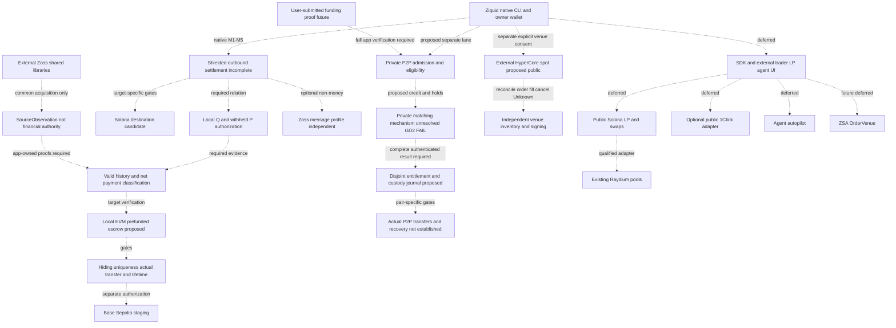
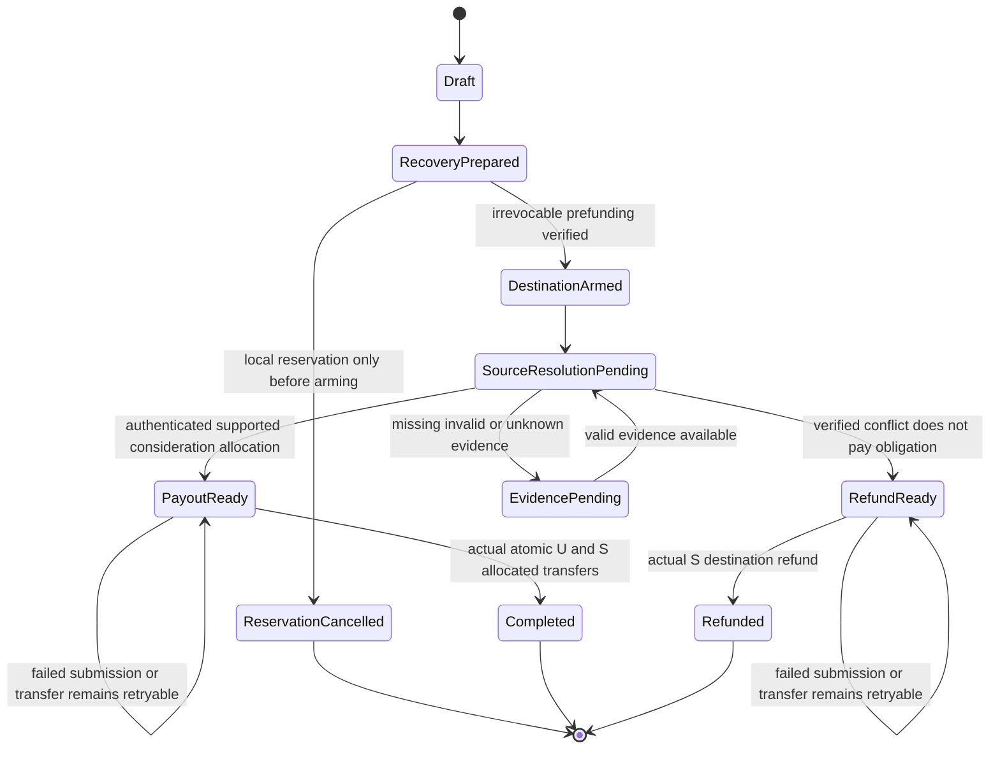

# Ziquid — kiến trúc đề xuất

**Trạng thái hiện tại:** native protocol đang implementation, chưa complete swap/deployment. User đã duyệt [native design](../superpowers/specs/2026-10-01-native-protocol-implementation-design.md) và [execution plan](../superpowers/plans/2026-10-01-native-protocol-implementation.md): full validating source proofs, proportional settlement và one-real-note/one-obligation trong một EVM deployment; SDK/UI/bindings deferred. [Observed status](../NATIVE-IMPLEMENTATION-STATUS.md) sở hữu checkpoint code và bằng chứng đã chạy, gồm local P/Q, source/proof subrelations, durable journal và acquisition qua `zoss-zcash`; chưa full financial verifier/escrow/actual transfer. Gates Open/Blocked. Frame-only approvals trước đó là lịch sử, không current code ceiling. Zoss độc lập, acquisition không funds authority; sign/send/deploy/fund/mainnet/new-viewer/Git actions vẫn chưa authorize.

**Hợp nhất tài liệu 2026-10-02:** Ziquid mở rộng là product umbrella; **Z2Z là tên tương lai**, chưa đổi repo/package/namespace. [PRODUCT](../PRODUCT.md) sở hữu hướng sản phẩm; [CONSOLIDATION](../CONSOLIDATION.md) sở hữu quyết định nhập và trạng thái từng lane; [Kerb archive](../imports/kerb/README.md) giữ nguồn/lịch sử, không chuyển code hoặc kế thừa readiness. File này sở hữu behavior, [MODULES](../MODULES.md) packaging, [BLOCKERS](../BLOCKERS.md) closure. Các lane mới bên dưới là **proposed/docs-only**, không implementation authorization; native M1–M5 vẫn ưu tiên.

Quy ước: **[Verified source]** = điều đọc được trong ZIP/code/docs, không phải chạy thành công; **[Verified vendor API]** = metadata provider trả; **[Verified on-chain]** = RPC observation có ngày/slot; **[Tuyên bố nhà cung cấp]** = chưa kiểm chứng độc lập; **[Người dùng cung cấp]** = thông tin từ người dùng; **[Proposed / Đề xuất]** = functionality chưa triển khai ở repo này; **[Đã duyệt]** = đúng phạm vi được duyệt riêng, không completed protocol; **[Unresolved / Chưa giải]** = điều kiện phải đóng; **[INFERENCE / Suy luận]** = suy luận từ quan sát, không phải thuộc tính đã chứng minh.

## 1. Mục tiêu và sản phẩm

Phạm vi sản phẩm chung xem [PRODUCT](../PRODUCT.md); sản phẩm phải giao tài sản/vị thế thực, không chỉ cảnh báo. **Critical path native đã duyệt giữ nguyên:** một chiều outbound Ironwood ZEC → một asset/chain; định nghĩa packet/state/allocation → **Q self-spend được prove local, executable khi user offline** → general-conflict/payment-class evidence → source valid-history/effect verifier + một **local EVM native-asset escrow** → hiding/privacy/lifetime. Solver phải prefund/irrevocably arm destination **trước khi user release real-input authorization của P**. **Base Sepolia** là staging sau các proof/gate và authorization riêng; không route deployed hay khóa chain sản phẩm. Solana vẫn destination candidate, adapter-gated. Public LP/1Click, autopilot và ZSA **deferred khỏi critical path**, không bị xóa khỏi sản phẩm (§10); market/custody/venue mới không đổi thứ tự này.

Các lane và quyền **độc lập**, không phải một nút “nâng cấp thành private DEX”:

1. **Solana public LP/swap — deferred:** SPL ZEC đã bridge, pool Raydium hiện hữu. Mọi hoạt động Solana công khai; chưa có LP/swap DEX hay cross-chain do DEX điều phối.
2. **1Click public route tùy chọn — deferred:** provider mô tả quote-specific deposit/settlement cho cặp được API báo giá; ZEC theo docs là **transparent-only**. Không phải venue LP hay đường nạp Ironwood shielded. Confidential Intents có basic/advanced modes, không phải proof cho Ironwood route (E18).
3. **Zoss message profile — optional, độc lập với library reuse:** thông điệp Ironwood theo route verifier/quorum, non-money. Quorum là trust assumption, không source financial proof. **Zoss shared native core** ở §4 có thể cung common infrastructure cho app mà không cần profile này; không funds authority.
4. **Shielded settlement — critical path, Blocked:** direct payment P, locally-proved recovery Q, positive valid conflict và payment classification (§7). **Chưa có route mang tiền đã xác minh**; một P/Q trên một real note chỉ là feasibility, không complete hostile-wallet swap. E21 là source lead mới; E10/E11/E13 vẫn ba ZWAP artifact riêng, không verified engine hay fallback ngầm.
5. **ZSA OrderVenue — future/deferred:** chờ mainnet consensus/client/liquidity. ZIP 228 là matching orders/bundles, không LP share. Không migration vị thế từ (1).
6. **Private P2P order market — proposed:** admission/eligibility, matching, funded credit/holds/entitlement và custody/reconciliation (§4.1). Giữ mục tiêu Solana↔Ironwood từ hồ sơ Kerb, nhưng không suy route hai chiều từ native EVM outbound. Hướng **A** xét tài sản Hyperliquid đủ điều kiện trong P2P; chưa chọn cặp/domain/custody. Strict matcher content/accepted-identity privacy còn known **GD2 structural FAIL**, không waiver (§9).
7. **External HyperCore spot — proposed, hướng B riêng:** người dùng chọn venue và ký/ủy quyền riêng; HyperCore khớp, không phải matcher P2P. Public execution, không perps/leverage, không tự chuyển residual hoặc fallback. Core/EVM/Solana/Ironwood inventory không tự fungible hoặc atomic.
8. **User-submitted funding proof — future/proposed:** thay người cung cấp evidence, không bỏ claimant/history/inventory/dedup checks, custody ZEC hoặc nghĩa vụ chuyển tài sản. Event proof ≠ credit ≠ spend authority; không shortcut tới native `VerifiedSettlementFact`.

**ZECATHON:** public site source đọc 2026-09-30 có Cross-Chain *“without unshielding on the way through”*, Privacy *“Leaks are disqualifying, not deductions”* và giá trị lịch đăng ký/nộp (E12). (1)/(2) không minh chứng private Cross-Chain; (3) không chứng minh (4). Đây là rủi ro fit, không phải ruling giám khảo. Exact build-window definition, testnet eligibility và privacy ruling vẫn chưa giải; opening trên site không tự là ngày code hợp lệ.

## 2. Bằng chứng và giới hạn suy diễn

| ID | Điều quan sát được | Nguồn, ngày | Điều **không** suy ra |
|---|---|---|---|
| E1 | Catalog 1Click liệt kê ZEC SPL mint `A7bdiYdS5GjqGFtxf17ppRHtDKPkkRqbKtR27dxvQXaS`, 8 decimals; read-only GET 2026-09-30 lại HTTP200 và xác nhận listing. | [1Click catalog](https://1click.chaindefuser.com/v0/tokens), quan sát 2026-09-28 và 2026-09-30 [Verified vendor API] | Không chứng minh canonical token, reserve/backing, redeem hay route thực thi. |
| E2 | NEAR nói Omnibridge đã đưa ZEC lên Solana; docs 1Click nói API quote, deposit address riêng cho quote, tracking và settlement on-chain. | [NEAR Solana case study](https://intents.near.org/case-studies/solana) [Tuyên bố nhà cung cấp]; [1Click overview](https://docs.near-intents.org/integration/distribution-channels/1click-api/about-1click-api), đọc 2026-09-29 | Không chứng minh mọi cặp chain/asset đều có quote, same-chain ZEC/USDC có route, hay NEAR quản lý vị thế Raydium. |
| E3 | Docs NEAR liệt kê Zcash `t1`/`t3`, “Transparent addresses only”; §4.1(h) điều khoản **1Click API** yêu cầu địa chỉ originator public có thể xác minh, không che qua proxy/intermediary. | [Chain support](https://docs.near-intents.org/resources/chain-support); [1Click terms](https://docs.near-intents.org/security-compliance/terms-of-service), đọc 2026-09-29 | Không phải định lý mọi giao thức swap ZEC phải unshield; chỉ giới hạn route/tích hợp được nêu. [Forum](https://forum.zcashcommunity.com/t/near-intents/54588) có phát biểu trái chiều về hỗ trợ shielded; không thay thế docs chính thức. |
| E4 | API ghi pool `FrMLgdeZrFp6mG4DZsvcVDpbyFMaBcsWRQ9WNk7pbM5e` Standard/CPMM và `C9W11rfTnqkR8eTtyjgHEi5Pkh1gTiq9Hg7txTurk1dr` Concentrated/CLMM, cùng mint E1 và USDC. RPC trước đó xác nhận *owner program* account pool. | [Raydium API](https://api-v3.raydium.io/pools/info/ids?ids=FrMLgdeZrFp6mG4DZsvcVDpbyFMaBcsWRQ9WNk7pbM5e,C9W11rfTnqkR8eTtyjgHEi5Pkh1gTiq9Hg7txTurk1dr), 2026-09-28 và GET HTTP200/success=true 2026-09-30 [Verified vendor API]; RPC `getAccountInfo`, slots 451531097–451531100, 2026-09-29 [Verified on-chain] | Owner check không decode mint/depth. GET mới không fresh RPC/quote. Pool cụ thể chưa chọn. |
| E5 | Số dư bốn vault tại thời điểm đọc: pool CPMM vault A 19.2482891, vault B 26,826.322499; CLMM vault A 0.19521866, vault B 1,573.769323. Việc gán A/B cho ZEC/USDC dựa vào Raydium API E4, chưa tự đọc mint của từng vault qua RPC. | Solana RPC `getTokenAccountBalance` trên vault IDs từ Raydium API, slots 451531325–451531329, 2026-09-29T04:16Z | Đây **không phải executable depth**, quote hay liquidity in-range. Trước sử dụng phải xác minh mint/decimals từng vault trên chain; không dùng mô hình x·y=k trên snapshot để chốt pool. |
| E6 | Mint E1: 8 decimals; supply 99,971.74671889 ZEC; freeze authority null; mint authority **vẫn được đặt** là `FvULawNPGBbuwYus74ECaQoV1oH9Tk6XPN7VPN51NYds`. Account của authority thuộc System Program, không có data. | Solana RPC `getAccountInfo`, slots 451531097–451531217, 2026-09-29T04:15Z | Mint thêm vẫn có thể xảy ra; *không biết* ai/cái gì kiểm soát authority (keypair, MPC, PDA...) hay bridge backing. Null freeze authority của mint không loại bỏ rủi ro dừng ở bridge khác. |
| E7 | Source Raydium nêu CPMM deposit `maximum_token_{0,1}_amount`, withdraw `minimum_token_{0,1}_amount`, swap `minimum_amount_out` hoặc `max_amount_in`; CLMM dùng giới hạn token amount và `other_amount_threshold` cho swap. | [Raydium cp-swap source](https://github.com/raydium-io/raydium-cp-swap/blob/master/programs/cp-swap/src/lib.rs), [CLMM source](https://github.com/raydium-io/raydium-clmm/blob/master/programs/amm/src/lib.rs), đọc 2026-09-29 | Chưa đối chiếu binary đã triển khai/source; không dùng một `min_out` chung cho LP và swap. |
| E8 | NU6.3/Ironwood kích hoạt mainnet ở height 3,428,143; sau upgrade không có giá trị mới vào pool Orchard và giá trị vẫn có thể rời pool đó. Ironwood là pool mới của Orchard protocol, có note tree riêng. | [ZIP 258](https://zips.z.cash/zip-0258), [ZIP 229](https://zips.z.cash/zip-0229), [Zebra release context](https://github.com/ZcashFoundation/zebra/pull/10938); đọc 2026-09-29 | Không đồng nghĩa wallet, contract hay swap Orchard trước đây tương thích Ironwood/v6. |
| E9 | ZIP 226–228 còn Draft; ZIP 228 định nghĩa swap order/matcher/bundle, **không** định nghĩa LP share. ZIP 311 disclosure còn Draft và có “TODO: Add support for Orchard.” | [ZIP 226](https://zips.z.cash/zip-0226), [ZIP 227](https://zips.z.cash/zip-0227), [ZIP 228](https://zips.z.cash/zip-0228), [ZIP 311](https://zips.z.cash/zip-0311), đọc 2026-09-29 | Các ZIP này không cung cấp ZSA AMM, chuẩn disclosure Orchard/Ironwood hoàn chỉnh hoặc refund primitive dùng ngay; không kết luận mọi cách xây các chức năng đó đều bất khả thi. |
| E10 | Paper tạo 2026-03-27 có **multiplicative ECDH aggregate-key lock** + hash lock, off-chain ZK binding cùng secret, solver/lock order/timelock refund. Concrete EVM↔UTXO example có Zcash **transparent P2SH script**; §X-D thừa nhận amount/timing/solver-graph linkage. | [Paper](https://zwap.atheon.xyz/), đọc 2026-09-29 [Verified source]; [transparent-route forum](https://forum.zcashcommunity.com/t/zwap-unlinkable-cross-chain-atomic-swaps/55104) | Đề xuất với giả định, không Ironwood/v6, Solana lock, triển khai live hay proof cho claim shielded sau đó. |
| E11 | Atheon ngày 2026-05-27 tuyên bố early-access Orchard-native Zcash↔Ethereum/Base, cap $1–$100; tác giả ngày 2026-06-10 nói mới review nội bộ, audit ngoài dự kiến. Bình luận tháng 8 chất vấn chỗ khác nhau giữa paper và sản phẩm. Lần đọc app của mình bị timeout. | [Forum early access](https://forum.zcashcommunity.com/t/zwap-trustless-shielded-atomic-swaps-for-zcash-early-access/55874), đọc 2026-09-29 [Tuyên bố nhà cung cấp & phản biện cộng đồng]; `app.zwap.exchange` timeout 2026-09-29 | Không biết tình trạng app, security review ngoài, tính đúng của cơ chế Orchard hay hỗ trợ Ironwood. Timeout **không chứng minh** app không hoạt động. Không nhầm với dự án khác tên Zwap. |
| E12 | Public HTML load `darkpool/data.js`; source ghi registration/submissions open **2026-09-28T00:00:00Z**, submissions due **2026-10-28T23:59:00Z**, Cross-Chain “without unshielding on the way through”, Privacy “Leaks are disqualifying, not deductions”, code trong build window/libraries allowed/existing products not/exactly one track. Open-source khi nộp còn là thể lệ người dùng cung cấp. | [HTML](https://thezecathon.com/), [event JS](https://thezecathon.com/darkpool/data.js), đọc 2026-09-30 [Verified source]; thể lệ người dùng cung cấp 2026-09-29 giữ nhãn riêng | Source values không backend enforcement/finalization proof; comments có preview/future-server/placeholder prize split. Opening không xác định exact code build-window; network/privacy/entry ruling chưa giải. |
| E13 | Vizor PR323/fork commit `b40d728f8714ca4137ed3883dfbd451cbef9db10` có **additive joint-key/adaptor** flow. Claim dùng OrchardDomain/default NU6, manual v5 sighash/`serialize_v5_orchard_only`; z2e có joint deposit/EVM digests. `zwap_z2e_refund_sig_b` ký solver **EVM** recovery, không source refund. | [PR323](https://github.com/chainapsis/vizor-wallet/pull/323), [pinned claim](https://raw.githubusercontent.com/atheonxyz/vizor-wallet/b40d728f8714ca4137ed3883dfbd451cbef9db10/rust/src/zwap/orchard_claim.rs), [z2e](https://raw.githubusercontent.com/atheonxyz/vizor-wallet/b40d728f8714ca4137ed3883dfbd451cbef9db10/rust/src/zwap/z2e.rs), [refund signature](https://github.com/atheonxyz/vizor-wallet/blob/b40d728f8714ca4137ed3883dfbd451cbef9db10/rust/src/api/swap_zwap.rs#L645-L659), [rollout plan](https://raw.githubusercontent.com/atheonxyz/vizor-wallet/b40d728f8714ca4137ed3883dfbd451cbef9db10/docs/vizor-zwap-mainnet-support-plan.md), đọc 2026-09-30 [Verified source; readiness là vendor claim] | Orchard/v5 source không Ironwood port/audited deployment/unilateral source refund. Đổi branch ID không đủ domain/tree/format; security argument khác E10. Chưa chạy engine. |
| E14 | Orchard 0.15.5 có IronwoodDomain/V3 plaintext; encryption 0.5.0 full decrypt lấy memo, compact decrypt không đủ. Backend 0.24.0/sqlite 0.22.0, protocol 0.5.0, lightwalletd 0.5.4, Zebra 6.4.2 là source/release leads. | [IronwoodDomain](https://docs.rs/orchard/0.15.5/orchard/note_encryption/type.IronwoodDomain.html), [encryption](https://docs.rs/zcash_note_encryption/0.5.0/zcash_note_encryption/), [backend](https://docs.rs/zcash_client_backend/0.24.0/zcash_client_backend/), [sqlite](https://docs.rs/zcash_client_sqlite/0.22.0/zcash_client_sqlite/), research 2026-09-30 [Verified source]; [Zoss register](../../../zoss/docs/BLOCKERS.md) giữ release detail | Pin coherent dependencies, không blindly trộn latest Orchard/encryption với stable wallet cohort. API/parser/decrypt không prove deployed scanner, mined send/scan/spend hay canonical inclusion. |
| E15 | Pinned proto có Ironwood actions/tree size, service filtering/block/full tx. ZIP302 binary memo `0xFF` + **511 app bytes**, total 512. | [compact proto](https://raw.githubusercontent.com/zcash/lightwallet-protocol/12b892541bbf14d8e485a13e63ccfac85382fc21/walletrpc/compact_formats.proto), [service](https://raw.githubusercontent.com/zcash/lightwallet-protocol/12b892541bbf14d8e485a13e63ccfac85382fc21/walletrpc/service.proto), [ZIP302](https://zips.z.cash/zip-0302), đọc 2026-09-30 [Verified source] | Không deployed gRPC/full-tx/tree proof hay wire/auth/AEAD boundary test. Hash không giao ciphertext; compact prefix không full memo. [Zoss G1–G6](../../../zoss/docs/BLOCKERS.md) chưa Pass. |
| E16 | ZIP203 expiry chặn **chưa mined** tx bị mine muộn, không refund mined note. Zebra source enable future lock_time khi có transparent input sequence khác `u32::MAX`. ZIP229 preauthorization là research lead. | [ZIP203](https://zips.z.cash/zip-0203), [Zebra lock_time](https://github.com/ZcashFoundation/zebra/blob/main/zebra-chain/src/transaction.rs#L127-L146), [ZIP229](https://zips.z.cash/zip-0229), đọc 2026-09-30 [Verified source; main link có thể đổi] | Pure-shielded future nLockTime một mình chưa là timelocked refund. Presigned recovery cần anchor/conflict/fee/expiry/upgrade/adversarial-preemption proof. Không kết luận mọi shielded refund bất khả thi. |
| E17 | Solana precompiles có **secp256k1 recovery** và Ed25519, không CPI-callable. Program phải kiểm instructions/message/key/context. | [Solana precompiles](https://solana.com/docs/core/programs/precompiles), đọc 2026-09-30 [Verified source] | Không nói Solana chỉ Ed25519; primitive không prove adaptor exchange, lock binding hay source refund. Chưa exercise/audit adapter. |
| E18 | NEAR docs có Confidential Intents **basic/advanced**. Quote API `dry:true` không tạo deposit address; status/refund/fee có giới hạn. Terms có unmasked originator, infrastructure fees non-refundable, recovery discretionary; caching/AI-data restrictions cần review. | [confidential swaps](https://docs.near-intents.org/integration/distribution-channels/1click-api/quickstart/confidential-swaps.md), [quote API](https://docs.near-intents.org/api-reference/oneclick/request-a-swap-quote.md), [terms](https://docs.near-intents.org/security-compliance/terms-of-service) §§4.1(h),6.4,7.1,7.7(d), đọc 2026-09-30 [Verified source] | Private NEAR execution không Ironwood route/hidden payout proof, không bypass originator rule. `FAILED` ≠ `REFUNDED`; `ANY_INPUT` không refund, insured flag không coverage proof. Chưa quote POST/refund exercise hay legal conclusion. |
| E19 | Bridge docs nói Zcash PoA, case study E2 nói Omnibridge đưa ZEC lên Solana. Generic OmniBridge source có SystemAccount PDA. | [bridge overview](https://docs.near-intents.org/integration/bridging/overview.md), [generic deploy-token source](https://github.com/Near-One/omni-bridge/blob/main/solana/programs/bridge_token_factory/src/instructions/user/deploy_token.rs), đọc 2026-09-30 [Verified source; case study là vendor claim] | Giữ khác biệt nguồn, chưa map exact quote/tx/mint custody/config. System-owned/zero-data không prove E6 là ordinary key hay đã là PDA. Không chọn trust/backing từ tên NEAR chung. |
| E20 | SPL delegate allowance cho transfer/burn; không tự giới hạn pool/recipient/expiry/window/min receive. | [SPL approve delegate](https://solana.com/docs/tokens/basics/approve-delegate), đọc 2026-09-30 [Verified source] | Chưa có signer/program-enforced agent authority; backend policy không constrain compromised signer. Autopilot deferred. |
| E21 | ZIP229/374 mô tả v6 preauthorization trước anchor/proof; pinned Orchard derives nullifier từ real note, Zebra cấm lặp nullifier trong cùng pool/valid history, PCZT extractor cần all-action SpendAuth và binding material. Inspected delegated prover dùng account FVK; đây leads cho P/Q same-real-input và local proving, không workflow đã chạy. | [Research §4.2](../SETTLEMENT-RESEARCH.md#42-positive-conflict-refund-candidate--audit-bổ-sung-2026-10-01), source audit 2026-10-01 [Verified source]: [ZIP229/374 revision](https://github.com/zcash/zips/tree/eaccf9a90ca0b860712fb3d05aa337d409f1c67e/zips), [Orchard revision](https://github.com/zcash/orchard/tree/e000e9f8e236edc0c4f25c1be475e69039fa5551/src), [PCZT extractor revision](https://github.com/zcash/librustzcash/tree/f7b1cfb0b5bb1bdb10564079ac51b54aa18b07a1/pczt/src/roles/tx_extractor), [Zebra v6.4.2 nullifier checks](https://raw.githubusercontent.com/ZcashFoundation/zebra/v6.4.2/zebra-state/src/service/check/nullifier.rs) | ZIPs Draft tại revision inspected; không wallet/node/prover/runtime proof, note-scoped FVK substitute hay automatic reanchor. T khác P có thể vẫn trả solver; conflict không tự chứng minh nonpayment. Khác pool có nullifier sets disjoint. |

**Lưu ý:** E10 (March multiplicative ECDH paper), E11 (May Orchard-native vendor claim) và E13 (pinned additive joint-key/adaptor implementation) là **ba artifact khác nhau**, không ghép thành verified Ironwood route. E13 là ID mới cho implementation, không alias catalog hay event E12. Source/library/provider findings không runtime pass. Atheon ZWAP cũng không phải [Zoss](../../../zoss/docs/ARCHITECTURE.md).

## 3. Sơ đồ ranh giới (đề xuất)

Sơ đồ chỉ mô tả **interface/gate dự kiến**, không topology đã nối hoặc route support. Native CLI/wallet là đường exercise core; SDK/UI vẫn deferred. Seam acquisition thực tế có phạm vi hẹp trong [observed status](../NATIVE-IMPLEMENTATION-STATUS.md).

**Một route không đổi nghĩa giữa chừng.** Từ chối public-Zcash quote/adapter khi intent yêu cầu shielded; không fallback âm thầm, gọi quorum trustless hoặc ZIP228 là LP AMM. P2P crossing, solver RFQ, external HyperCore spot và LP/1Click/autopilot/ZSA không thay nhau hoặc thừa hưởng liquidity/privacy. Shared Zoss libraries không bắt memo/inbox/watchers/IVK/quorum/receipt/runtime; source financial proof đi trực tiếp DEX verifier. Zoss **message profile** Ironwood testnet → Solana devnet độc lập với local EVM/Base settlement; local native EVM không cần Zoss EVM route, không inferred EVM/Base messaging support. Joint-note/source-refund-first cũ superseded architecture, không current mode.

## 4. Module và interface logic (đề xuất)

[MODULES](../MODULES.md#11-layout-đã-duyệt--frame-hiện-tại) giữ package layout và [intended acyclic dependencies](../MODULES.md#12-core-crate-dependency-map--acyclic). **Native Rust core workspace:** `crates/{protocol,zcash,proofs,chains,runtime}`; TypeScript `packages/sdk` và chain-specific contracts build riêng; UI repo riêng, Zoss external. [Observed status](../NATIVE-IMPLEMENTATION-STATUS.md) phân biệt actual native code, EVM allocation/base verifier và phần financial verifier/escrow/client còn thiếu. Bảng dưới là responsibility/interface đích đến, không claim tất cả đã implemented. Market/credit/custody/venue/proof-intake mới là module **logic proposed**, chưa chọn package/process, không nhập Kerb code.

| Module / adapter | Interface và trách nhiệm | Bất biến / quyền |
|---|---|---|
| [Wallet authoring](../modules/wallet-authoring.md) — `crates/zcash` | Reuse upstream authoring/scanning/note witnesses; dựng `UnsignedPaymentP`, prove/ký Q local qua wallet-client composition, giữ `PayoutWitnessU`; kiểm arming trước release P authorization. | Keys/viewing authority, note reservation/release record và witness giữ wallet-local. P export không executable; Q complete same real input, mọi nonzero output U-owned, phí bind; không U FVK/spending key cho S. |
| [Zcash settlement/proofs](../modules/zcash-proofs.md) — `crates/proofs` + `zcash` | Implement transaction/payment/history circuits, witness/prover/verifier artifacts; bind source effects/auth/inclusion/real-input/payment relation. `zcash` supplies upstream parsing/scanning/witness integration. | `PaysObligation` / `DoesNotPayObligation` / `Unknown` khác nhau; không source evidence project riêng hoặc RPC/quorum proof giả. Keys/private witness không public queue. |
| [Destination settlement](../modules/destination-settlement.md) — chain contract packages + `crates/chains` | Target-specific verifier và DEX escrow ở `contracts/{evm,solana,near}` theo target chọn; off-chain destination clients ở `chains`; arm và actual payout/refund fixed beneficiaries. | Exact context/version/unique payment; irrevocable arming, no solver cancel/admin timer, once-only retryable actual transfer. EVM local initial candidate; Solana candidate; NEAR layout slot không ready settlement/1Click route. |
| [Solver operations](../modules/solver-operations.md) — `crates/runtime` | Orchestrate quote, durable inventory/funding persistence, low-privilege Q/prover/relayer workers và reconciliation qua `zcash`/`proofs`/`chains`. | Funding signer tách workers; không U key custody/new spend/reanchor tự động. Solver khác LP; observations không economic authority. |
| [Client SDK](../modules/client-sdk.md) — TypeScript `packages/sdk`, deferred | Route-specific coordination, disclosure, wallet interfaces, observations/ETA cho external UI hoặc client khác; build riêng cùng repo. | U keeps signing/private witness; native CLI không bị chặn bởi SDK/UI/bindings. SDK/status/ETA không settlement predicate hoặc liquidity guarantee. |
| Intent/policy + route registry | Exact network/execution domain, mint/token ID/contract/native asset, decimals, account/recipient, amount/min receive, fee, quote/venue/privacy/trust và quyền thực thi. | Không nhận diện bằng ticker hoặc đồng nhất Core/EVM; không fallback privacy hoặc quảng cáo research như capability. Agent trước hết propose/owner signs; auto-execute cần signer/program enforcement. |
| Public venue / provider adapters — deferred | `LPVenue` quote/build unsigned/read owner position; 1Click quote/status/reconcile; `OrderVenue` là ZSA future riêng. | Per-instruction bounds, đúng route/asset/ownership; không generic timeout refund hoặc auto LP migration. |
| Zoss shared native libraries — external | Actual `zoss-zcash` acquisition seam theo [observed status](../NATIVE-IMPLEMENTATION-STATUS.md); common domain/encoding/auth và chain plumbing chỉ reuse theo exports/policy đã kiểm tra của [Zoss](../../../zoss/docs/ARCHITECTURE.md#31-shared-native-core). | DEX statement/circuits/history/proof strategy, target-specific financial facts và allocation giữ internal; source observation không consensus/payment proof hoặc market credit. |
| Zoss message client — external, optional profile | `MessageTransport`/`QuorumAcceptedMessage` theo separately selected route/quorum/visibility. | Non-money `Delivered` không `EconomicSettlement`, `VerifiedSettlementFact` hoặc claim/refund authority; profile không dependency của library reuse. |
| Market admission/eligibility — proposed | Qualify exact pair/domain/asset/units; verify claimant/order authorization, collateral và accepted-participant policy; FAA/input certificates nếu sau này được chọn. | Admission không matching hoặc payout proof; eligibility/custody/viewing roles tách matcher. Không chọn FAA/MPC backend hay public membership map bằng import docs. |
| Private matching — proposed, Blocked | Consume admitted funded orders; produce complete authenticated allocation theo mechanism/privacy contract được duyệt riêng. | Limit/conservation/accepted-identity privacy phải cùng đạt; GD2 structural FAIL chưa giải. MPC/receipt hiding không sửa own-result inference. |
| Credit/holds/entitlement journal — proposed | Durable unique funding credit, symmetric maximum-debit/quantity holds, immutable epoch disposition, disjoint filled/unused portions và activation/reconciliation. | Credit phải có controlled unallocated backing; partial result/timeout không release hold. Entitlement không actual payment; market ledger không constructor của `VerifiedSettlementFact`. |
| Custody/effect/recovery — proposed market role | Designated source acquisition/viewing, physical inventory/input/change locks, exact recipient/fee/effect checks, authorized spend intent và outcome reconciliation. | ZEC custody/threshold native signing chưa chuyển vào repo; approver/business ACK ≠ spend signer ≠ mined payout. Native wallet-local U keys/P/Q không chuyển cho matcher/custodian. |
| Explicit external HyperCore venue — proposed | User-selected account/spot market/domain/limit/fees; separately authorized signing; reconcile open/partial/filled/cancelled/Unknown và transfer riêng nếu đủ điều kiện. | Core fill không P2P allocation hoặc ZEC/Solana delivery; CoreWriter enqueue/EVM success không fill. No perps/leverage/automatic residual fallback; unresolved action giữ reservation. |
| User-proof intake — future/proposed | Nhận bounded versioned proof/context, verify đúng app relation và policy trước funding reconciliation hoặc native target submission tương ứng. | Người nộp không chọn trust level; phải bind claimant/history/occurrence/inventory/uniqueness. Proof không cấp custody/spend rights hoặc tạo liquidity/atomicity. |

**Shared `StatementContext` — yêu cầu relation:** native canonical encoding/checks đã có theo [status](../NATIVE-IMPLEMENTATION-STATUS.md), không complete semantic-opening/circuit proof. Relation phải bind schema/proof/verifier version; source network/pool/branch/checkpoint **state** và accepted-history policy; destination chain/deployment/code/verifier identity; `orderId`, `sourcePaymentCommitment`, `realInputCommitment`; exact source receiver/amount/ciphertext relation, authenticated COMPLETE real-input set/ownership và zero-dummy constraints; gross-vs-net/no-S-input hoặc supported solver debit predicate, quote-bound solver funding scope/contribution và fee policy; destination asset/amount/fixed U payout/S refund beneficiaries; consensus expiry. Authoring, prover, verifier và allocation dùng cùng statement/version. Encoded fields không prove hiding, ownership/net consideration hoặc uniqueness; independent U proof privacy không được phụ thuộc S giữ witness.
Target-specific verifier chỉ xuất `VerifiedSettlementFact` sau context/statement/history/classification/uniqueness checks cho economic escrow; không RPC/quorum/business ACK hoặc market credit. Proof implementation xác thực facts; escrow/app sở hữu allocation/beneficiaries. Supported authenticated proportional relation ở §7 áp dụng khi `0 <= C <= A`; arbitrary-T completeness và actual excess return vẫn thiếu, không tự đổi partial/overpayment thành full refund hoặc gift.

**Ownership đã chọn:** core Rust `protocol` pure DEX rules/schema; `zcash` P/Q authoring/scanning/note-witness integration; `proofs` circuit/witness/prover/history-strategy/verifier artifacts; `chains` exact app destination clients; `runtime` durable solver/relayer state/workers. [MODULES §1.2](../MODULES.md#12-core-crate-dependency-map--acyclic) giữ intended dependency direction. Common Zoss libraries ngồi dưới đúng role; actual acquisition reuse không thay Ziquid paths/packages hoặc đưa app proofs/economics sang external repo. Core/SDK/target slots internal, UI và Zoss external. Market responsibilities chưa có package assignment; Kerb code/recorded local safety remains external/source-reported. `contracts/near` slot không NEAR/1Click route approval.

**Shared-core seam, docs direction 2026-10-01 và current checkpoint:** [MODULES §1.3](../MODULES.md#13-external-zoss-shared-core--proposed-library-reuse) giữ DEX responsibility map; [Zoss](../../../zoss/docs/ARCHITECTURE.md#42-package-repository-and-process-map) giữ external packaging/exports, [native status](../NATIVE-IMPLEMENTATION-STATUS.md) giữ reuse đã exercise. Map không tự chứng minh mọi file/API/dependency/support; không universal consensus/proof engine, generic verified boolean hoặc proof→quorum conversion. Domain/signature primitives phải pin algorithm/schema: Kerb wallet/Solana **ordinary Ed25519**, Arcis **SHA3-512 Ed25519 certificates**, native Zcash SpendAuth/FROST roles và HyperCore action signing khác nhau; common helper không thay semantics/governance/quyền custody.

**Direct app proof path:** caller-owned acquisition → `SourceObservation` → DEX transaction/payment/history circuits → actual DEX target verifier → `VerifiedSettlementFact` → app financial allocation/actual transfer. `SourceObservation` ≠ `QuorumAcceptedMessage` ≠ `VerifiedSettlementFact`; observation/quorum không constructor cho financial verified result. DEX owns same-real-input/Q-output/auth/history/net-consideration/hidden-uniqueness relations; common parsing/decrypt/context code không prove chúng.

**Private/acceptance boundaries:** reusable library chạy trong wallet/solver-owned process với caller-owned viewing capability; không new key/viewing party, mandatory shared daemon hoặc cross-app IVK/FVK/witness store. U locally prove complete Q, S không user FVK/spend key; independent U witness và private mappings vẫn actor-owned. Public data cache có pinned provenance, không private witness sharing. [Zoss shared-library readiness](../../../zoss/docs/BLOCKERS.md#7-shared-library-readiness), optional message G/Z/rejected B và DEX M/S/P là separate acceptance; no gate closure hoặc runtime claim từ docs adoption.

### 4.1 Market accounting, custody và user-proof intake — proposed

Behavior yêu cầu tham chiếu [imported safety design](../imports/kerb/docs/docs/superpowers/specs/2026-10-02-kerb-safety-core-design.md), [Kerb source-reported checkpoint](../imports/kerb/docs/README.md#implemented-local-safety-cores-2026-10-02) và [Hyperliquid scope/evidence](../imports/kerb/docs/product/17-HYPERLIQUID-EXPANSION.md). Đây không adoption cơ chế auction bị fail, database/custody selection hay code packages. Route/design status thuộc [CONSOLIDATION](../CONSOLIDATION.md), release prerequisites thuộc [BLOCKERS](../BLOCKERS.md).

- **Funding → credit:** observation hoặc user proof → app verifies exact network/pool/receiver/value/stable occurrence, claimant authorization, accepted canonical history và controlled **unallocated spendable inventory** → durable claimant-bound issuance/dedup. Re-inclusion, restart, copied memo hoặc đổi logical ID không tạo credit mới; change backs existing liabilities, không deposit mới. Funding relation này khác native P/Q settlement relation; không dùng một `verified` boolean để gộp.
- **Order → hold → entitlement:** mỗi bên cấp vốn chân của mình; signed pair/order/limits/fees giữ full maximum buyer debit và seller quantity. Chỉ complete authenticated result, immutable global epoch disposition và valid activation mới partition filled/unused portions. Partial chunks, missing ACK, timeout, zero fill hoặc cancellation request không tự giải phóng vốn. Mỗi portion có tối đa một live disposition; unused refund và seller payout là quyền khác nhau. `Unknown`/live signed intent giữ hold/input/nonce fences tới exact outcome reconciliation.
- **Custody → actual transfer:** designated viewing/acquisition, eligibility/FAA, matcher, business authorizer và native spend signer là quyền khác nhau. Funding proof không bỏ native ZEC custody/FROST hoặc cho matcher user FVK/spend keys. Exact input/recipient/change/fee/effect approval không chữ ký hoặc mined payment. Threshold-signing trust, governance/upgrade/censorship và thực sự kiểm soát inventory phải được disclose/prove theo pair; journal/MPC/quorum không làm hai chain atomic. Native U wallet ownership, prefund/P-release ordering và §7 không bị thay bởi market credit.
- **Physical backing/replay/lifetime:** available credit, prepared/encumbered hold, unpaid entitlement, provisional recipient/change và confirmed inventory phải disjoint. Không đếm input và derived change cùng lúc; sponsor fee capital riêng. Một phần vốn không backing đồng thời P2P, Core order và withdrawal ở Core/EVM/Solana/Ironwood. Reorg/dispute/unknown impairment fence new sends nhưng giữ liabilities/live intents. Journal/retained heads chống rollback, stable identities không reset theo signer/epoch/library upgrade; funded evidence/recovery path giữ tới actual terminal.
- **External venue là domain riêng:** HyperCore và HyperEVM là hai execution domains của **cùng một L1**, không hai chain mới; asset link/decimals/balances/control không tự tương đương. Hướng A cần pair-specific qualification/custody; hướng B cần consent và signing riêng, actual usable Core balance và order/fill/cancel reconciliation. API/agent wallet là delegated signer, không mặc định AI hay quyền rút toàn bộ. EVM success/CoreWriter enqueue không Core fill; hủy có race với fill, lost response không no-effect. Không reuse vốn còn reserved, không fallback/perps/leverage; rút/chuyển chain là action riêng chưa qualified.
- **User-proof submission:** user có thể là future evidence producer, nhưng verifier vẫn app/target-owned, context/schema/history/authorization/unique claim phải bind đầy đủ trước credit hoặc money transition. Source event proof ≠ funding credit ≠ spend permission; không bỏ custody, tạo đối ứng, atomicity hoặc sửa GD2. Private witness availability là prerequisite thật; proof system không phục hồi fact không có witness. Không công khai source↔order/identity map chỉ để intake thuận tiện.

## 5. Public Solana trading/LP — deferred, độc lập

**Phạm vi khi mở lại lane:** người đã có SPL ZEC đúng mint E1 và tự chấp nhận bridge risk. DEX không bridge shielded ZEC qua lane này; public LP không là bước đầu của shielded spike.

**Luồng dự kiến:** tìm pool bằng `(program ID, pool ID, mint A/B)` → đọc state/quote trực tiếp theo pool kind → kiểm hạn mức và slippage **theo instruction tương ứng** (E7) → dựng unsigned transaction → chủ vị thế kiểm tra/ký → theo dõi xác nhận → đọc lại owner/vị thế/phí từ chain. Chủ vị thế có thể dùng Raydium trực tiếp nếu DEX UI hỏng; không hứa liquidity hoặc khả năng rút khi bản thân pool/program gặp sự cố.

- CPMM `FrMLg…bM5e` là ứng viên; ít range management hơn CLMM **[INFERENCE]**, không chắc yield/depth tốt hơn. CLMM có thể cho quote swap tốt hơn nhưng cần ticks/liquidity in-range. E4/E5 metadata/vault snapshot không thay actual-size quote/simulation để chọn pool.
- Trước tiền thật phải map exact-mint controller/PDA/program/upgrade/pause, custody/backing/redeem terms/traces (E6/E19), đọc vault mint/decimals/token program/config/status, quote/deposit/withdraw/owner exit thực. System-owned authority có thể là PDA, không gọi ordinary key. U1/U2 trong [DEX register](../BLOCKERS.md) vẫn Open.
- LP hưởng phí nếu pool có volume; có exposure/impermanent loss, fee và rủi ro bridge. Không gọi APR dự báo là lợi nhuận; không tự nhận có farming rewards.
- Mọi swap và vị thế Solana **công khai** (account, amount, pool, thời gian). Sản phẩm này độc lập hữu ích về mặt *giả thuyết*, chưa có chứng cứ người dùng sẽ trả tiền hay được giám khảo Cross-Chain chấp nhận.

## 6. Optional public route qua NEAR Intents / 1Click — deferred

Provider mô tả quote, quote-specific deposit address, status/refund (E2/E18). Adapter Proposed chỉ xét cặp asset/network có quote thật; bind source/destination/recipient/min receive/fee/timing/refund route và reconcile actual outcome. `dry:true` không tạo deposit address. Chưa chạy quote POST hoặc refund; không mặc định API quote same-chain Solana hay beat Raydium. Người dùng gửi theo originator requirement, không dùng backend/wallet trung gian để che nguồn.

**Privacy/trust:** E3 ghi ZEC transparent-only và originator unmasked. E18 có Confidential Intents basic/advanced; không nói API chỉ public, nhưng private NEAR execution không prove Ironwood shielded route, hidden payout hay bỏ terms. Lane DEX này vẫn optional public, không critical-path Cross-Chain. `FAILED` không `REFUNDED`; `ANY_INPUT` không refund; insured flag không prove coverage. Under/over/late/partial/missing-memo payments và recovery/fees cần exercise. E19 bridge claims chưa map exact mint/quote/custody; U3–U6 giữ provider/qualified-legal review, không legal conclusion.

## 7. Shielded cross-chain settlement research; shared core không financial authority

### 7.1 Hướng đã duyệt và những gì chưa prove

Mục tiêu một chiều: Ironwood ZEC → một tài sản trên chain lập trình được, **không unshield principal trên chặng Zcash**. **Đã duyệt làm research architecture:** direct P + independently executable local-proved Q, ưu tiên positive-conflict evidence trước whole-interval exclusion; solver-prefunded destination trước executable P authorization. Đây thay hướng joint-note/source-only funded-abort-first, **không** chứng minh fair exchange hoặc finite recovery. [Research §4.2](../SETTLEMENT-RESEARCH.md#42-positive-conflict-refund-candidate--audit-bổ-sung-2026-10-01) và [audit §9](../ARCHITECTURE-AUDIT.md#9-positive-conflict-alternative--không-assume-exclusion-bắt-buộc) giữ source leads/counterexamples; các dòng “canonical chưa đổi/chưa approve” trong memo phản ánh thời điểm lịch sử, nay **superseded về direction**, không về findings/safety hay gate Pass.

| Hướng | Vị trí hiện tại | Giới hạn |
|---|---|---|
| **P/Q + general conflict/payment class — selected native direction** | Một real owned/available Ironwood note, Q prove local trước solver funding; exact P authorization withheld tới irrevocably armed/finalized destination. | E21 giữ dated source leads; [status](../NATIVE-IMPLEMENTATION-STATUS.md) có local generated cryptography, chưa chain-admissible note/complete hostile swap. Same-nullifier conflict chỉ exclude exact P; arbitrary T/payment variants và earlier history cần classifier/evidence thật. |
| **Complete-interval exclusion — alternative riêng, không critical path mặc định** | [Research §4.1](../SETTLEMENT-RESEARCH.md#41-absence-branch-research-construction-exact-payment-proof-aware-escrow) khảo sát sound absence sau consensus expiry. | Không fallback từ Unknown/im lặng/timeout. Muốn chọn phải spec/prove complete valid history/transactions; claimed txid list + Merkle root không nonmembership proof. |
| **Attested money escrow — rejected hiện tại** | Zoss **message profile** optional/non-money; [register chuẩn](../../../zoss/docs/BLOCKERS.md) giữ B/G/Z, [DEX mapping](../BLOCKERS.md#2-ranh-giới-zoss-và-settlement-implications) giữ S/P. Shared library reuse không mở lại path này. | Receipt/quorum không payout/refund fact; trusted operator/arbitrator là trust-model khác chưa approve. |
| **Joint-note/adaptor refund-first — superseded historical research** | E10/E11/E13 là ba artifact distinct, không verified Ironwood route; [research §3](../SETTLEMENT-RESEARCH.md#3-refund-before-fund-recovery-component-chưa-complete-fair-exchange) giữ failed/reverted-claim counterexample. | Không current gate, launch mode hoặc fallback. EVM recovery signature không source refund; custom crypto/port không được authorize bởi docs. |

Local EVM native asset là target proof đầu sau transaction/proof gates, không chain lock-in. Base Sepolia staging authorize riêng. Solana vẫn candidate: E17 signature primitives không đủ, target verifier/allocation/runtime/asset semantics phải prove riêng. `contracts/near` là layout slot cho target-specific Rust build, **không chọn NEAR settlement hoặc 1Click adapter**; không newly ready route. Không both/bidirectional trước một exact route proved.

**Quyết định:** settlement/proofs vẫn DEX-owned; Zoss shared core chỉ common infrastructure, optional **non-money message profile** không critical-path requirement. Reuse domain/encoding/source acquisition/chain plumbing không receipt, quorum hay Zoss runtime dependency. `MessageTransport` không financial fact; không `SettlementMode::Attested` launch path hoặc trusted operator/arbitrator substitute recovery nếu chưa approval riêng.

**Chỉ khi optional messaging được chọn:** public receipt là opaque delivery ID, không raw source locator/height/value/private-record hash mặc định; public `H(domain,route,cmx)` có thể nối source. Private provenance/signature bind exact public body/context. One-source→one-receipt guarantee giữ nguyên, nhưng **owning namespace across routes/deployments còn Unresolved** tại Zoss; không tự diễn giải per-route hoặc global DEX payment uniqueness. Shared source acquisition không tự tạo/consume receipts. Destination replay/app nonce, DEX hidden payment→obligation uniqueness và escrow terminal consumption là ledgers khác nhau.

Verify/replay-consume/authorized non-money callback atomic tại destination; callback lỗi rollback và retry **cùng immutable receipt/body khi receipt/app authorization vẫn valid**, mỗi attempt verify đầy đủ. Không reset IDs bằng epoch/route thay, guarantee qua rotation/revocation, eventual delivery hoặc cross-chain atomicity. On-chain validators không app decryption secret; ciphertext hash chỉ bytes, không meaning/payment predicate. [Zoss BLOCKERS](../../../zoss/docs/BLOCKERS.md) sole G1–G6/Z1–Z8/B1–B5 register và shared-library readiness; không bảng closure thứ hai ở DEX.

**Financial lifetime độc lập:** funded obligation cần original usable proof/verifier/history/private-witness/recovery path qua possible indefinite pending; messaging epoch/roster/revocation hoặc library/SDK upgrade không retire path đó. Source expiry không tước valid included-payment payout; pin version string không đủ nếu executable artifacts/data mất.

**Native implementation decision supplement:** approved full validating source proofs (no SPV fallback), proportional allocation for authenticated supported `0 <= C <= A`: `U = floor(D*C/A)`, `S = D-U`, rounding dust to fixed S. Partial transfers to both fixed beneficiaries must commit/rollback atomically. One authenticated real note reserves one obligation at fund/arm within selected EVM deployment across versions. This supersedes earlier full-U-or-full-S-only direction **only for the approved proportional relation**; excess `C>A` remains pending without actual source-return evidence/capability, no gift/full-refund default. Arithmetic/body/encryption code is not proof or escrow acceptance; hostile mixed-input private witness availability, full genesis validation and usable source-return/uniqueness certificates remain blockers. [Exact approved plan](../superpowers/plans/2026-10-01-native-protocol-implementation.md), [current evidence](../NATIVE-IMPLEMENTATION-STATUS.md).

**Điều kiện complete không bị thu hẹp:** [native blockers](../NATIVE-IMPLEMENTATION-STATUS.md#concrete-blockers-to-the-entire-protocol) giữ yêu cầu independently usable terminal recovery cho mọi hostile spend và actual S-authorized/proven source return khi `C>A`. `Unknown/EvidencePending` là fail-closed operation, không completed delivery; tài liệu market/user-proof không cung witness hoặc return capability còn thiếu.

### 7.2 Transaction, evidence và state machine (chỉ đặc tả yêu cầu)

**Actor:** U bán ZEC, S cấp destination asset. Initial feasibility giới hạn **một real note đã valid/available thuộc U**; không joint note/shared dummy nullifier, arbitrary top-up hoặc multi-real-input promise.

**M3 `AuthenticatedNetConsideration` — gross-vs-net/no-S-input hoặc debit gate, Open:** incoming decrypted outputs chỉ **gross credit**, không net consideration và không đơn độc `PaysObligation`. Initial meaningful-payment path phải authenticate COMPLETE real-input set là cùng **một U-owned note**, không S-owned/third-party funding inputs ở bất kỳ pool/transparent path; zero-dummy semantics cần actual authenticated constraints. Ownership/input completeness/debits chưa biết → `Unknown/EvidencePending`, không `DoesNotPayObligation`, payout hoặc inferred full refund. Mixed-input T vẫn reachable hostile case, không loại khỏi release acceptance bằng wallet policy. Future S-funded support cần authenticated quote-bound solver funding-scope ownership/debits và contribution/fee policy: net = gross credits − solver debits, U tự prove với privacy không phụ thuộc S giữ witness. Supported proportional allocation ở §7.1 đã được duyệt; arbitrary-T proof và excess-return capability còn thiếu, không generic partial/overpayment fallback. [Zcash settlement/proofs](../modules/zcash-proofs.md) sở hữu relation chi tiết.

1. **RecoveryPrepared:** U dựng finite-consensus-expiry P exact S receiver/amount/valid ciphertext nhưng chỉ export `UnsignedPaymentP`, không complete real-input SpendAuth hoặc material cho S hoàn tất P. U prove/ký **Q local**, self-spend same authenticated real Ironwood input, mọi nonzero output U-owned, fee/branch/expiry/anchor đã bind. S nhận `ExecutableSelfSpendQ` complete transaction với every-action/dummy signatures, proofs/binding material cần để independently validate/broadcast khi U offline; **không user FVK/spending key**. Certificate real-input/Q-output ownership vẫn phải implementation/verify, không so hai caller-supplied nullifier strings. U giữ private `PayoutWitnessU` durable trước funding; payout không phụ thuộc S release IVK/witness.
2. **DestinationArmed:** S kiểm packet/capacity, prefund exact asset/amount/fixed beneficiaries; funding **irrevocably arms** obligation, không solver cancel/withdraw sau đó ngoài verified refund. U independently kiểm deployment/code/verifier/context, asset/amount, source history/expiry và destination finality **trước release executable P authorization**. Quote signature không P SpendAuth, “chưa broadcast” không đủ. Không funding hoặc sai binding → U không release P; chỉ local inventory `ReservationCancelled` trước chain arming. Nếu U tự gửi P sớm, đó là source transfer at own risk; wallet gate không ép S phải fund.
3. **SourceResolutionPending:** U có thể release/broadcast checked P; S có thể broadcast complete Q đã được ủy quyền. Q local proof chỉ dùng được khi anchor/branch/expiry/fee còn valid; ZIP229 reanchor giữ effects/signatures **vẫn cần new proof capability**, final packet không tự reanchor. Delegated PCZT prover inspected dùng account FVK, không note-scoped privacy; không âm thầm quay lại gửi FVK cho S. Anchor invalid/branch change/missing proof → EvidencePending, không guarantee recovery.
4. **Verified facts → entitlement:** trên **cùng accepted valid finalized source history**, eligible exact/supported-class authenticated consideration `0 <= C <= A` → allocation §7.1 cho fixed U/S beneficiaries; authenticated real-input conflict + `DoesNotPayObligation` → `RefundReady` cho S. Exact Q là known self-return branch chỉ sau ownership/effect verification. General T có thể mine trước P/Q: cần full valid single-transaction effects/**mọi output** processing, same real input/pool/network và payment classification, không exact-Q-only. **T != P không chứng minh S chưa được trả**: P′ fee bump/different effects có thể trả đúng obligation. Unsupported partial/multiple-output classification, `C>A` chưa có actual source-return evidence hoặc `Unknown` → `EvidencePending`, không hoàn toàn bộ escrow cho S hoặc gift. P đổi auth/anchor/proof nhưng same v6 effect identity vẫn là P, không conflict; equal nullifier bytes khác pool không liên quan.

**Eligibility/history không được tạo stuck bằng cutoff giả:** không đặt lower bound L theo thời điểm funding rồi loại valid bound P đã trả S trước L, vì P consumed input khiến Q impossible. Nếu arm order, chosen policy phải xử lý earlier valid bound P/T bằng historical inclusion/authenticated checkpoint-spent-state evidence hoặc admissible proven history tương đương; không omit earlier history. Funding không bắt buộc khi U đã tự trả trước đó. Consensus expiry H vẫn chặn P chưa mined được mine sau last-valid height; included valid payment không bị tước payout bởi submission deadline/đồng hồ destination. Exact admission/payment-class/allocation/history statement vẫn là M1/M3/M4 gates, không wallet policy cưỡng chế malicious U.

`Completed` = actual correct allocated U/S destination transfers **và** authenticated supported source consideration theo chosen finality policy; partial allocation hai beneficiaries commit/rollback atomically. `Refunded` = actual correct S destination refund + verified conflict/nonpayment allocation; Q path còn verify source self-return U trừ agreed fee. Arbitrary T không đồng nghĩa U lấy lại toàn bộ source; `C>A` cần actual S-authorized source return/proof, không Q-return hay gift giả. **Withdrawal credit/entitlement không paid**; nếu dùng credit thì ở `PayoutReady`/`RefundReady` tới actual withdrawal. Một terminal allocation/idempotent consumption; failed/reverted/OOG proof/transfer không consume quyền rồi bỏ tiền. `EvidencePending` nonterminal/resumable, `QBroadcast` chỉ observation; hết deadline/status stale/source scan silence/Zoss `Delivered` không transfer fact hay refund proof.

**Cancellation/liveness:** executable pure-shielded Q cho S quyền broadcast sớm, kể cả trước prefunding/deadline. Nếu outputs đã verify U-owned, đó là cancellation/fee/option grief, không source principal theft; disclose capability/fee, không promise delayed Q hoặc guaranteed payment window. E16 pure-shielded future nLockTime không tự enforce delay. Nếu cần delayed construction phải prove source mechanism/privacy/UTXO riêng, chưa chọn. Source/destination halt, censorship, unavailable history/witness/prover hoặc Q lifetime hết có thể **pending vô hạn**; không finite-recovery guarantee/admin timer fallback.

**Refund ETA — estimate, không allocation:** observer/SDK theo stage source inclusion → evidence/proving → destination submission → finality → actual transfer. Status `Unmeasured`, `Estimated`, `EvidencePending` có reason/asOf/measurement provenance; chưa đo thì không bịa số. Không so/cộng trực tiếp source height với destination slot/time. Deadline cập nhật ETA/status, không authorize payout/refund; proof/reorg/finality assumption thất bại giữ pending thay claim đã hoàn tiền.

### 7.3 Gates có thứ tự — tất cả Open/Blocked

1. **M1 — packet/state/allocation definitions, Open:** pin coherent wallet/node/prover/indexer cohort E14/E15/E21 và một versioned `StatementContext`; offline/local define P unsigned export, complete locally-proved Q, U payout witness custody, real input/output ownership, fee/consensus expiry/history admission/unique payment, typed classifier và transfer-vs-credit/retry semantics. Không code/runtime proof đã có từ tên fields.
2. **M2 — executable local Q + U-offline feasibility, Open:** một actual real owned Ironwood/v6 note trên môi trường nghiên cứu được phép; U prove/ký Q local, S validate/broadcast complete packet khi U offline, không user FVK/spend key/re-sign/operator rescue. Giữ raw tx/domain/pool/tree/branch/effects/signatures/proofs/spend trace; P/Q relation real-vs-dummy và mọi Q self-output/fee phải verify. Exercise stale anchor, fees, expiry/branch và no automatic reanchor. **Đây chưa complete hostile swap**, không joint-note funded-abort gate cũ.
3. **M3 — general T/payment classifier + independent U witness; gross-vs-net/no-S-input hoặc debit gate, Open:** valid T spending same real input gồm Q, exact P/same-effect new auth, paying P′, third-party self-spend, earlier P/T, partial/over/multiple outputs, duplicate/new randomized commitment/multi-order reuse. Complete transaction inputs/outputs/actions + authenticated initial all-U real-input set/zero dummy hoặc supported solver debit relation; gross đơn độc không payout. Acceptance T dùng agreed U n + S-owned note, trả S gross >= amount nhưng net zero/insufficient → unsupported `Unknown/EvidencePending`, không payout hoặc inferred full refund; wallet guard không loại case này. U tự prove khi S offline/withholds IVK/debit witness. Supported proportional rules đã duyệt; composed classification/allocation, independent hostile-spend terminal và actual excess-return capability còn Open, không refund vì T != P.
4. **M4 — real source verifier → local EVM native-asset escrow, Open:** authenticated valid checkpoint **state**, connected history/consensus/PoW/difficulty/work, valid transactions+authorization/auth-root, authenticated inclusion/effects/real-input relation và earlier historical evidence. Best-submitted work không global canonical: honest competing-history availability/freshness/anti-eclipse là **safety** assumptions phải định nghĩa. Merkle root + caller txid/count list không đủ; validate parsed transactions/leaf-depth/tree structure hoặc separately sound circuit. Sau source proof, run one actual funded/irrevocably armed escrow; P auth release gate, payer/beneficiary/asset/deployment binding, unique consumption, failed proof/transfer retry, actual U payout/S refund, wrong asset/recipient, offline/malicious actors, reorg/halt/restart. No timeout/receipt/mock outcome Pass.
5. **M5 — hiding/uniqueness/privacy/resource/recovery lifetime, Open:** hiding same-real-input/effect/inclusion/conflict/classification, không public txid/n/locator; prove same payment không dedup bypass bằng new quote/random commitment. Measure public observer/operator/FVK/funding/amount/time/API/IP linkage và prover/gas/data/storage cost, anchor/fee/branch/verifier-version support qua pending recovery. Old verifier không retire chỉ vì P expired. Denominations/batching chỉ proposed, không bịa k/window/`1/k` hay performance. Actual user job/inventory/fee limits không fabricated demand/yield.

**Later staging/release vẫn Open:** Base Sepolia chỉ sau M1–M5/local outcome proof, network/signer/assets/fees/simulation và authorization riêng trước transaction/deploy. Solana E17 candidate cần target-specific proof, không inherit EVM result. External security review scope/commit/findings, deployed mapping/runbook và organizer ruling E12 chưa có. Không live/atomic/privacy/backing guarantee từ docs hay một Q transaction.

**Chưa gate nào Pass.** Native subrelations/local callers trong [status](../NATIVE-IMPLEMENTATION-STATUS.md) là evidence thật nhưng không complete wallet/node/source-history/financial-verifier/escrow acceptance. Conditional recovery có possible indefinite pending, không timeout thay fact hoặc đáp ứng full-delivery yêu cầu khi thiếu terminal capability; operator/arbitrator là trust model chưa approve. [DEX register](../BLOCKERS.md) giữ S1–S7/P1–P2; [MODULES](../MODULES.md) giữ ownership. [Zoss register](../../../zoss/docs/BLOCKERS.md) giữ sole G/Z/B cùng [shared-library readiness riêng](../../../zoss/docs/BLOCKERS.md#7-shared-library-readiness), không shared-source-integration proof thay DEX settlement/privacy evidence.

## 8. LP và agent — automation deferred

Người dùng sở hữu vị thế trực tiếp theo cơ chế Raydium program; DEX chỉ đọc dữ liệu và dựng hành động được ví ký. `PositionLedger` là cache, chain là nguồn sự thật. UI phân biệt **realized fees**, đánh dấu giá trị ước lượng và phí chưa thu; không đồng nhất headline pool APR với PnL sau impermanent loss.

Khi mở lại agent lane, bắt đầu **read-only/propose/owner signs**, không autopilot. E20: SPL allowance chỉ transfer/burn, không pool/recipient/expiry/window/min receive policy. Auto-execute cần signer/program-enforced pool/mint/recipient/amount/time/replay/revoke/pause constraints; backend policy không constrain compromised signer. Chưa delegate/vault design verified. Solver inventory role khác LP Raydium, không chuyển LP positions thành solver inventory; A1 trong [DEX register](../BLOCKERS.md) Open.

## 9. Trust boundary, privacy và threat model

| Route / đối thủ | Điều lộ / giả định | Rủi ro chính | Kiểm chứng trước release |
|---|---|---|---|
| Public Solana venue / observer | Owner, asset, amount, pool, timing công khai; RPC có thêm IP/query | Mint có authority E6, reserve/backing chưa chứng minh; MEV, pool mỏng | Mint authority/controller, vault/mint, quoted depth, actual buy/sell/withdraw path, fees |
| 1Click public / provider | Theo E3 ZEC transparent; 1Click §4.1(h) originator public, provider thấy quote/deposit | Quote/deposit sai cặp, status stale, provider refund không đáp ứng điều kiện | Live quote trên cặp mục tiêu, điều khoản, nguồn/destination address, status & refund-path exercise |
| Zoss shared-library consumer / upstream data | Caller-owned viewing/signing/private state; public acquisition provenance/cache pin theo network/branch/policy, không mandatory new viewer | Trust confusion từ parse/decrypt observation, shared key/witness cache leak hoặc common helper đổi app domain/policy | [Shared-library readiness](../../../zoss/docs/BLOCKERS.md#7-shared-library-readiness): isolated app-owned consumers, explicit domain/algorithm, unsupported data/policy rejected; DEX actual history/proof/privacy gates vẫn riêng |
| Zoss optional message profile / watcher quorum | Chỉ nếu chọn: watcher IVK thấy full memo/value/height; raw public source locator linkable; app secret off-chain | Forged/missing attestation, censorship/replay/reorg/callback fail; receipt không money predicate | [Zoss G/Z/B register](../../../zoss/docs/BLOCKERS.md): private provenance/opaque receipt, distinct signers, atomic callback rollback/same-valid-receipt retry; không money safety/delivery guarantee |
| Shielded P/Q / malicious solver, wallet, prover, chain view | Source/destination locators/amount/time/funding/API có thể link; valid accepted history và independent witnesses là assumptions | Early Q fee grief; pre-funded P leak, payment-class/earlier-history gaps, replay, withheld heavier history, missing proof gây indefinite pending | M1–M5/S1–S7/P1: same-real-input/Q ownership, irreversible arming trước P auth, complete T classification, independent U payout, historical evidence, once-only actual transfer/retry, privacy/lifetime; external review |
| Private admission/matching / matcher colludes với trader | Order content, accepted identity/membership và adversarial own asset/result view đều thuộc retained strict threat model | Public epoch membership và own-price/fill/withdrawal inference: imported candidate known **GD2 structural FAIL**, không chỉ thiếu benchmark | Approved feasible mechanism/auction-output semantics và end-to-end admission/matching/settlement privacy evidence; không own-result waiver, matcher-model change hoặc MPC/hidden-receipt shortcut |
| Market custody/ledger / operator, authorizer, spend threshold | Designated views có thể thấy note/deposit/claimant; privileged spend và business authorization tách riêng | False credit/backing, double-use/change, rollback/nonce reset, withheld payout, key-threshold theft; local fixtures không independent governance | §4.1 claimant/history/inventory/dedup, disjoint holds/entitlements, physical effect/replay fences, actual transfer/recovery; disclose custody/control/upgrade, isolate matcher/FVK/spend keys |
| External HyperCore spot / venue, signer, public observer | Account/order/cancel/trade/amount/timing public; Core/EVM asset/domain/account policy riêng | Wrong domain/signature, enqueue mistaken for fill, cancel race, partial/Unknown reused capital, P2P↔venue double backing | Separate explicit consent/signing/limits/fees/recipient, qualified asset/account/control, reservation and exact fill/transfer reconciliation; public venue không privacy waiver hoặc GD2 remedy |
| Future user-proof intake / malicious submitter | Proof bytes/context untrusted; relation và private witness/disclosure policy phải explicit | Valid event attached wrong claimant/order, duplicate credit/payment, stale history hoặc proof promoted to spend authority | App-specific verification/authorization/context/history/uniqueness; controlled inventory trước credit, target proof trước financial fact; no automatic custody removal |
| Agent signer / adversary có quyền ký | Grant/policy off-chain có thể bị bypass | Rút về recipient lạ, vượt limit, replay, stale state | On-chain/signer-enforced caps & revoke, ownership, simulation, fuzz/property tests |
| Future ZSA / matcher | Order metadata có thể lộ cho matcher | Mislabel ZSA OrderVenue là LP/farm; chưa có mainnet | Activation, wallet/client, matcher execution, liquidity semantics; review riêng |

**Ba privacy contract khác nhau:** Zcash payment/source privacy, market order-content/accepted-participant privacy và end-to-end funding↔order↔payout linkage không suy ra lẫn nhau. [Imported strict-privacy analysis](../imports/kerb/docs/reviews/2026-10-02-strict-privacy-feasibility.md) giữ lựa chọn **strict privacy, redesign first**, không đổi matcher adversary/collusion hoặc cho own-result waiver. Actual asset disposition của adversarial trader cũng lộ information; MPC, encrypted outputs, hidden receipts/cohort hoặc thêm HyperCore không giải structural contradiction. Không funded-private enablement hoặc privacy claim từ source-reported safety-core work; [BLOCKERS](../BLOCKERS.md) giữ readiness riêng.

**Privacy disclosure là bắt buộc trên quote/UI:** chain nào public, ai thấy memo/value/recipient, verifier là attested hay proof-verified, Q có thể broadcast sớm, fee/lifetime/witness/liveness assumptions và refund ETA không guarantee. “Shielded source” không đồng nghĩa “ẩn danh cross-chain”. P trả trực tiếp S không có quyền user rút lại từ inbox; Q chỉ self-return khi same input chưa bị accepted spend khác tiêu thụ. Sau valid payment, quyền U là destination payout có evidence/retry path độc lập, không lời hứa S gửi lại ZEC.

## 10. Roadmap native đã duyệt và các lane proposed độc lập

| Lane | Deliverable hợp lệ | Chỉ mở khi |
|---|---|---|
| **M1 — transaction/state/allocation specification / current, Open** | Một shared versioned P/Q/StatementContext, early-history/payment-class/transfer/uniqueness contract | §7.3 M1, S1–S5: unsigned P không authorization leak, locally proved Q packet, witness custody, explicit Unknown/allocation và retry rules. Logical fields không protocol proof. |
| **M2 — executable local Q / feasibility, Open** | Một real owned Ironwood note, S thực thi Q khi U offline, source self-return U đúng fee | §7.3 M2, S1/S3/S5: same REAL input/Q ownership verified, complete signatures/proofs/usable anchor; không U FVK/spend key/re-sign hay automatic reanchor. Chưa hostile-wallet swap. |
| **M3 — general conflict/payment classifier / Open** | Complete transaction inputs/outputs, gross-vs-net/no-S-input hoặc debit gate và U independently usable payout witness | §7.3 M3, S2/S4/S5: P/Q/T/P′, same-effect/earlier/partial/over/duplicate và mixed U+S input T; gross đơn độc không payout, unknown ownership/debit không nonpayment/full refund. |
| **M4 — source verifier + local EVM native asset / next, Open** | Một actual solver-prefunded/irrevocably armed escrow, source verified facts → actual U payout/S refund | Sau M1–M3, §7.3 M4, S1–S7: valid history/effect/auth/checkpoint-state/historical inclusion và competing-history policy, funded/finalized P auth gate, unique consumption, failed transfer retry. Mock flags/receipt không Pass. |
| **M5 — hiding/privacy/resource/lifetime / Open** | Private facts/input relation + uniqueness, measured linkage/cost và recovery-version support | §7.3 M5, S5–S7/P1: không public n/txid link; disclosure/FVK risk, independent witness custody, stale anchor/branch/expiry và indefinite pending. |
| **Base Sepolia staging / later, Open** | Staging scenario đã prove, không route live hay chain lock-in | M1–M5 + local outcome/privacy; staging config/signer/fees/simulation và authorization riêng; external review/contest ruling vẫn Open. |
| **Solana destination / candidate, adapter-gated** | Exact shielded settlement route nếu destination lock/claim/refund được prove | E17 native secp256k1 không đủ; port/security argument và end-to-end claim/refund/privacy riêng. Không inherit EVM result. |
| Zoss message profile / external optional, independent | Ironwood testnet memo → Solana devnet non-money callback theo disclosed quorum, chưa runtime Pass | [Zoss message gates](../../../zoss/docs/BLOCKERS.md), local keys simulated quorum. Library acceptance riêng; không DEX outcome/refund/EVM/Base transport support. DEX financial source proofs bypass receipt; shared-core packaging không closure của lane này. |
| Public LP/swap / deferred | Người đã có exact SPL mint quản lý vị thế/swap Raydium công khai | E1/E4–E7/E19, U1/U2/D1: controller/backing/mint/vault/depth/deposit/withdraw/exit và demand riêng. Không dependency source spike. |
| Optional public 1Click / deferred | Route đúng cặp được provider quote | E3/E18/E19, U3–U6: quote/status/fee/refund/terms/bridge mapping và disclosure. Không Ironwood shielded proof. |
| Agent autopilot / deferred | Rebalance theo quyền thực thi được | E20/A1 signer/program constraints, revoke/replay/expiry và compromised-signer proof; trước đó chỉ proposal. |
| Native ZSA orders / future, deferred | Order/matcher venue khi activation/client/liquidity thật | E9/F1: ZIP226–228 activation/wallet/indexer/prover/execution/cancel/expiry/privacy. Không AMM LP/farm hay migration LP share. |
| Private P2P market/admission/credit/custody / proposed, Blocked | Qualified pair, viable strict-private mechanism và durable funded holds/entitlement/actual-transfer path | Reviewed design/authorization riêng, §4.1/§9 và [BLOCKERS](../BLOCKERS.md); retained GD2 FAIL chưa waiver. Kerb local safety là source-reported external, không integration/route evidence. |
| Hyperliquid A — P2P assets / proposed, unqualified | Exact chosen Core/EVM asset leg trong P2P, dedicated backing và pair-specific recovery | [CONSOLIDATION](../CONSOLIDATION.md), exact network/token/account/decimals/control/finality, matching/custody/privacy gates; không tự support HYPE/ZEC hoặc HYPE/Solana-USDC. |
| Hyperliquid B — external HyperCore spot / proposed | Explicit user-selected public venue, action signing và order/fill/cancel/transfer reconciliation | Separate consent/design/authority, qualified spot market/balance và reservation fences; no perps/leverage/residual fallback, không P2P/private settlement claim. |
| User-submitted funding proof / future, proposed | Real app-specific verification và claimant/history/inventory/dedup binding | Witness availability, context/private uniqueness, custody/credit/spend separation và authorization riêng; không dependency hoặc substitute của M1–M5. |

Không lane nào Passed; native implementation checkpoint không complete runtime settlement evidence. Deferred không deletion; LP/1Click/autopilot/ZSA và new proposed market/venue/proof intake không entry dependency của M1–M5. LP positions vẫn thuộc owner trên Solana; exit rồi tham gia Zcash venue tương lai là hành động mới, không automatic LP migration. Product demand D1 không dependency của P/Q implementation. [MODULES](../MODULES.md) giữ Rust core/TypeScript SDK/chain slots trong monorepo, **UI và Zoss ở repo/project riêng**. Native design/plan đã được duyệt; consolidation chỉ docs, không mở thêm code/packages/custody/financial target, đổi namespace hoặc cho phép sign/send/deploy/fund/Git actions.

**Hackathon:** E12 public site source không organizer ruling. Cross-Chain submission phải có actual shielded outcome/recovery/privacy đúng phạm vi; public LP/1Click hoặc message-only receipt không thay settlement. P2 cần written ruling exact UTC build window/library policy, testnet/devnet acceptance, public destination/operator metadata và message-vs-settlement outcome. Không tự email/đổi track; disclosure không sửa leak bị rules cấm. Nếu §7.3 không đạt, không đổi tên public route để claim eligibility.

## 11. Bằng chứng đã có, giới hạn và kiểm chứng còn thiếu

**Current observed checkpoint nằm ở [NATIVE-IMPLEMENTATION-STATUS](../NATIVE-IMPLEMENTATION-STATUS.md), không frame-only snapshot.** Có real native P/Q/proof subrelations, durable actor-private state, limited Zoss acquisition và EVM allocation/base verifier; chưa complete source history/classifier/hiding/uniqueness certificate, DEX escrow/actual transfer hoặc deployed route. Source-reported Kerb local safety giữ trong [archive](../imports/kerb/README.md), không chạy/import/chứng nhận lại ở repo này. Các dated E1–E21 và research/audit là provenance, không mới runtime pass: E5/E6 vẫn RPC snapshot 2026-09-29; vendor/source findings không network outcome/privacy proof. Tài liệu hợp nhất không implementation/action permission hoặc gate closure.
Kiểm chứng còn thiếu theo §7.3 và từng lane; prior native approval không authorize các lane mới, ký/gửi/deploy/funding hoặc new viewer:

- Public pool: cặp mint/program/pool đúng, fee/amount bounds của từng instruction, signer/owner, malformed token, stale state, withdraw khi UI pause.
- 1Click: quote thiếu cặp, thay source/destination address, deposit sai amount, status delayed, refund thực trên môi trường thử nghiệm; không giả định provider refund luôn hoàn tất.
- Zoss: [shared-library readiness](../../../zoss/docs/BLOCKERS.md#7-shared-library-readiness) phải prove actual reuse với isolated caller-owned state/data, không bắt message profile. Optional messaging kiểm own [G/Z register](../../../zoss/docs/BLOCKERS.md), receipt không `Completed`/payout/refund; hai loại evidence không mở EVM/Base transport route hoặc đóng DEX S/P.
- Settlement: M1 packet/state/allocation → M2 actual local-proved Q trên one real Ironwood input, U offline/no FVK → M3 complete T/payment classification, gross-vs-net/no-S-input hoặc debit gate và independent U witness → M4 source valid-history/effect/auth/earlier inclusion proof tới actual prefunded local EVM transfer → M5 hiding/uniqueness/privacy/resource/lifetime. T != P, early bound P, payment variants, partial/over/duplicate, mixed T dùng U n + S note trả S gross >= amount nhưng net zero/insufficient, unknown input ownership/completeness/debits, withheld history, expiry/anchor/branch, failed proof/transfer/reorg/halt đều cần acceptance evidence; unsupported mixed T pending, không payout/inferred full refund hoặc loại bằng wallet guard. Base staging/transactions chỉ authorization riêng; joint-note source-only funded-abort-first đã superseded.
- Agent: over-limit, revoked/expired grant, changed transaction after review, recipient lạ, compromised signer; test quyền thực tế không chỉ unit test policy.
- Private market: feasible strict-privacy mechanism trước enablement; claimant/history/physical backing, source credit dedup, maximum holds, global epoch/full-result activation, disjoint portions, rollback/Unknown/input/change/nonce/replay, actual custody payout/refund. Import không rerun hoặc inherit source Kerb local results.
- Hyperliquid: qualify A/B độc lập, exact Core/EVM asset/account/signing/control; explicit consent/limits/fees/recipient, CoreWriter enqueue-vs-fill, partial/cancel race/Unknown reservation và transfers; không giả bridge, đối ứng, privacy hoặc atomicity.
- User proof: real statement/context/claimant/history/occurrence/inventory/uniqueness verification và witness/privacy availability; valid proof không generic credit/spend/terminal constructor.
- ZSA: chỉ làm khi mainnet activation và client hỗ trợ, contract test **orders**, không test LP share giả định.

**Các quyết định còn hiệu lực:** native design/plan 2026-10-01 giữ P/Q/M1–M5, prefund trước P authorization, complete local Q/no U FVK cho S/no auto-reanchor, full-T gross-vs-net/no-S-input hoặc authenticated debit gate, fail-closed Unknown; proportional allocation/one-note-one-obligation/full validation và actual excess-return requirements không bị market credit thay thế. ETA không timer allocation; pending chưa complete delivery. Package paths vẫn `crates/{protocol,zcash,proofs,chains,runtime}`, `packages/sdk`, `contracts/{evm,solana,near}`; EVM local initial target, Base staging authorize riêng, Solana candidate, NEAR slot only. Actual limited Zoss acquisition theo [status](../NATIVE-IMPLEMENTATION-STATUS.md), message profile optional/non-money; DEX circuits/history/financial state và actor-private keys/witnesses internal. [PRODUCT](../PRODUCT.md)/[CONSOLIDATION](../CONSOLIDATION.md) ghi expanded Ziquid/future Z2Z và docs-only Kerb import; không code move, namespace rename, new financial authority hoặc readiness inheritance.
