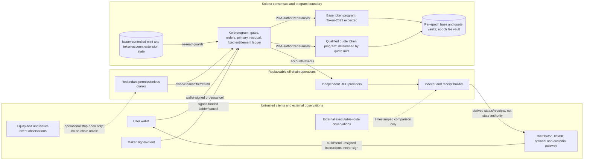
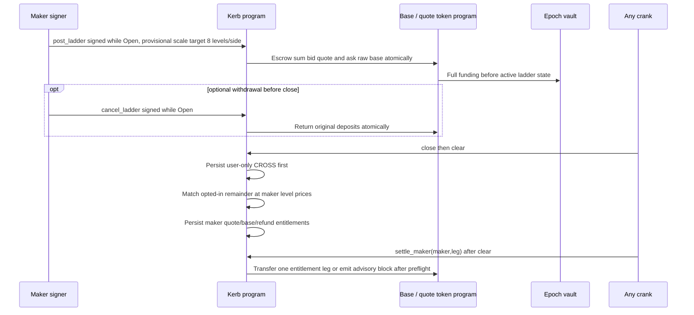

# Kerb system architecture — current reuse and retained public-Solana proposal

Status: **Shared-library docs direction adopted 2026-10-01; implementation/packaging Proposed.** Financial/private candidate remains unapproved; retained public-Solana design below remains owner-review material, unimplemented and unbenchmarked.
Owner role: **Solana protocol architecture design lens (not a credential or sign-off)**  
Date: historical public-Solana record 2026-09-28; shared-library authority update 2026-10-01.
Evidence legend: **P** primary, **S** secondary, **I** inference, **U** unverified; facts marked **U** are unverified. [INFERENCE] identifies design decisions not proven in production. [`../00-CANONICAL.md` §0](../00-CANONICAL.md#0-current-documentation-authority) records current docs authority; its retained §§1–6 and [`../mechanism/01-MECHANISM-SPEC.md`](../mechanism/01-MECHANISM-SPEC.md) govern only the historical public-Solana proposal below.

## Current shared-library direction — adopted docs only, 2026-10-01

[Zoss shared native core](../../../../../../zoss/docs/ARCHITECTURE.md#31-shared-native-core) supplies reusable source/context/domain/auth and Solana client modules; [Kerb consumer contract](../../../../../../zoss/docs/kerb.md) defines the consumer seam. Its native `protocol` / `zcash` / `chains` / `runtime` responsibility map and separately built target-safe Solana **message** contract remain Proposed packaging, not Kerb scaffold or supported runtime. Kerb can consume the library modules without the optional message runtime/contract, IVK watchers, receipts/quorum, unsigned message authoring or a Zoss daemon. No current imports or tested integration are claimed.

| Reused module responsibility | Kerb-controlled consumer / retained authority |
|---|---|
| Source acquisition/parse/decrypt with coherent pinned upstream Ironwood/v6 cohort | Kerb scanner process supplies its own viewing capability; returns private `SourceObservation`, never funding or accepted-history proof. Kerb binds claimant/receiver/occurrence, canonical-history/reorg policy, controlled unallocated inventory and durable credit dedup before credit. |
| Context/domain/canonical authorization primitives | Kerb defines funding/order/hold/epoch/intent schemas, roster/state versions and policy. Standard wallet/Solana Ed25519, Arcis SHA3-512 certificates and native FROST spend domains stay explicit and non-interchangeable. No generic `verified` result or universal consensus/proof engine. |
| Solana off-chain submission/inclusion/finality observation | Kerb selects exact program/method/accounts, signing/fee payer and business finality; unsigned requests and RPC observations do not authorize allocation. Kerb's escrow, FAA/MPC, journals and monetary replay remain app-owned. |
| Optional message profile/runtime | **OFF / non-money diagnostic only**; separately approved watchers could add viewing access, never spending/credit/payout/refund authority. Money happy/fault flows must work without watchers/receipt/runtime. |

Data/key flow is **Kerb-owned viewing capability → shared source library inside Kerb scanner → Kerb ownership/canonical/inventory/dedup checks → Kerb funding journal/holds → FAA/MPC → Kerb FROST/custody and two-leg settlement**. Library reuse adds no viewer or shared private daemon. Per-pair/caller private caches, source locators, IVK/FVK, note witnesses, FAA mappings and custody logs stay isolated from Ziquid, optional Zoss runtime and matcher access; common public acquisition is not permission to share decrypted state or witnesses.

The [Oct1 candidate](../docs/superpowers/specs/2026-10-01-kerb-production-demo-design.md) and [review](../docs/superpowers/specs/2026-10-01-kerb-design-review.md) remain unapproved financial/private proposals, with **GD2 structural FAIL** for public membership/singleton/own-fill probing. Shared context, scanners or opaque receipts do not repair it. [Zoss BLOCKERS](../../../../../../zoss/docs/BLOCKERS.md) is the sole core register; Kerb app gates are separate and no runtime gates close here. The remaining dated diagram/state flow is the retained public-Solana dossier, not approval to build either proposal.

## Hyperliquid product extension — documentation only, 2026-10-02

[Hyperliquid scope](../product/17-HYPERLIQUID-EXPANSION.md) adds two separately labelled paths: **Kerb P2P matching → dedicated Hyperliquid-side funding/escrow/settlement**, and **user-approved HyperCore spot order → observed venue order/fill/cancellation**. A future HyperEVM contract is a candidate for holding transferable assets; HyperCore API/CoreWriter integration is a separate external execution path, not the Kerb matcher. Neither module is implemented. HyperCore balances, HyperEVM balances and Kerb reserved liabilities cannot be treated as one spendable balance; exact asset mapping, authority and asynchronous effects must be verified before use. HyperCore execution is public, not a private Kerb fill, and it does not imply ZEC delivery. This direction neither closes GD2 nor replaces existing Solana/Ironwood custody or adds a mandatory Zoss daemon.

## Historical public-Solana components and public state

**Not the current cross-chain architecture.** The diagram and lifecycle below describe the retained tokenized-stock/USDC proposal. Its `Maker signer/client` is the liquidity owner's wallet signing funded residual quotes, not a custody signer or a required AI agent. The later cross-chain candidate has no residual-maker role. For the requested current-concept comparison, actor distinctions, user stories and implementation limits, see [Zolana concept and actor review](../reviews/2026-10-02-zolana-concept-and-actors.md).



**Trust boundary A — wallet and signing.** Users and makers authorize exact market/epoch, side, raw lots, ticks, limits, opt-in, nonce and economic owner. Settlement/refund destinations are canonical token accounts fixed by the entitlement, mint and token program, never caller-selected. Gateway/SDK must not have custody, order amendment, pooled signing keys or discretionary price selection. A distributor reference is an address for fee accounting, not an endorsed counterparty or compliance credential. Orders and maker ladders are visible on-chain before close; this system does not conceal them.

**Boundary B — program and token programs.** Only program code/upgrade authority controls the auction algorithm; its PDA controls the epoch vaults but not issuer-managed mint authorities. USDC's mint owner determines `quote_token_program`; the base mint's qualified owner determines `base_token_program`. Transfer success also depends on issuer pause/freeze/delegate policy. Any base or quote mint carrying `TransferHook` is refused at market creation in V1, whether its hook program is set or unset. [INFERENCE] A mint without the extension cannot gain it later under Token-2022 initialization rules; re-verify against the exact token-program version. Hook support requires a future reviewed, audited amendment. An issuer freeze can block even a RefundOnly withdrawal, so liveness cannot be promised regardless of crank redundancy. Only a precisely qualified extension profile is permitted ([`05-TOKEN-2022-ISSUER-INTEGRATION.md`](05-TOKEN-2022-ISSUER-INTEGRATION.md)).

**Boundary C — off-chain services.** Cranks submit candidates; `clear` verifies any sorted-permutation hint and computes its own price/allocation. RPC, indexer and gateway data are observations; recipients can read canonical epoch accounts directly. Reported equity halts are observable only off-chain; the team's crank avoids opening new epochs while a halt is reported, but halt sources, treatment of an already-open epoch and notification are open (canonical §3.9), not enforceable on-chain in V1. An external route quote does not define `p*` or an execution entitlement. Reorg/commitment differences must be displayed as pending vs finalized rather than silently converted into fills ([`06-OFFCHAIN-SERVICES.md`](06-OFFCHAIN-SERVICES.md)).

## State and data flow

An authorized market snapshots an exact mint, its program and issuer-sensitive fingerprint, quote mint/program, raw lot size, quote tick size, guard interval and epoch cadence. Provisional scale targets are 64 user orders per epoch and 8 levels per side × 4 makers, pending LiteSVM/SBF CU and transaction-size benchmarks; hackathon MVP bounds are ≤8 user orders, 1 maker, 1 level per side. Each epoch has bounded orders, funded signed maker ladders and token-program-owned base/quote vaults controlled by an epoch PDA. Order placement or ladder posting **atomically** transfers the original raw deposit; a reverted CPI creates no order. Quotes and fills use checked `u128` arithmetic, then checked `u64` token-transfer conversion. The base mint may apply Scaled UI Amount for display, never to escrow accounting.

At `open_epoch`, `close` and `clear`, the program re-checks both mint extension/authority fingerprints: an opening mismatch blocks new epochs pending requalification, a mismatch before clearing an existing epoch sends it to RefundOnly, and a post-clear mismatch preserves results and `settle_*` subject to freeze/pause/recipient preflight but blocks further openings until requalification. At close, the program also reads time guards and per-epoch vault balances against **outstanding entitlements**; if safe, it closes admission. At clear, it sorts orders (or verifies a sorted hint), sweeps distinct submitted limits in O(n log n), or O(n) after hint verification, and finds the user-only CROSS maximizing interval on integer ticks. Its marginal-plateau midpoint `p*` is the half-even midpoint of `[p_lo,p_hi]`; with no cross all three are absent. It allocates deterministically, then separately consumes maker ladders against opted-in unfilled user remainders. `clear` stores fixed base, quote and fee entitlements backed by recorded funded amounts; neither solver nor admin supplies a fill. Excess unsolicited direct deposits are quarantined, neither fee nor claim; sweep authorization remains open (canonical §3.9).

A quote fee entitlement is reserved inside the funded quote ledger; transfer to the epoch fee vault and distribution by fixed floor shares are permissionless and accounted exactly once when solvent. Which caller earns the settlement-crank share and how that claim is recorded remain open (canonical §3.9). Each `settle_*` or `refund` pays at most one recipient leg per instruction, split across transactions. Its deterministic preflight examines the entitlement-fixed vault, mint and recipient canonical token account for vault/recipient freeze, mint pause or missing/closed recipient. Wrong destination, mint or program hard-reverts without recording a block. A preflight obstacle succeeds without transfer, emits `SettlementBlocked(reason, leg, slot)`, retains an `Unpaid` entitlement and stores an advisory, non-sticky reason; it gates nothing. The first later preflight-passing call with a successful transfer marks the leg `Settled`; a missing canonical account may be recreated permissionlessly. An unexpected failing token CPI rolls back and leaves the entitlement retryable; crank/indexer surface it as an off-chain incident. Details and account layout are in [`04-ONCHAIN-PROGRAM-DESIGN.md`](04-ONCHAIN-PROGRAM-DESIGN.md).

## Lifecycle sequences

```mermaid
sequenceDiagram
    participant W as User wallet
    participant P as Kerb program
    participant T as Leg-specific token program
    participant V as Epoch vaults
    participant C as Any crank
    W->>P: open order signed: exact market/epoch/lots/ticks/nonce
    P->>P: Verify Open, market profile, bounds, nonce, fee reserve
    P->>T: Transfer exact raw quote (bid) or base (ask)
    T->>V: Deposit; atomic with order creation
    W->>P: cancel signed, Open only
    P->>T: Return original deposit from epoch vault
    T-->>W: Fund transfer before cancel bit commits
    C->>P: close at/after close_ts
    P->>P: Fingerprint, multiplier, per-leg solvency; Closed, RefundOnly, or Impaired leg
    C->>P: clear before deadline with optional sorted hint
    P->>P: Verify guards/hint, compute CROSS then RESIDUAL, store fixed entitlements
    P-->>C: Cleared result, RefundOnly ordinary guard, or Impaired leg on shortfall
    C->>P: settle_order / settle_maker (one recipient leg per ix; split transactions)
    alt preflight safe and CPI succeeds
      P->>T: Exact entitlement transfer; paid bit commits
      T-->>W: Base/quote payout or unused deposit
    else deterministic preflight obstacle
      P->>P: Emit SettlementBlocked(reason,leg,slot); Unpaid; advisory marker only
    else per-epoch vault shortfall
      P->>P: Impaired(leg), VaultShortfall; stop that leg, preserve claims
    end
    C->>P: If pre-clear RefundOnly: refund_order/refund_maker (one leg per ix)
    P->>T: Refund original deposit where token rules allow
```



The depicted user-side `refund` is only the **pre-clear RefundOnly** path. A post-clear unused deposit is a fixed entitlement and goes through `settle_*`, never RefundOnly.

Production eligibility is **BLOCKED**: no exact mainnet xStock or other issuer mint has passed the allowlist. Any demo market uses a test mint labelled **SYNTHETIC**; this architecture does not imply eligibility of any named xStock. See [`05-TOKEN-2022-ISSUER-INTEGRATION.md`](05-TOKEN-2022-ISSUER-INTEGRATION.md).

## Actor powers and limits

| Actor | Can do | Cannot do |
|---|---|---|
| User owner | Sign/pre-fund an order; cancel and reclaim while Open; opt in/out of residual per order; read direct chain state; invoke anyone's permissionless settle/refund | Amend a live order; settle at a price worse than signed limit; unwind an already-cleared trade; change someone else's fixed entitlement |
| Maker owner | Sign/pre-fund ladder; cancel/reclaim only while Open; choose next epoch's offered levels | Last-look, withdraw after close, set primary `p*`, use a quote without escrow |
| Crank / distributor / RPC / indexer | Submit valid lifecycle calls, offer UI and derived status, provide fee payer | Substitute a result for program computation, change signed limit, force recovery under issuer restriction, claim an off-chain halt as on-chain verified |
| Governance multisig with timelock | Pause **new** orders, add qualified markets, upgrade program subject to published process | Move vault funds via an admin withdrawal, edit stored clearing result, block refund as a designated admin function; upgrades remain a code-governance risk |
| Issuer / mint authorities | According to mint privileges, pause/freeze or change UI multiplier; a permanent delegate could transfer/burn vault assets but such a mint is refused in V1. A mint carrying `TransferHook` is also refused regardless of hook-program setting. | Change `p*` directly through Kerb's cleared state or erase an already-stored Kerb nominal entitlement; token authority can nevertheless immobilize assets |

## Failure boundaries

| Failure | Observable handling |
|---|---|
| No opposite user order | CROSS volume zero; after storing that result, eligible residual may trade; without funded maker interest deposits return via cleared entitlements while solvent. |
| Missing close or clear transactions | Any caller may retry. If no clear by `clear_deadline_ts`, pre-clear `RefundOnly` permits refunds of original deposits where transfer is allowed; a shortfall instead stops the affected leg as `Impaired`, leaving nominal claims equal to original deposits, possibly unrecoverable. No admin action is needed to trigger, but issuer/token restrictions can prevent completion indefinitely. |
| Wrong sorted hint / stale RPC / fork | Hint fails without partial clear. Re-fetch confirmed state and submit correct hint; finality-aware indexer reconciles rollback. Do not manufacture a fill from a pending log. |
| Mint hash or multiplier guard fails before clear | `RefundOnly` if solvent; block opening new epochs until qualified review. Where issuer freezes vault, refund transfer itself can remain impossible. |
| Transfer or vault balance blocked after clear | Fixed nominal ledger remains. Deterministic preflight records an advisory, non-sticky `SettlementBlocked` on the entitlement-fixed canonical recipient without paying; wrong destination/mint/program hard-reverts. A shortfall records `Impaired` and stops payouts from that leg, preserving the other leg. Unexpected CPI error reverts and is an off-chain incident. No post-clear RefundOnly or automatic redistribution. |
| Off-chain halt or route service unavailable | Stop the team's open-epoch crank/gateway placement, show report and source timestamp; users can cancel while Open. There is no on-chain halt oracle or automatic source of executable external prices; full halt policy remains open (canonical §3.9). |
| Program upgrade | Code authority is a multisig with timelock; a future upgrade could alter future behavior. No assertion of immutable/audited deployment; prospective freeze of settlement core requires separate review. |

Unsolicited-surplus quarantine/sweep and settlement-crank fee attribution likewise remain open policies, not implemented resolutions (canonical §3.9).

Issuer/legal market qualification and demand validation are release blockers, not solved by this component diagram. See [`../security/07-THREAT-MODEL.md`](../security/07-THREAT-MODEL.md) and [`../legal/09-REGULATORY-AND-LEGAL.md`](../legal/09-REGULATORY-AND-LEGAL.md).
