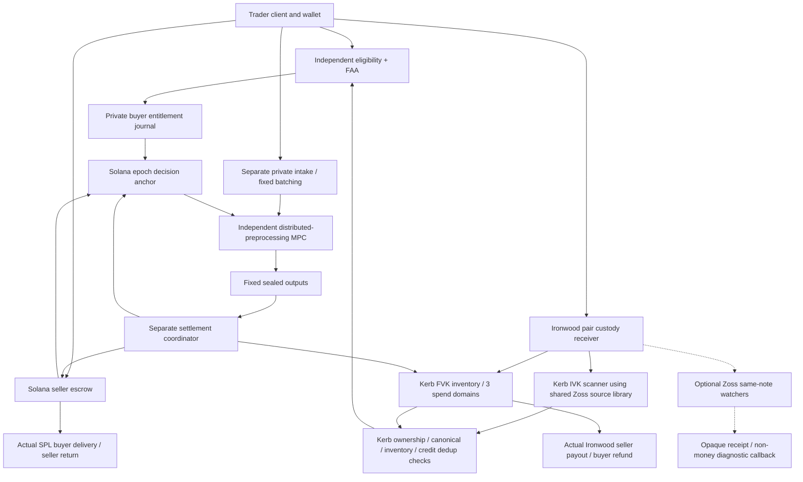

# Kerb — integrated production-demo architecture and workflow

**PROPOSED FOR OWNER REVIEW · 2026-10-01 · design, not implementation or production readiness.** User requested one complete architecture/workflow using recommended or alternative choices to expose design defects, with Zoss consumer requirements in [kerb.md](../../../../../../../../zoss/docs/kerb.md). This integrated **financial/private candidate remains unapproved**: no permission to build/deploy/sign/send/fund/publish or replace the legacy financial dossier. No running Kerb system, actual independent roster, audit, lawful operating cohort or demonstrated privacy guarantee exists in the reviewed workspace. P = source statement; I = proposed design/derived requirement; U = unavailable evidence. Unless marked P, financial requirements below are I, not observed results.

**Review verdict:** one complete candidate workflow is specified below, but adversarial review found a **structural privacy failure for a permitted singleton/attacker-probing epoch** (§6, GD2). Consequently it is **not a viable private funded production-demo release under the unchanged unconditional requirement**. This failure needs a validated redesign or explicit owner scope decision; the corrected accounting/authorization policy and source-level SDK facilities must not be mistaken for resolving it. [Full design findings](2026-10-01-kerb-design-review.md).

**Separate adopted documentation decision (2026-10-01):** [current Kerb authority](../../../00-CANONICAL.md#0-current-documentation-authority) adopts **Zoss shared native libraries** for source/context/domain/Solana client reuse inside Kerb-owned processes, without required Zoss message runtime/watchers/receipts/quorum or an added viewing party. This update changes that dependency direction only; it does not approve this candidate's FAA/MPC/custody/financial selections, close GD2 or authorize a privacy waiver. Package choices remain Proposed and no code/dependency is added.

## 1. Intent, scope and meaning of complete demo

The owner's unchanged thesis is ONE native Solana↔Zcash spot-market architecture, THREE isolated candidate pairs, and no individual matching operator/control domain able to read order plaintext OR participant identity linked to an accepted order. Committee-custodied shielded ZEC is the accepted research trust model: non-atomic, quorum-dependent refund, possible theft/indefinite lock. These are not claims of global anonymity or trustless settlement. [Prior proposed thesis](2026-09-29-kerb-zolana-design.md) and [full blocker research](../../../../zolana-research-2026-09-30/README.md) preserve decision history; this financial candidate changes conflicting *financial design recommendations* only if separately approved. The shared-library docs decision is adopted separately, not replacement of the historical dossier.

**Production-demo target** means a complete, real integration on **Solana devnet + Zcash Ironwood testnet**, with actual client, private admission, independent MPC execution, durable journals, actual synthetic SPL custody, native testnet ZEC threshold spends, two-leg observations, unused refunds and restart/fault recovery. Not a UI mock, plaintext simulator renamed MPC, fake balances, or mainnet/real-asset launch. No transaction is authorized now. Local model exercises below prove state-policy properties only, not this target's readiness.

First configured market is one exact **synthetic legacy SPL Token mint**, with disclosed mint/freeze authorities for fault demonstrations. Keep USDC/ZEC and exact qualified xStock/ZEC as separately gated future profiles; no pooled credit, control keys or inventory across pairs. Do not replace Ironwood with a wrapped token or transparent ZEC to make the demo easier.

## 2. One selected architecture, not unresolved menu

| Decision | Selected candidate for this design | Consequence / remaining evidence |
|---|---|---|
| Matching | Fixed eight-slot uniform-price maximum-lot call auction; zero protocol fee; no residual maker/oracle/amendment/min-fill. | Eight is a bounded demo design, not a capacity benchmark; raw lot/tick/range constants in versioned manifest. |
| Admission | Independent **Funding Admission Authority (FAA)** privately verifies client ownership, exact signed order and funding hold; certifies the SAME bounded order consumed by MPC. | Deliberate alternative to inventing a complete blind-token/ZK adapter. FAA sees order+identity; must be genuinely outside every matcher access/control domain. Owner review of this privileged role required. |
| MPC | Arcium Cerberus candidate, distributed preprocessing, three separately controlled matcher domains; trusted-dealer path disabled in approved demo configuration. | Pin actual compatible components/config/startup logs, recovery peers/migration/program authority and callback output validation; names/keys alone do not prove independence. |
| Input transport | Separate intake/batching operator, one-use client encryption/result keys, fixed eight encrypted slots including certified padding, shared relayer payer not participant payer. | No wallet account/login/session identifiers in matcher-facing transport; active/public timing and funding/output attacks remain a hard privacy gate. No claimed anonymity from padding. |
| Outputs | No public exact clearing price, side/quantity/per-order mapping; fixed encrypted results to participants and separately controlled settlement coordinator. | Participant gets own fill/price; coordinator/FAA can see privileged terms. Ordinary SPL transfers still public; later linkage must be attacked. |
| Epoch decision | Solana epoch-control record is canonical COMMIT/FINAL/ABORT/FIRST-LEG decision anchor; private buyer journal durable serializable with fencing, NOT a distributed atomic DB+chain transaction. | Prepare holds first; finality observed before freeing. Fail closed on unknown journal/chain state. |
| Custody | Three independent spend domains, 2-of-3 FROST native spends; separate Solana Ed25519 authorizer keys; unanimous three-domain business-decision acknowledgements for epoch/refund state. | 2-of-3 signing does NOT provide Byzantine ledger consensus. Unanimous policy sacrifices liveness if one offline; no claim corrupt spending threshold cannot steal. |
| Settlement | SPL-first, one concurrent fill, then exact ZEC payout from already reserved buyer credit; observe finality independently. | Seller explicitly bears non-atomic ZEC withholding/reorg loss absent separately funded compensation. No atomicity/automatic recall. |
| Refunds | BOTH seller SPL and buyer FULL max-debit encumbered before acceptance until final allocation or safely fenced irreversible epoch abort. | Timeout, zero fill reservation, Zoss delivery failure or ledger restart never frees accepted buyer backing. Disjoint unused claims persist through note→change. |
| Zoss shared core / optional messaging | Adopted docs direction: source/context/domain/auth/Solana client library modules run inside Kerb-owned processes; no required Zoss daemon, new viewer, watchers/receipts/quorum or message runtime. Optional same-note diagnostic is **OFF / non-money**. | Observation must pass Kerb claimant/ownership/canonical/inventory/durable credit-dedup before credit; message delay/reorg/rotation cannot credit/unencumber/pay/refund. [Consumer contract](../../../../../../../../zoss/docs/kerb.md) and [sole core register](../../../../../../../../zoss/docs/BLOCKERS.md) retain separate readiness; no library or app runtime pass implied. |
| Software shape | Rust client-facing protocol/ledger/coordinator/signing services and Solana program; Arcis/Anchor where required; TypeScript browser client. Postgres transactional private ledger, bounded workers. | Language/storage selection is design only; reuse vendor/runtime primitives, no generic bridge/plugin/event-bus framework required. |

### Alternatives rejected for this candidate

Blind anonymous issuance/full ZK funded relation remain research alternatives if FAA's disclosed view is unacceptable or unavoidable metadata links persist. They are not required to pretend this selected workflow exists. Single-operator MPC, direct participant-paid ciphertext enqueue, maker-visible RFQ, default public price, transparent HTLC, wrapped ZEC and funding via Zoss receipt do not silently replace the selected owner requirements. Choosing this FAA alternative does not permit a matcher to become FAA or read its logs.

## 3. Components and actual trust/control boundaries

| Role | May learn/control | Must NOT be available to one matcher |
|---|---|---|
| Client | Own identity, order, funding references, signing/encryption/result secrets. | Wallet key/signature/source address/IP/session sent as matcher plaintext. |
| Eligibility + FAA | Participant identity/eligibility, signed order, custody/escrow mapping, certified max debit, hold and refund destination. | Credential issuance logs, canonical certificate plaintext, identity/order index, shared administrator or audit export. |
| Private intake | Request transport/IP unless anonymized, encrypted slots/availability receipts; can censor before receipt. | Request→slot map, timing/session databases, participant account login. Distinct intake and FAA operators proposed; no sharing with matchers. |
| MPC operator | Encrypted inputs, one node's share/protocol view, public epoch/domain and full PUBLIC chain/transport data. | FAA/custody/result plaintext, intake mapping, recovery/upgrade ability to obtain all keys/shares. |
| Kerb source-library consumer | Kerb scanner-owned IVK and private source acquisition/decrypt/cursors; Kerb canonical context and inventory/claimant checks. | No additional shared viewing party, IVK/FVK daemon, cross-app private cache/witnesses or logging. Observation is not funding authority; matcher must not access scanner/claimant maps. |
| Custody + coordinator | Private note/value/claimant/order/result/payout/refund mapping needed to act; spend policy/authorities. | Plaintext exports/debug/support/admin access crossing into matcher. Disclosure is privileged settlement view, not globally private trading. |
| Solana program/public observer | Synthetic mint, vault/source/destination, transfer atoms, epoch decisions, public replay guards, timing. | No private ZEC occurrence/FVK/IVK/certificate/order identifier mapping published by default. Public join/inference can still defeat matcher privacy. |
| Optional Zoss watcher/public receipt | If separately enabled, watcher has private same-note provenance; public opaque receipt/route/app key/nonce/callback/timing. | **OFF / non-money** by default; no viewing handoff is required by libraries. Matcher-controlled watcher/IVK mapping or FAA per-user diagnostic key fails privacy; no credit authority. |

Actual named operators/legal/hosting/admin/backups/RPC/telemetry/support access must be supplied and tested; three containers owned by the developer are one domain. Local multi-process execution reports simulated independence, never fulfills funded privacy gate. Legal restrictions and user's original content+identity requirement are conjunctive release conditions.

## 4. Records, domains and certificate/input consistency

Common canonical domain includes schema version, Solana cluster+program, exact mint+token program, Zcash network+Ironwood pool, market version/receiver policy, epoch, rules hash, authority roster versions. Integers are raw SPL atoms/zatoshis with explicit upper bounds; all products/sums checked in u128, transfers checked to u64. Network fees from separate operator inventory; user credits never silently pay them. Solana transaction size/CU and Zcash dust/actual fee policy measured before any authorization.

Common Zoss protocol primitives may encode/bind that explicit context and authorization; **Kerb owns every schema, algorithm choice, registry/roster and application predicate**. `SourceObservation`, optional `QuorumAcceptedMessage` and DEX app-owned `VerifiedSettlementFact` are distinct outputs, not a generic `verified` boolean, trust-level ordering or proof-to-quorum conversion. No universal consensus/proof engine is introduced; direct app proof paths do not need a message receipt.

| Record | Required relation / owner |
|---|---|
| Private FundingClaim | Stable source occurrence `(network,pool,txid,action_index)` + matched cmx, chain canonical context separately; claimant authorization; confirmed unallocated custody inventory; exact credit amount. Change doesn't generate another claim. FAA/custody only. |
| Order | Domain, side, q, limit, lot/tick profile, max debit/fee cap, client nonce/expiry, committed payout/refund destinations, one-use authorization/result keys. Client signs exact encoding; FAA verifies ownership and standard wallet signature off-chain. |
| AdmissionHold | Stable business entitlement ID, order commitment, private funding/escrow reference, max debit, epoch, state version, lock/fence generation, authority/rules versions, pending/accepted/allocated disposition. Private journal owns buyer portions; Solana owns seller state. |
| FAA certificate | Domain/rules/epoch, canonical order commitment, maximum held debit, signed hidden order fields or digest of those exact fields, hold ID+generation, client one-use authorization/result keys, destinations and certificate expiry. FAA signs only after durable prepare; certificate validity alone is NOT irrevocable accepted funding. |
| Encrypted MPC slot | SAME full certified order + certificate + hold generation + client possession authorization + valid/padding flag. MPC recomputes digest from decrypted-in-MPC fields and checks signature/authorization/ranges before allocation. Independent prepare/root evidence binds exact slot digest. |
| EpochControl | Immutable accepted ciphertext root, prepare decision digest and roots of both prepared hold sets, rules/circuit/config versions; monotonically fenced phase, final result commitment, activation/result digest, first-leg flag, abort marker. Public commitments MUST be randomized/proper hiding where dictionary attacks reveal private values; do not hash identifiable raw maps and call hidden. |
| FinalAllocation | Exact input/root/rule binding, q/price/notional/fill limits, unique trade decisions, seller holds+buyer max debits, disjoint unfilled/slack amount, recipients and payout-policy version. Sealed to independent coordinator plus individual sealed openings to clients. |
| PayoutIntent | Exact trade/portion, prior state+version, frozen recipient/value/change/fees, expiry, canonical SPL release evidence, selected native PCZT/effects/sighash; durable transaction identity before signer nonce use/broadcast. |

**Selected certificate scheme is a capability relation, not a crypto claim.** Arcis's documented signature primitive uses SHA3-512 (`ArcisEd25519`), NOT ordinary RFC8032/Solana Ed25519. FAA wallet verification and Solana authorizers use standard Ed25519. For FAA's private-MPC certificate select the existing vendor TypeScript [`@arcium-hq/client.arcisEd25519`](https://ts.arcium.com/api/client/variables/arcisEd25519) signing primitive, matched to the pinned Arcis encrypted verifier; no custom Ed25519 variant or blind-signature cryptography required. Keep separate keys/domain, canonical vectors and independent review; source/API existence is not Kerb interoperation evidence. Never pass standard signatures to Arcis and report success or expose certificate/order plaintext merely to validate outside MPC. The actual certificate encoding/circuit and composite client/certificate verification remain U; their absence blocks the integrated demo. This design chooses a testable private predicate rather than inventing a drop-in ZK proof.

For the selected demo relation, client proves possession of its one-use authorization secret inside MPC by recomputing `SHA3-256("Kerb/client-possession/v1", domain, secret)` and comparing with the commitment certified by FAA. The secret travels only in the client-encrypted tuple; FAA certifies the commitment after checking the client's standard wallet authorization, never receives that possession secret. Ciphertext copying is rejected by hold/order uniqueness and cannot redirect a result/destination; changing either field invalidates the FAA certificate. This avoids an unspecified native-wallet signature circuit, not a substitute for audited transport/encryption or proof against a compromised client. Canonical hash preimage, lengths and fixed integer encodings require vectors; no public secret, identifying wallet signature or certified plaintext as verifier shortcut.

Certificate/slot/result outputs may reveal nothing privately identifying to a matcher: use exact fixed-size inputs and fixed ciphertext outputs. Accepted set validation rejects duplicate hold/order/certificate ownership, invalid padding, stale generation, wrong root/rules/epoch or insufficient held max debit. Querying current private hold status is performed through independent authority decision certificates, not a matcher database join. An FAA compromise can falsely fund/authorize; independent hold/custody checks catch factual mismatches under honest policy, not colluding authorities.

**Encrypted input size is an explicit engineering gate, not assumed to fit one transaction.** The [vendor input example](https://docs.arcium.com/developers/js-client-library/encryption) read2026-10-01 serializes each encrypted primitive as32bytes; full order/certificates multiplied by eight can exceed1232bytes before results. Select generated `Pack<T>` plus fixed-count bounded ciphertext uploads into program-owned versioned epoch-input accounts; independent batch relayer pays, no participant payer. Pin index/count/offset/length/digest, upload authority and immutable sealing; no computation until SAME-root inputs all present. The pinned [arcium-anchor0.15.0 ArgBuilder](https://docs.rs/arcium-anchor/0.15.0/arcium_anchor/struct.ArgBuilder.html) has `account(pubkey, offset, length)` and [source](https://docs.rs/crate/arcium-anchor/0.15.0/source/src/arg_builder.rs) encodes AccountArgument—an actual source-level account-read facility, not an invented off-chain input channel. Queue ONLY checked sealed account references and exact parameter layout; reject overwrite, conflicting chunks, wrong account owner/offset/length, prior-generation replay and partial sealing. Runtime decode/layout/root binding and maximum queue/CU/account size remain unmeasured and must pass before enabling8slots; never silently drop certificate checks. Outputs use authenticated fixed-size extraction computations against immutable final encrypted book/result account, each callback bounded to one transaction; full result finalized only after every selected fixed chunk authenticates SAME finalized computation/state/result generation. Don't assume multi-tx callback feature enabled: pinned source rejects `num_callback_txs != 1` without its explicit feature. Digest by itself authenticates neither output signer nor retrieval availability.

Three distinct commitments MUST NOT be conflated: `Rct` is the root over exact ordered sealed ciphertext accounts/bytes, encryption owner/nonce, slot index, fixed layout/length and generation; `Cholds` is a randomized **private-opening** hiding commitment to exact prepared entitlement membership/versions; `Corder` is the FAA-certified canonical plaintext-order commitment recomputed INSIDE MPC from the tuple actually allocated. Coordinator authenticates queue/account/Rct provenance and sealed computation context, then privately checks Corder and current holds; it cannot derive ciphertext-root equality from plaintext alone. Binding hidden holds to encrypted slots in this FAA design is explicit unanimous business-authority testimony, not a ZK equality/funding proof. Hiding salts for small domains are private, not public nonce masquerading as entropy. On-chain actual prepared escrow membership still public; hiding Cholds does NOT remove the structural privacy case in §6.

**Output-owner authorization is mandatory:** epoch manifest pins the coordinator encryption key+version and permitted recovery policy; queued computation and EVERY extraction authenticate that exact owner. Whole-book output NEVER uses arbitrary caller-provided Shared/input.owner, client result key or a matcher-owned key. Each private client output uses ONLY that slot's FAA-certified one-use result key. Replacement/migration/rekey is a separately authorized versioned incident transition; unavailable pinned key cannot trigger reveal-to-public or caller-selected recipient fallback. This prevents a relayer with a valid input root from exfiltrating the whole book by substituting an output encryption owner.

## 5. Symmetric entitlement accounting and admission protocol

### 5.1 Partitions and invariants

For every unique buyer credit C (demo protocol fee zero):

`C = available + admission_prepared + epoch_encumbered + seller_payout_outstanding + buyer_unused_outstanding + seller_payout_final + buyer_refund_final`.

Every category is disjoint; pending refunds stay buyer-unused-outstanding with substate InFlight, pending payouts stay seller-payout-outstanding. Inventory note selection/change is a separate ledger; do NOT count original inputs plus pending change twice. Unclaimed/unconfirmed/reorged assets are not another confirmed credit. Fee/loss operator capital tracked separately, never included as user credit/revenue.

Seller atoms similarly partition `available/locked + admission_prepared + epoch_encumbered + filled_outstanding + final_unfilled_returnable + released + returned`. Prepared/encumbered/fill/refund states include generation fences and mutually exclusive transitions. Every entitlement **unit/portion** at most one reservation; disjoint filled+unused portions can coexist. A whole credit need not have just one reservation after final allocation.

`released/returned` in the private conservation equation mean observed FINAL recipient effects, not just a successful program CPI/status. A canonical SPL transfer awaiting finality is exclusively attributed to its own outstanding claim, no longer simultaneously spendable in the vault. ZEC backing similarly partitions controlled spendable notes, exclusively locked live inputs, and provisional approved recipient/change effects: observe canonical input consumption before replacing input entry with recipient+change, never double-count both. Provisional change cannot fund/refund another portion until controlled+witness-ready and policy-confirmed. In-flight recipient effect backs ONLY its own pending payment, not new available custody value. Existing claims persist during reorg/ambiguity, but unavailable backing halts new activation/sends and reports impairment; credit conservation alone does not prove spendable solvency.

**Funded accepted membership is a promise to keep the FULL max-debit held through matching resolution**, not a one-time balance check. Pre-root admission_prepare already holds it. Even zero Fill records, slow MPC, client expiry, unavailable relay or phase restart does NOT free that accepted buyer backing or allow a different order to use it. Any surplus outside the declared held max debit may remain available only if disjoint and no accepted order can debit it.

### 5.2 Prepare/commit without fictional cross-system atomicity

1. Validate funding+eligibility+order privately; reject pending/insufficient/reorged/wrong-domain assets before prepare. Confirm actual source/pool/note+separate inventory ownership/spendability, or exact SPL locked atoms.
2. FAA requests a buyer max-debit hold using a serializable transaction+unique hold generation; custody business-decision domains all acknowledge the same durable journal version. Seller prepare is an actual escrow transition referencing epoch and commitment; once prepared, ordinary withdrawal/cancel is disabled pending canonical disposition.
3. Only after both applicable per-order hold evidence and ciphertext availability are durable does client get an admission receipt. An order uses its OWN leg, not complementary buyer+seller funding requirement before peer matching. Receipts may be pending until canonical commit; state UI never labels pending as executable.
4. At cutoff, accepted root references exactly available prepared orders. Three business-decision domains sign identical domain/epoch/root/prepare digest. `commit_epoch` checks authorized identical signatures, actual seller prepared aggregate bounds and immutable/fresh epoch state; private buyer journal confirmation is a TRUSTED attestation. Observe finalized canonical commit before `Prepared → EpochEncumbered`. Delayed local acknowledgement cannot make prepared buyer value refundable.
5. Submission crash/unknown root means **hold+recover**, not free. If no commit at cutoff, an explicit canonical finalized irreversible ABORT or immutable committed-set exclusion is required, including proof no later stale commit can succeed. Deadlines alone don't supply that proof. Excluded orders release only after the frozen final membership excludes them; equivocated membership is Disputed.
6. No prepare receipt/root → no computation. No root-consistent, well-funded, eligible slot certification → no executable results. No acceptance certificate means local simulation only. Idempotence key binds `(deployment, market/pair, epoch, stable entity/hold/portion/intent ID, monotonic generation, prior version, transition)`—not a per-hold generation shared by distinct orders. Freeze order/certificate eligibility and expiry decision at canonical admission cutoff; delayed MPC neither rechecks it against wall-clock to mutate accepted membership nor frees backing. Expiry blocks NEW admission; release/native transaction expiry separate. Retain consumed business IDs/terminal epoch markers through roster rotation, restore and account closure; generation never reused (ABA). Failed CPI rolls back the on-chain attempt, not private prepared value.

The canonical journal has ONE active fenced writer per market and unanimous replicated business-decision acknowledgements before monetary or epoch state changes. Transactional storage enforces unique intent/nonces and version CAS; signer replicas persist received decisions and reject contradictory transitions. Solana finalized record disambiguates canonical epoch commit/final/abort. This is conservative **fail-stop policy**, not a newly invented BFT protocol. Unavailable replica→pause; no failover that creates a new writer while prior lease/decision unresolved. A spend quorum can ignore policy and steal; threat disclosure remains.

Each unanimous acknowledgement is a signed acceptance of exact predecessor journal head/hash, writer generation, entity/portion prior version, next state and immutable effects digest, durably persisted BEFORE monetary signing. Each signer retains non-rollback high-water/used business-intent and signing-nonce history; backups cannot reset it. On restore, compare independently retained signed heads and all possibly live signed transactions/physical-input locks plus canonical decisions; missing or inconsistent retained history is `Disputed`/policy halt. Never restore three pre-intent snapshots and accept a fresh intent for the same liability. Consensus node nullifiers prevent same NOTE double spends, not double payment of one business portion from distinct notes. A signer lacking defensible non-rollback recovery evidence cannot resume issuance.

### 5.3 Final result, release and abort

MPC produces sealed allocation bound to root/rules and its output authentication. Independent settlement coordinator receives the authenticated full accepted orders, certificates, private permutation and allocations in the sealed output, checks exactly the same certified set with a separately written integer reference, and checks hold/notional/destination conservation against authority evidence. This is an expressly privileged plaintext role OUTSIDE every matcher control/access domain, not an oracle that can recompute from hidden limits it never received. It must authenticate actual cluster output, not signed-looking bytes. Finalization requires all affected allocation transitions prepared and unanimous business-decision digest. Canonical `FINAL` carries result/activation digest; private journal can finish applying exactly that result after restart. **No first-leg authorization before matching journal activation AND observed finalized FINAL decision agree**.

For each buyer max debit M and final filled notional N, reserve N for filled seller obligations; `M−N` becomes BuyerUnusedReturnable ONLY when canonical finalized FINAL selects the exact result digest, all authenticated fixed output chunks are present, all three business domains acknowledge it, and the PRIVATE journal has fully activated exactly that allocation (`AllocationActive`). Chain FINAL alone or partially applied allocation is insufficient for **refunds as well as first-leg release**. Fully unfilled buyers regain M, not a copy/new credit. Seller q splits filled atoms/final-unfilled under the SAME activation predicate. Partial unused refunds may progress while DIFFERENT fill portions remain outstanding, never the same units.

`ReserveFill`/allocation finalization records liabilities but creates **NO live Release authorization** and does not set first-leg fence. Before issuing/signing any live `Release` intent, all business domains persist `FirstLegPrepared` with exact fill/version/recipient/amount; then record its monotonic canonical fence and observe the selected finalized policy. This happens BEFORE releasing signatures to any relay. A missing ack/crash/unknown canonical outcome holds the fill; no generic epoch abort. Pre-release safe fill cancellation remains possible only through the explicitly mutually exclusive `cancel_fill` path below; a prepared/signed first-leg authorization can never be forgotten as if no intent existed.

A whole-epoch ABORT before FINAL/first leg needs definitive no-first-leg state, monotonic canonical abort fence, revoked future authorizations and acknowledged private intent state. Once a FINAL result is active, unfilled/slack portions are returnable; filled portions require separately reviewed safe cancellation protocol, not generic epoch timeout. Once any first leg is authorized/sent/ambiguous, ordinary abort is forbidden; Disputed preserves filled exposure. Loss/quorum/censorship may strand claims indefinitely. Solana can't prove absence of an Ironwood spend; honest custody policy and canonical journals—not negative Zoss attestation—govern safe cancellation.

**Selected filled-cancellation procedure for SPL-first demo:** before any ZEC intent can be signed/broadcast, all business-decision domains fence the exact fill's funding reservation as `CancelPrepared`; stop first-leg authorization generation. Solana `cancel_fill` and `release_spl` consume the SAME monotonic fill transition state, so only one can commit. Observe finalized canonical `Cancelled` with SPL still unreleased and all signers' durable journals showing no native payout intent/signature/broadcast before returning either filled portion. A submitted but not finalized SPL transaction requires authoritative finalized mutually exclusive cancellation; if release won, cancellation fails and buyer credit stays seller-payout-outstanding. Any unexpected prior ZEC signing or broadcast, missing signer journal, source/chain disagreement or finalized SPL delivery ⇒ `Disputed`, not refund. Unanimous cancellation plus program exclusion controls honest policy; a corrupt spend threshold can ignore it, which remains custody risk. This procedure terminates a pre-first-leg failed fill without requiring a fictitious Zcash absence proof or racing a live native transaction; dead quorum cannot promise recovery.

## 6. Matching rules and confidentiality of results

Take fixed available funded set on one pair/epoch. For integer ticks p over submitted limit interval: D(p)=sum buy q with limit≥p; S(p)=sum sell q with limit≤p; V(p)=min(D,S), V*=maxV. No side/V*=0⇒no cross/no price. Otherwise maximizing interval [plo,phi], price=half-even midpoint; price priority, marginal pro-rata floors, remainder via fixed accepted-index priority after an independent private batch permutation chosen **before the final root commit and not reselected on retries**. Parent candidate explicitly does not claim randomized ties fair: intake/ordering bias, splitting and small-lot remainder games must be measured. If chosen permutation can't be authenticated/fixed without identity leakage or malicious bias, matching is blocked; don't substitute public owner/slot priority.

Circuit checks signed private order/certificate, positive bounded q/limit, max debit sufficiency, exact root slot membership, client authorization and rejection of duplicates. Padding is authorized separately as zero-quantity dummy, cannot become trader-funded fill. A client cannot submit valid certificate for one tuple then encrypted different tuple. Filled buy/sell quantities equal V*, each respects its limit, no max-debit exceed, no floats or public revealing intermediate side/limit/size.

Sealed settlement output contains fixed eight certified order records (full orders/certificates/permutation needed by independent reference) plus bounded pairings and per-order allocations encrypted for independent coordinator; clients get fixed own sealed result. Coordinator therefore learns order content and payment mapping by design and must not be a matcher/control-domain member. Public callback only epoch-completion/result commitment and fixed encrypted bytes/availability record. Don't expose per-order certificate/hold IDs, client pubkeys reused across funding, or mapping ciphertext index→public escrow/fill. Split callback/availability into measured bounded authenticated chunks if entire sealed result cannot fit Solana transaction; full result finalized only once all chunks authenticate SAME computation/result digest, without freeing funds on partial callback. No hash-only mock retrieval service.

**Known structural privacy failure, not just an unmeasured attack:** the permitted padded8-slot corpus can contain ONE natural seller Alice and attacker-owned contra orders. Public epoch-bound seller escrow reveals Alice's membership; attacker subtracts its own known orders/legitimate client outputs, so padding is no independently unknown participant. If Alice's secret ask is known a priori to be6 or10, attacker buy at8 fills iff ask6. This leaks the private limit and accepted identity without breaking MPC. Thus this transparent per-seller escrow/epoch-membership candidate **does NOT satisfy the owner's unconditional no-single-matcher content+identity requirement for every permitted execution**. GD2 currently fails for that corpus, even perfect FAA separation/opaque tags/private price. Don't exempt own-result inference, add fake traders or claim k-row/1/k guarantee. A genuinely hidden collateral/membership design with compositional evidence—or an explicit OWNER-reviewed change to the privacy guarantee—is required before funded private use. The rest of this workflow is a complete candidate for safety/operations review, NOT a currently viable private production-demo release. No silent privacy waiver selected.

## 7. Complete user/system workflow

| Step | Actual demo behavior and durable evidence | Failure path |
|---|---|---|
| 1 Configure | Approved testnet/devnet manifest, exact synthetic mint/authorities, receiver/key versions, roster/control graph, rules/circuit hashes, real fees/caps/finality/health policy. | Missing manifest/pins/privacy/legal/transaction approval ⇒ no enabled funding UI. |
| 2 Enrol | Independent eligibility/FAA validates participant rights/cohort and discloses privileged view/non-atomic loss/refund policy. Client derives one-use authorization/encryption/result keys locally. | Invalid/revoked/cross-domain eligibility ⇒ reject; matcher never queries identity. |
| 3 Fund | Seller signs exact synthetic SPL lock; buyer signs native testnet Ironwood deposit to exact pair receiver with privately claimant-bound reference. Observe actual transfer/note/inventory. | Unknown recipient/amount, pending chain, bad reference, unclaimed deposit⇒quarantine; receipt delivery alone zero credit. |
| 4 Prepare | Private signed order checked FAA; max-debit/atoms durably held, certificate emitted, encrypted certified tuple routed separate intake. | Invalid certificate/ownership/amount/availability⇒no receipt/executable membership; held uncertainty reconciled. |
| 5 Commit | Freeze root at cutoff after both authority/store hold evidence; actual seller bounds plus trusted buyer attestation; canonical finalized decision observed. | Gap/omission/equivocation/late commit⇒hold until fenced exclusion/abort, never withdraw in MPC delay. |
| 6 Compute | Actual distributed-preprocessing MPC on exact certified set; versioned authenticated sealed outputs and same independent integer oracle. | Aborts/invalid slot/missing chunks/root/cert failure⇒no executable final allocation; no favorable retry with altered tie/root. |
| 7 Activate | Private prepare-allocation then canonical FINAL then matching journal activation; all amounts/hold/destinations checked. | Crash/reorg/partial apply⇒replay exact decision or dispute; no spend until both agree. |
| 8 First leg | One fill authorization verified under canonical state/roster/version; actual SPL buyer transfer finalized. | Frozen/invalid recipient/CPI error⇒unchanged entitlement; no ZEC payout; safe filled cancellation requires separate no-spend policy. |
| 9 Second leg | Durable exact ZEC payout intent, operator fee inventory, effects/sighash verified by signers, 2-of-3 spend, mined/canonical recipient effect and confirmation evidence. | Signing fail/offline/ambiguous broadcast⇒held in flight/dispute; retry exact intent only, no fresh competing payout/refund. |
| 10 Complete | BOTH observed final legs+liability reconciliation, not signature/broadcast/Zoss callback. Client sees private evidence/status; operator sees restricted audit. | Reorg removes prior confirmation⇒append correction+pause; no imaginary reversal of final other leg. |
| 11 Refund unused | Final unfilled seller atoms transferable; final unused buyer-credit portions quorum-refunded from controlled inventory/change. | Accepted/prepared/payout portions never refunded; issuer freeze/dead quorum/shortfall⇒claims outstanding. |
| 12 Recover | Restart/checkpoint replay, canonical decisions, intent nonces, note/change inventory, current authority versions, participant notices and audit evidence. | Uncertain state⇒pause new work, preserve claims, reconcile. Never blanket admin sweep or timeout rollback. |

UI shows distinct `FundingPending / HeldForAdmission / AcceptedHeld / Matching / AllocationFinal / SPLSent / SPLFinal / ZECSent / ZECFinal / Complete / RefundInFlight / Refunded / Disputed`. Only action-specific actual evidence permits statuses. Display testnet/synthetic and raw/display units, fee sponsorship, privileged data viewers, irreversible risk and blocked refunds. Do not display the entire participant/order or funding map in a public observer dashboard.

## 8. Signers, payment effects, finality and recovery

Shared Zoss source integration may run inside the **Kerb-owned IVK scanner** with its existing viewing capability; it adds no viewing/signing service or party. Kerb independently governs FVK/nullifier/witness inventory and claimant/ownership/canonical-history/credit-dedup checks, pins native Ironwood/v6/node/prover versions, pool/branch/key derivation, birthdays/checkpoints and actual canonical transactions. Caller/per-pair private cursors/cache/locators/decrypted notes/witnesses and custody logs stay isolated from matchers, Ziquid and optional message workers. FROST tool experiments with non-quantum-recoverable constructor are not production wallet qualification; real-asset gates demand maintained conformant key/recovery review. Three signer domains have separately controlled keys, authenticated effect exchange and crash-safe never-reused signing nonces. Wallet master/spend key must not secretly bypass threshold.

Before any native signature, every signer checks exact PCZT recipient/value/change/fees/network/pool/expiry and recomputes correct v6 sighash, plus SAME unanimous durable intent/portion/state generation; never opaque coordinator hash. **Intent-kind predicates differ:** `SellerPayout` requires active allocated seller liability AND exact finalized SPLReleased destination/atoms; `BuyerRefund` requires a proven returnable disjoint buyer portion (matching AllocationActive unused, fenced immutable exclusion/pre-FINAL abort or finalized safe fill cancellation), immutable buyer refund destination and no competing SAME-portion live intent/signature/broadcast. BuyerRefund expressly does **NOT** require SPL delivery: no-cross, excluded and aborted orders have none. Sponsor-only fee spends have separate non-user authority/inventory policy. Keys separate FAA/MPC/Solana/native domains. Solana verifies distinct authorized native signatures/precompile exact bytes, owners/PDA/token/current state/expiry/replay; custody signatures remain trusted statements, not Ironwood payment proof.

Pin a **DemoManifest** before enabling actual funds: max total custody exposure, max per order/fill, one concurrent fill, exact lot/tick/q/price/rent/tx-size limits, real Zcash fee/dust source policy and separate sponsor budget, deposit and payout confirmation rules/count convention, Solana finalized commitment, staleness/disagreement limits, deadline/grace inequalities, backup retention, exact role roster/authority periods. Values derived and signed after cost/fault observations and operator/tester acceptance; not guessed here as production-safe parameters. Absence of any required value disables funding, not a permissive default or fake fallback.

Finality probabilistic and chain-specific. No node's maximum reorg window equals safe customer confirmation count. Deadline before first-leg activation can trigger REQUEST to abort but not release a prepared/accepted hold without canonical irrevocable decision. After first leg, timeouts escalate dispute; they cannot recall SPL, force ZEC payout/refund, or prove no transaction will mine. Withdraw/refund, fee sponsor and reserve inventories separated, unsolicited assets quarantined, impairment stops payouts rather than first-come liquidation. Any compensation requires real independently controlled capital/contracts, not another promise signed by the failed quorum.

## 9. Zoss responsibility and interface contract

The adopted [Zoss shared native core](../../../../../../../../zoss/docs/ARCHITECTURE.md) covers actual upstream source-data integration, explicit context/domain/canonical authorization primitives and target-specific off-chain Solana clients. Its proposed `protocol` / `zcash` / `chains` / `runtime` packages and independently built target-safe Solana message contract are a responsibility/build map, **not installed Kerb dependencies or runtime support**. SDK is deferred until real operations need one; no empty packages, generic bridge/plugin/event bus, universal consensus/proof engine or shared key daemon. [Kerb consumer contract](../../../../../../../../zoss/docs/kerb.md) owns integration requirements; [BLOCKERS](../../../../../../../../zoss/docs/BLOCKERS.md) alone owns core gates and named shared-library acceptance rows. Core and Kerb runtime/privacy gates remain unclosed.

**Library flow:** Kerb-owned viewing capability → shared source acquisition/parse/decrypt → private `SourceObservation` → **Kerb claimant/ownership + exact receiver/network/pool/occurrence + canonical-history/finality + controlled unallocated inventory + durable credit dedup** → Kerb credit/holds/FAA/MPC/custody. Observation/decryption/node provenance is not source authorization validity, accepted history, spendability or proof. Reuse does not move funding/order/certificate/ledger/MPC/FROST/settlement/recovery authority into Zoss. Ordinary wallet/Solana Ed25519, Arcis SHA3-512 certificates and native FROST spends keep separate keys/algorithms/domains; common signature checks grant no monetary predicate. The Solana client returns caller-pinned unsigned requests and reconciled inclusion/finality observations; Kerb selects exact method/accounts, actor signing/fee payer and business effect/finality policy.

**Private state:** libraries run inside Kerb-controlled processes with caller-isolated viewing/signing capabilities, private cache/cursors/witnesses/DB/backup/log ACLs. No new mandatory viewer, shared IVK/FVK daemon, cross-app private store or watcher receipt mapping is created. Private note/claimant/order/result/PCZT/witness data cannot enter shared metrics/debug/support or matcher access. A separately enabled watcher would be an additional viewing boundary requiring review, not an implied library dependency.

**Optional message profile only:** retained private signed provenance binds the exact opaque public receipt digest. Public receipt has random delivery_id, destination/route/verifier epoch/app key/nonce/explicit public fields/ciphertext digest; **no default public cmx-derived ID/txid/action/block locator, source height/value/raw memo or private-observation hash**. Historical preSep30 payloads are not restored. `QuorumAcceptedMessage` is not funding credit or app proof-verified settlement; direct app proofs bypass receipts. No core money, reverse-chain or payment-effect proof is added.

Optional diagnostic workflow stays **OFF / non-money**: same inbound Kerb custody note/receiver → separately approved watcher viewing domains → current public receipt → non-money diagnostic app. Library reuse does not require this path or any key handoff. Relayer sees public body, not private source observation. Even exact receipt cannot prove claimant ownership, unspent inventory, max-debit hold, accepted-set inclusion, finalized MPC allocation, outbound recipient effect, safe abort/refund or Solana→Zcash. Matcher access to watcher/IVK logs or public diagnosis-to-order tags fails privacy. Use one operator diagnostic app identity, not participant/order app keys or public credit/hold/trade tags; opaque IDs do not erase public timing joins.

Kerb happy/fault workflows must run with the **Zoss message runtime disconnected**, even when compiled common libraries are used. Diagnostic reconnect cannot create credit, alter canonical app state or unblock a refund. Destination verification/replay consumption/non-money callback rollback is atomic only **on that destination**; retry the same immutable receipt only while its receipt/app authorization remains valid, with full verification again. This is no cross-chain payout/refund/atomicity guarantee.

Zoss's documented one-source-occurrence→one-receipt scope across routes/profiles/consumers/deployments is **unresolved**, not silently per-route or global payment uniqueness. Library data acquisition can feed private consumers without receipt fan-out. Kerb credit/hold/portion/native-intent and destination monetary replay are separate app ledgers; message epoch/key rotation cannot reset consumed financial identities. Funded app proof/evidence/witness/recovery lifetime remains independently usable through messaging revocation/library upgrades; no latest-version fallback may strand an accepted obligation.

## 10. Adversarial design acceptance and defect ledger

| ID | Explicit failure scenario | Required outcome / falsification |
|---|---|---|
| PD01 | Seller prepare succeeds, buyer journal prepare/epoch commit ack lost or chain commit unknown. | Prepared holds persist, no executable set/fill until exact canonical commit; no deadline release while stale commit possible. |
| PD02 | Accepted buyer M=34 tries refund/reassign34 while MPC delayed and zero Fill reservations; seller tries same SPL withdrawal. | BOTH reject; backing still held at identical generations. A unilateral journal reset fails. |
| PD03 | Final buy M=34,N=25; original note spent into payout+change, buyer unused9 refund alongside different seller portions. | Claims partition25seller+9buyer, no new credit from change; pending spends remain reserved; may refund final unused only. |
| PD04 | Malicious client encrypts new q/limit/destination with old valid FAA cert or reuses hold/new epoch. | Same-tuple digest+hidden signature+ownership/domain/generation checks reject before allocation, no plaintext reveal workaround. |
| PD05 | One business signer equivocates between two 2-of-3 payout/refund histories; coordinator restart sends different tx. | Policy unanimity/canonical state/durable intent prevents honest conflicting signatures; corrupt spending threshold can still steal, disclosed trust breach. |
| PD06 | Callback/result chunk partial/reordered/forged; FINAL chain decision ahead of local allocation journal. | No first-leg until exact authenticated full result + journal activation; recover same digest, no output replacement/reprice. |
| PD07 | Final settlement public recipient/amount/index/log links prior ciphertext or infers private fields. | FAIL funded privacy gate even if input encryption/certificate correct; redesign joins/output/transport, not content-only waiver. |
| PD08 | Trusted-dealer typo/default, all matcher/recovery shares accessible one admin, stale circuit/auth/backend. | Config gate FAIL, no private demo claim; pin logs/control graph and rerun real configuration. |
| PD09 | SPL-first final then no ZEC quorum/recipient error/reorg; ZEC-first comparison then frozen SPL. | Disputed loss with exact liable actor/asset; no Complete, automatic refund or atomicity claim. |
| PD10 | Expiry near broadcast, old quorum/epoch authorization, refund/cancel vs sent transaction. | No new incompatible signature/refund; sent/reserved portion held, canonical/intent fence retained. |
| PD11 | Shared-library observation repeats/re-includes/restarts; optional message arrives before Kerb checks, callback fails, rotates or stays disconnected. | Kerb ownership/canonical/inventory/durable credit-dedup still gate credit; message has zero admission/spend/unencumber effect. Same immutable still-valid receipt retry/no-locator bytes enforced; private caches/viewing/logs remain caller-isolated. |
| PD12 | Reorg/restart removes deposit or spends, two chain observers disagree, fee/dust drains sponsor. | Pause/rescan/reconcile outstanding claims and exact original intent, no credit recreation or phantom spendability; sponsor deficit not user credit deduction. |
| PD13 | Fixed8 arrays overflow/invalid padding/no cross/tie split/commitment grinding/selective retry. | Independent exhaustive integer oracle, no overfill/unfunded slot, publish bias/abort findings not fairness guarantees. |
| PD14 | Escrow issuer freeze/closed wrong-mint account/PDA/precompile offset/replay across rotation/account closure. | CPI/state rejection atomic, nominal claims preserved; no sweep/first claimant shortfall payout. |

**Defects reconciled in candidate policy:** asymmetric buyer encumbrance; whole-credit reservation exclusivity; fictional DB+chain atomicity; 2-of-3 history serialization; native/Arcis signature mismatch; signer predicate that would block no-fill buyer refunds; caller-selected whole-book output owner; partial-FINAL unused refund; operation-key collisions/expiry and restored journal rollback; stale Zoss schema. **Known UNRESOLVED structural defect:** transparent seller membership+singleton/attacker-own-result probing violates mandatory privacy (§6). **Unproven engineering:** certificate/client circuit and encoding, real role independence, immutable input/root/hiding/output transport, non-rollback journal/signing recovery, PCZT/inventory/change effects, exact runtime/cost/finality. No document or state model certifies these.

[Adversarial review and dispositions](2026-10-01-kerb-design-review.md) records F1–F7, concrete counterexamples and corrected typed predicates. F1 remains structural/open; F2–F7 have candidate-policy corrections, not tested implementations.

### Local model smoke observed 2026-10-01 — NOT integration evidence

Disposable in-memory Python model (no repository code added) executed after all document workers completed:

- **6,561 exhaustive tiny books PASS:** four slots with absent or q∈{1,2}, limit∈{1,2,3,4}; independent per-integer-tick oracle versus distinct-limit sweep; maximizing interval/endpoints, half-even price, fill-size/limit and both-side volume invariants. Example B(4,6),B(2,5),A(3,4),A(2,5) gives V=5,p=5, buy allocations[4,1],sell[3,2]. This bounds only that corpus, not arbitrary-size arithmetic/overflow/circuit fit or fairness.
- **Legacy abstract counterexample observed:** accepted root max-debit34 with no epoch hold allows refund34 during MPC delay, leaving later obligation25 backed by0. Corrected abstract policy rejected prepared/accepted refund/reuse; seller500 mirrored the hold check.
- **25 rejection cases PASS:** missing/conflicting acknowledgements; prepared/accepted reuse; FINAL without activation; missing chunks/ack/full journal; wrong result/domain/generation; duplicate refund; ordinary abort after FINAL/first leg; cancel after release/native intent or without finalized cancellation/journals; unresolved-reorg refund/Release. Also observed exact activation replay,34=25+9, no-cross refund without SPL delivery, canonical abort fence, cancel defeating late Release and five diagnostic receipt variants causing no monetary state change.
- **Abstract inventory replacement PASS:** consumed input34 replaced by exclusively attributed pending recipient25+change9, no simultaneous original input or new credit; confirmed controlled change9 becomes separately spendable. This is a toy accounting assertion, NOT observed native spend/reorg/witness usability.
- **Privacy counterexample reproduced arithmetically:** legitimate attacker bid8 yields own fills[1,0] for asks[6,10]. This supports the structural own-output inference in F1; actual public escrow/access/transport trace was not run, and the defect remains OPEN.

These checks execute newly written reference/state-policy models, **not existing Kerb implementation**. No FAA signature circuit, MPC cluster, Postgres transaction/recovery, Solana CPI, native PCZT/FROST wallet, chain finality or browser client was exercised. F4 non-rollback recovery remains a requirement, not tested behavior. No runtime or production/privacy gate passes from this smoke.

**Document checks observed:** 28 Markdown documents (18 staged dossier,6 Sep30 research,3 proposal/review specs,1 Zoss consumer) contained **348 relative file-path links:0 missing targets**. **0 trailing-whitespace hits**, excluding intentional double-space Markdown hard breaks. URL availability and fragment anchors were not checked; link existence proves no protocol property. Checks were performed with raw tool-read bytes and local path existence, without deployment or source changes.

**Current-validation boundary:** the preceding document-check counts record the earlier pass, not this cutover's current link/anchor validity. Shared-core docs and sibling repository backlinks changed afterward; the docs-only update establishes no new runtime/privacy result or recertification of those historical counts.

## 11. Operational completeness and enabled-demo gates

A production-style demo release includes actual browser client and private status, real program/scanner/circuit/wallet/nonce journal, strict manifests/configs, restricted-key custody, independent operator runbooks, exact error/retry/idempotence rules, deployment/build hashes, chain cursor checkpoints, crash/backfill/reorg restore procedure, append-only payment/credit audit, privacy-safe metrics and observable fault controls. Minimal hosting can use supervised processes and transactional DB; no Kubernetes/extra middleware requirement. Metrics aggregate/fault indicators only; no order/identity/amount/ciphertext mapping or full cert/PCZT dumps in shared logs.

| Gate | Must be observed before enabling complete integrated funded demo |
|---|---|
| GD1 Design/authority | Shared-library **docs direction only** is adopted; owner must separately review this financial/private candidate and implementation plan plus explicit setup/deployment/transaction actions. No financial legacy replacement or privacy waiver implied. |
| GD2 Privacy/certificate | **KNOWN FAIL for allowed singleton/active-probing corpus (§6), not merely unrun.** Hidden certificate runtime also U. Before funded private release, redesign publicly linkable collateral/membership AND address own-output auxiliary inference under unchanged requirement, or obtain explicit owner-reviewed scope change. FAA/coordinator privileged view needs consent; no blanket approval of other gates. |
| GD3 Independent execution | Actual independent MPC/preprocessing/recovery/FAA/custody/authorizer configuration, verified callback/circuit IDs and measured maximum fixed8/result-size behavior. Local simulated domains don't pass. |
| GD4 Symmetric holds | PD01–PD06,10,12 executed across actual DB/program crashes; no buyer or seller accepted max-debit withdraw/reuse; canonical decision and private activation agree. |
| GD5 Custody/settlement | Actual Ironwood receive/control/inventory/witness/FROST2of3 effect checks, real devnet SPL release, observed exact native payout and disjoint unused refund/change; happy+fault/restart evidence. |
| GD6 Operations/legal | Real test cohort/operator agreements, eligibility/counsel applicability, loss/limits/fees/sponsor manifest, key recovery/audit access/operator notices, independent security review. |
| GD7 Optional Zoss messaging | Only if enabling the diagnostic profile: actual core message readiness plus exact bytes/dedup/rotation/viewing/consumer privacy evidence and separate authorization. Remains **OFF / non-money** if absent; source/context/Solana library reuse does not require it. Core shared-library readiness stays in Zoss's sole register; Kerb GD2–GD6 remain independent. |

Current GD1–GD7 NOT passed. A codebase working only in arithmetic harness is NOT the requested full demo; absence of implementable private binding or independent operators means integrated demo blocked rather than mocked functionality. Real assets require additional qualified issuer/exact-mint/legal/demand/economics/audit and explicit approval; synthetic actual testnet success never inherits real-asset clearance.

## 12. Source evidence and decision trace

[P, primary pages read 2026-10-01 where marked; prior evidence dated2026-09-30 remains version-scoped]: [Arcis primitives](https://docs.arcium.com/developers/arcis/primitives) read2026-10-01, SHA3-512 signature variant/hash/RNG operations; vendor not external audit. [Arcium release/node config](https://docs.arcium.com/developers/release-notes), [node setup](https://docs.arcium.com/developers/node-setup), [program/public enqueue](https://docs.arcium.com/developers/program), [limits](https://docs.arcium.com/developers/limitations), [migration](https://docs.arcium.com/clusters/cluster-migration) read2026-09-30. These describe facilities, not Kerb compatibility.

[Protocol/custody research](../../../../zolana-research-2026-09-30/protocol-custody.md) records exact ZIP258 status/activation sources, patched Zebra6.4.2, FROST593 native test report vs experimental key constructor, IVK/FVK nullifiers, actual fee-policy drift and local-only reorg window. [Privacy/admission research](../../../../zolana-research-2026-09-30/privacy-admission.md) records credential primitives/gaps and public payer/output joins; selected FAA candidate is explicit I alternative, not already-implemented anonymous proof. [Business/legal research](../../../../zolana-research-2026-09-30/business-legal.md) keeps issuer/contest/legal scope/demand constraints; no new legal conclusion.

[Current Zoss consumer contract](../../../../../../../../zoss/docs/kerb.md), [shared-core architecture](../../../../../../../../zoss/docs/ARCHITECTURE.md) and [sole core blocker register](../../../../../../../../zoss/docs/BLOCKERS.md) own current library/message requirements and override HISTORICAL Zoss payload/overall transport-only descriptions in older Kerb research/spec. Shared-core **docs adoption only** is authorized; no core money/proof/reverse support or financial/private-candidate approval follows. GD gates retain real technical/operational evidence; business/issuer/submission gates are not solved by protocol signatures.

**Next review decision:** inspect this ONE integrated candidate and F1–F7. Under unchanged mandatory privacy, the concrete GD2 failure must be redesigned and independently evaluated BEFORE approving a funded-private implementation path. FAA privileged view/no public price/unanimous business decisions/SPL-first loss model are proposed choices, not approved exceptions. A narrower privacy guarantee or a deliberately non-private synthetic settlement experiment is a material OWNER decision, not selected here. No design review authorizes actual deployments, funding, publication, roster assumptions or old-doc replacement.
