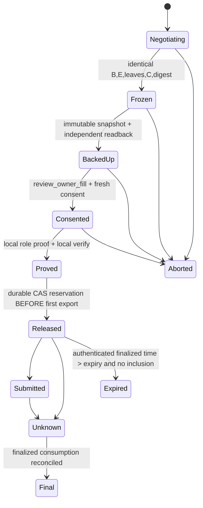

# Phase 0 research — private discovery, wire/state and network (P0.05 / P0.06 / P0.07)

**Date:** 2026-10-06. **Owner:** PlanNetworkMultichain (PLAN model), integrating the frozen PlanPrivateDiscoveryNetwork handoff after independent re-checks. **Kind:** a planning and research report. It is not an approved spec, not implementation, and not readiness evidence. [BLOCKERS](../BLOCKERS.md) remains the only readiness register and [NATIVE-IMPLEMENTATION-STATUS](../NATIVE-IMPLEMENTATION-STATUS.md) remains the only record of exercised evidence. No build, test, SQL, network, signing, deployment or funds action was taken to produce this report.

**Status vocabulary** (per ConfiguredPlanCoordinator): SOLVED-TECH, PROPOSED-MECHANISM, RESEARCH-OPEN, OWNER-DECISION, ACTION-HELD, EXTERNAL-INPUT. **Lane namespaces** (pending MQ8): the existing 122 IDs belong to EVM/Base. `L-HEVM.*`, `L-SOL.*` and `L-NEAR.*` are lane work; `X.*` are shared seams.

## 0. Owner answers this report must not reopen

- **Disclosure:** terms go only to the selected bilateral counterparty. That answer is not a GD2 waiver, does not infer backing, and does not permit public ads.
- **Reachability:** direct connectivity plus an optional independent relay. No mandatory company or paid infrastructure.
- **Current network checks:** generated peers on loopback only. LAN, WAN, mDNS multicast, router changes and packet capture are not approved.
- **Durability:** a self-operated PostgreSQL design target per owner. No install, run, schema or migration permission.
- **Sequence:** erase memory → exchange unauthorizing public descriptors → freeze complete packet → backup/readback (independent failure domain before funding or any new release capability) → consent.
- **Lanes:** NEAR and Solana run in parallel with EVM, not deferred to V2. Each lane needs its own explicit constraints and acceptance. **Cross-chain fills are also an ACTIVE requirement** (owner, 2026-10-06), as are HyperEVM spot and perps positions, not only token swaps. A samechain-first release may pass first, but the whole project stays incomplete until every lane and cross-chain obligation closes. Atomicity across chains is **not** claimed; §5.1 gives the asymmetric construction direction and its research gate. Solana owner-ZK targets Devnet, with the 3-ACK escrow as provenance only. NEAR is owner-ZK first, with Intents in the backlog. Every lane is immutable. Native ZEC is the active L-ZEC lane, required for the whole project but not for the first journey; wrapped ZEC is never a substitute. Standing maker and GUI stay V2.
- **Holds:** no heavy proving, production secrets, deployment (including Anvil), signing, sending, funds, push or migration.

Questions already sent (MQ1–MQ9) are not repeated. The new questions are NQ1 and NQ2 in §6.

## 1. Re-verified source facts used below

| Fact | Source (read 2026-10-06) |
|---|---|
| Runtime pins `libp2p =0.56.0`, no default features; enabled features are tokio, tcp, noise, yamux, ping, identify, macros, ed25519, kad | `crates/runtime/Cargo.toml:35` |
| Lock: core 0.43.2, swarm 0.47.1, identity 0.2.14, tcp 0.44.1, noise 0.46.1, yamux 0.47.0 (with yamux crates 0.12.1 and 0.13.10), kad 0.48.0, quic 0.13.1, tls 0.6.2, mdns 0.48.0, quinn 0.11.12, quinn-proto 0.11.19, rustls 0.23.45, tokio 1.53.1. **No gossipsub, request-response, relay, dcutr or autonat in the lock.** | `Cargo.lock` (awk over package names) |
| `libp2p-kad` is patched to `vendor/libp2p-kad` (hardened) | `Cargo.toml:9,35` |
| Kad bounds: closest-peer limit = `max_peers`, packet 4096, query 10s, substream 5s, parallelism 1, manual inserts, no periodic bootstrap, 0 records/providers | `crates/runtime/src/node/discovery.rs:50-73` |
| Config: 16KiB file, 256-byte address, 64 peers max, 1h max run; identify protocol `/z2z/transport/1.0.0`; lifetime peer cohort cap; explicit keepalive handler | `node/config.rs:7-10`, `node/network.rs:25-121` |
| Packet bounds: up to 8 outputs, ciphertext ≤4096 bytes, packet ≤64KiB, up to 4 fee entries; schema/relation version 1 | `crates/protocol/src/samechain.rs:14-19` |
| EVM authority: public `spent`, `rootCounts[tree][root]`, `seenCommitments`; `fill(raw, proofA, proofB)` is permissionless; rejects only when `block.timestamp > expiry` | `contracts/evm/src/SamechainAuthority.sol:21-25,127,181` |
| libp2p-quic 0.13.1 defaults: handshake 5s, idle 10s, keepalive 5s, 256 bidirectional streams, 10,000,000 bytes per stream, 15,000,000 bytes per connection; unidirectional streams 0; datagrams off | installed `libp2p-quic-0.13.1/src/config.rs:31-153` |
| request-response 0.29.0: default timeout 10s, `max_concurrent_streams` 100 (inbound + outbound per handler); `pending_outbound_requests: HashMap<PeerId, SmallVec<…>>` has **no global cap** | installed `libp2p-request-response-0.29.0/src/lib.rs:310-372,464` |
| libp2p-relay 0.21.0 defaults: 128 reservations, 4 per peer, 1h reservations; **16 circuits, 4 per peer, 2-minute circuit duration, 128KiB per circuit**; per-peer and per-IP rate limiters | `rust-libp2p@libp2p-v0.56.0/protocols/relay/{Cargo.toml,src/behaviour.rs}` |
| Solana transaction ≤1232 bytes (the v1 format raises this to 4096), ≤64 accounts, blockhash valid 150 slots; atomic per transaction; commitments processed/confirmed/finalized | solana.com/docs/core/transactions, solana.com/docs/rpc |
| sp1-solana verifies SP1 Groth16 using the BN254 syscalls. Unaudited; the example uses about 280K CU; proofs exceed transaction data limits in practice | github.com/succinctlabs/sp1-solana README (master) |
| NEAR cross-contract calls are asynchronous and independent, run 1–2 blocks later, and have **no automatic rollback**; callbacks always run | docs.near.org/smart-contracts/anatomy/crosscontract |
| NEAR RPC `block` accepts `finality: "final"` or a block id, not both | docs.near.org/api/rpc/block-chunk |

The frozen handoff read the GossipSub 0.49 config source at `libp2p-v0.56.0` (handler queue 5000, max transmit 65536; the docs.rs summary disagrees, and source wins). The mDNS 0.48 unbounded `discovered_nodes` and per-interface tasks were also read there. I re-read neither and treat both as secondary until re-read at implementation time. NEAR alt_bn128 host functions, the Solana pinned syscall source and HyperEVM historical state are delegated to PlanChainsProverPolicy and are **not asserted** here.

## 2. P0.05 — discovery backing and privacy contract

| Field | Content |
|---|---|
| **Acceptance** | Bind the exact advertised terms to owned, authentic backing (asset, value, remaining, membership) and to block-qualified current unspentness, under the bilateral disclosure model. Root existence, signatures or hints must never be labeled verified. Public fields, IP, amounts and timing must not be presented as closing GD2. |
| **Current source evidence** | No discovery relation exists. `PublicHistory` replays acquired blocks but trusts the provider's completeness; an NF-only withdrawal leaves `treeState` unchanged (`crates/chains/src/samechain/history.rs`). Inspection is same-block `TRUSTED_NODE` with code/hash pins (`inspection.rs`). Financial certificates release executable authority (`SamechainAuthority.fill` is permissionless). |
| **Contradiction** | P2P spec §4 offers "UNVERIFIED hints" while the delivery matrix requires independently checked backed orders. Bilateral-only disclosure does not remove the requirement, so P2.17 stays blocking. |
| **Status** | Backing relation: **PROPOSED-MECHANISM**. Strict GD2: **RESEARCH-OPEN** (known structural FAIL retained). |
| **Proposed resolution and interfaces** | See §2.1–§2.4. |
| **Future verification** | Negative corpus in §2.2. Independent spec review and plan review before code. The GD2 finite experiment in §2.4. |
| **Remaining owner / permission** | Owner reviews the written spec. NQ1 (introduction model). No order publication or real-asset use is authorized. |

### 2.1 Dedicated non-executable discovery relation `BackingClaim`

This must be a **separate** relation, with its own domain `Z2Z_DISCOVERY_BACKING\0` (version 1), its own guest program, VKey and journal. It **never** emits an OwnerJournal or a Fill/Cancel/Withdraw authorization, and it never accepts or carries an OwnerCertificate. Reusing financial certificates as advertisement proof is forbidden, because pairing two of them is executable authority.

The public journal is fixed-width canonical binary, fully consumed, with no trailing bytes:

```
domain || u16BE(1)
|| lane_id u16              // EVM-Base / HEVM / SOL / NEAR (MQ8 catalog)
|| chain_context_digest[32] // lane-specific, §5
|| deployment_digest[32]    // authority code/program/VKey/token/schema/tree pins
|| asset_body               // exact lane asset identity
|| side u8 || remaining U256 || min_price_num U256 || min_price_den U256 || fee_cap_digest[32]
|| input_identity[32]       // lane-specific input locator (EVM: tree_id||root||index||commitment digest)
|| nf[32]                   // stable NF of this generation
|| order_id[32] || generation u64
|| anchor_block_hash[32] || anchor_height u64   // verifier-selected anchor
|| session_challenge[32]    // receiver-chosen, fresh, nonzero
|| prover_coord_key[32] || verifier_coord_key[32]
|| claim_expiry_height u64  // discovery horizon only; never packet expiry
```

The private witness stays owner-local: the owner capability, the authentic NoteOpening and OrderPolicy, and the insertion path selected from complete PublicHistory.

The relation proves all of the following:

- The opening recomputes the commitment, and the commitment sits at `index` under `root` for `tree_id`.
- The opening's asset and value cover `remaining`, and the policy matches the side and limit.
- The NF is the stable NF of exactly that opening and generation, under the owner capability.
- `order_id` and `generation` come from the authenticated policy.
- The challenge and both coordination keys are bound.

The verifier, not the prover, then independently does three things:

1. Selects the anchor under its finality policy.
2. Reads `rootCounts(tree_id, root) > index` and `spent(nf) == false` **at that anchor hash**, or the lane equivalent (§5).
3. Selects the historical insertion descriptor from its own PublicHistory. It never accepts a root derived from the supplied path.

**Result label:** `BACKED_AT(anchor, TRUSTED_NODE)`. This is capacity at a block. It is **not** an exclusive reservation, not a guarantee that a fill will settle, and not consensus proof.

**Interfaces** (inside existing crates; no new crate):

- `protocol::samechain::discovery::{BackingStatement, frame}`
- `proofs::samechain::discovery::prove_backing / verify_backing` (separate program identity)
- `chains::samechain::inspection::inspect_input(anchor, tree_id, root, index, nf)`. This is a minimal call that reuses the pinning in `inspect(packet)` without manufacturing a dummy financial packet.
- `runtime::node::coordination` verifies before it shows anything as "backed".

**Proving cost** is a real concern because it adds one owner-local proof per counterparty. It falls under the P0.08 methodology, with no heavy trial now. The ≤15 min proof-latency figure is provisional, not a guarantee.

### 2.2 Falsifiable negative corpus (spec acceptance; not run)

Each of the following must reject:

- Copied public commitment paired with an arbitrary unspent NF (the NF↔opening binding fails).
- Root/count exists but the opening is wrong.
- Amount, asset or side substituted.
- Another owner's note.
- Spent NF at the anchor.
- NF-only withdrawal omitted by the provider. The verifier's `spent(nf)` read catches this; history replay alone would not.
- Stale anchor beyond horizon.
- Replayed challenge.
- Swapped coordination keys.
- Financial certificate offered as backing.
- Lane/chain-context substitution, for example a Solana claim presented to an EVM verifier.

Each of the following must be **labeled correctly**, not rejected:

- Two concurrent claims on one generation are both valid. Over-commitment is a disclosed limit.

### 2.3 Field-by-field disclosure (bilateral audience)

| Field | Needed? | Counterparty learns | Residual leak |
|---|---|---|---|
| lane/chain/deployment/asset | yes | pair and venue | interest (also in NQ1 beacon) |
| side/remaining/limit/fee cap | yes, to that peer only | full terms | own-result inference (GD2) |
| input identity/NF/order_id/generation | **required** for current-state check | onchain locator of the maker's note | links the maker to all past and future onchain activity of that note; directly identifies the accepted maker after settlement |
| anchor/challenge/coord keys | yes | session linkage | cross-session linkage if coordination keys are reused. Recommend a fresh coordination key per session. |
| PeerId/IP/timing | transport | network identity | not hidden. No anonymity claim. Tor/mixnets are out of scope (no stealth expansion). |

An NF-free blinded alternative, where the proof shows a hidden NF is unspent, needs a non-membership or accumulator proof over the spent set. That does not exist on any lane today. It is **RESEARCH-OPEN** and is not selected.

### 2.4 Strict GD2: finite compatibility branch and kill criteria

This is the retained definition: a matcher may collude with a legitimate trader and observe that trader's own assets and results ([imported analysis](../imports/kerb/docs/reviews/2026-10-02-strict-privacy-feasibility.md)). **Counterexample**, kept as is: an adversarial buyer with limit 8 faces an honest seller with limit 6 versus 10. A crossing world and a noncrossing world then differ in the adversary's own delivery. Equal-view noninference would force delivery 0 in both worlds, so no useful trade is possible. This is an incompatibility result for this world pair. It is not a claim that every privacy definition forbids trading.

**Experiment** (paper/model only; no trial):

1. Formalize adjacent worlds and the full adversary view: own E/assets/refunds, acceptance timing, queries, PeerId/IP and public chain history including NF/order locators.
2. Enumerate small integer quantities, limits and fees, and the legal allocations under ownership, conservation, partial fills and liveness.
3. Compute the intersection of legal observable-outcome supports across adjacent worlds.

**Kill criteria:**

- **K1:** a required useful trade exists in only one of two adjacent worlds, so identical views force no trade.
- **K2:** the accepted identity is carried directly by public owner/NF/order locators. §2.3 shows that V1 does this.
- **K3:** the candidate needs a trusted party or witness exchange.

**Survival** requires a concrete nontrivial mechanism with a justified, changed-but-owner-approved adversary. That would be an explicit **OWNER-DECISION** on the definition, never a silent waiver.

**Expected outcome on current V1:** K2 fires, so the **retained strict-GD2 gate is unmet**. The current design fails it, specifically on content and accepted-identity noninference against a matcher colluding with a legitimate trader. Three channels each break it independently:

1. The counterparty receives the exact terms.
2. The public NF, order_id, generation and tree locators identify the accepted maker onchain.
3. Own-result delivery distinguishes adjacent worlds (K1).

Restricting the audience to bilateral counterparties is **data minimization, not a privacy waiver**. It also does not substitute some different privacy product for GD2. Any V1 release must state that GD2 is unmet. GD2 remains an active Blocked obligation, closed only by a reviewed construction that passes K1–K3 under the unchanged adversary, or by an explicit owner decision on the definition. No hint, label or status claims otherwise.

**Executed finite model — 2026-10-06 (Python Eval; no product build/test or network action).** Only the seller limit changes between adjacent worlds: 6 versus 10; buyer limit is 8. Buyer initially owns 24 quote units and no base; seller owns 3 base units. Enumerated integer price `p=1..12`, delivered quantity `q=1..3`, and total buyer-paid fee `f=0..2` (108 candidate positive allocations per world). Legality requires `p*q + f <= 8*q` and seller proceeds `p*q >= seller_limit*q`. Quote conservation is buyer payment = seller proceeds + fee; refund is `24 - (p*q+f)`. Base conservation is delivered `q` + seller residual `3-q` = 3. No-trade has zero fee/payment and full refund.

| Seller limit | Legal positive allocations | By fee 0 / 1 / 2 | Distinct own-result views, including no-trade |
|---|---:|---|---:|
| 6 | 20 | 9 / 6 / 5 | 16 |
| 10 | 0 | 0 / 0 / 0 | 1 |

The projected adversary view is `(delivered base, paid quote, refunded quote, final base inventory, final quote inventory)`. The actual support intersection is exactly `{(0, 0, 24, 0, 24)}`. Thus identical own-result distributions in these two worlds force zero delivery, contradicting any positive-trade liveness in the crossed world: **K1 fires for this finite model/world pair**. This is a projection of the full view, not an enumeration of network/timing/history or arbitrary mechanisms; adding those observations cannot hide a difference already visible in one's own assets. It is not a general impossibility claim about other privacy definitions, and does not close discovery backing, P0.05, or strict GD2.

## 3. P0.06 — wire/state contradictions

| Field | Content |
|---|---|
| **Acceptance** | FillAccept is negotiation only. The flow is: local output preparation → public-descriptor exchange → identical canonical packet/digest → backup/readback → both fresh consents → local role proofs → durable release record → certificate export. Export is irrevocable release. Partial remainder is required. No witness exchange, even encrypted. |
| **Current source evidence** | Fill2 is implemented: E frame2, D, leaves, C (`crates/protocol/src/samechain/fill.rs:14-132`), consent (`crates/proofs/src/samechain.rs`), `review_owner_fill`, `review-fill` CLI, permissionless `fill`, expiry by `>`. The reviewed spec is [2026-10-06-independent-owner-fill-design](../superpowers/specs/2026-10-06-independent-owner-fill-design.md). |
| **Contradiction** | Spec §5 is already reconciled with Fill2. What remains missing: a session envelope codec, a state machine, durable release CAS before export, idempotent exact-byte export/ACK, and a finality reconciler. |
| **Status** | Pipeline/semantics: **SOLVED-TECH** (source + reviewed spec). Session envelope/state machine: **PROPOSED-MECHANISM**. Release durability: depends on P0.04 (**ACTION-HELD** for SQL execution). |
| **Proposed resolution and interfaces** | §3.1–§3.2 |
| **Future verification** | Golden-byte envelope vectors. Tamper rejection (B/E/role/fees/outputs/session/sequence). A late permissionless submission after abort/timeout (P3.08). Crash at every arrow, then restart. |
| **Remaining owner / permission** | SQL execution and scope (P0.04). Signing and sending are separately held. |

### 3.1 Session envelope `Z2Z_SESSION\0` (version 1)

```
domain || u16BE(1) || lane_id u16 || chain_context_digest[32] || deployment_digest[32]
|| session_id[32] || initiator_coord_key[32] || responder_coord_key[32]
|| role_map u8 (initiator=A|B) || challenge_i[32] || challenge_r[32]
|| seq u32 (strictly +1 per sender) || kind u8 || body_len u32 || body || sig_ed25519[64]
```

The signature uses the per-session coordination key. It is a **transport/transcript key**: never a PeerId key, wallet key or consent key. It supplements independent owner review and does not replace it.

**Kinds:** Hello, BackingChallenge, BackingClaim, Terms(E), Descriptors(inputs/outputs/payments), Leaf, PacketDigestAck, Certificate, Abort, Ack(msg_digest).

**Rules:**

- A changed B/E/role/fee/output rejects the session. It never triggers a silent re-sign.
- Retries are idempotent on `SHA256(envelope)`.
- No snapshot paths or names, private generation, salt or policy are sent.
- Abort ends negotiation only.

### 3.2 State machine (per owner, durable; the store is a P0.04 seam)



From `Proved` onward, nothing reaches `Aborted`. A timeout, disconnect, ACK refusal or local delete does not unlock. A cancel/exit races on the same stable NF, and an unfinalized cancel request unlocks nothing. Partial fills require exactly one successor with the same order, generation +1 (overflow checked) and `remaining`. Successor discovery must issue a **new** BackingClaim, because the old claim's NF is spent.

## 4. P0.07 — minimal networking design

| Field | Content |
|---|---|
| **Acceptance** | Pinned features and versions. TCP+Noise+yamux, with QUIC using its own TLS (no Noise over QUIC). Discovery, gossip and request-response selected. Fixed wire IDs, versions, codecs, sizes, timestamps, cache, query and concurrency bounds. A zero-paid reachability path. No sixth money crate. |
| **Current source evidence** | §1: the TCP/Noise/yamux/ping/identify/kad node runs. QUIC/mDNS are locked transitively but inactive. GossipSub, request-response and relay are absent from the lock. |
| **Contradiction** | The P2P spec plans mDNS and GossipSub. Bilateral-only disclosure forbids **public order-term gossip**, but it does not forbid neutral availability messages. mDNS needs LAN multicast, which is not approved now, and its 0.48 internals are unbounded. Both stay **planned features** with the constraints in §4.1. Neither is deleted. |
| **Status** | Selection and bounds: **PROPOSED-MECHANISM**. Feature additions or lock change: future reviewed change (no Cargo compatibility claimed). WAN/LAN/relay hosting: **ACTION-HELD**. Introduction model: **OWNER-DECISION** (NQ1). |
| **Proposed resolution and interfaces** | §4.1–§4.3 |
| **Future verification** | Loopback-only generated peers. Oversize, trailing, unknown-version and overflow inputs reject before allocation. Global pending caps hold under a burst. Mismatched PeerId/TLS rejects. Relay circuit cut mid-session resumes by message ID. |
| **Remaining owner / permission** | NQ1, NQ2. Any LAN/WAN/UDP/relay use needs a later explicit grant. |

### 4.1 Selection (lazy version)

| Component | Decision | Reason |
|---|---|---|
| TCP+Noise XX+yamux | **keep** (exists) | runs today |
| QUIC (`quic` feature, libp2p-quic 0.13.1, TLS 0.6.2) | **add for UDP reachability**, with explicit config: `max_concurrent_stream_limit=8`, `max_stream_data=131072`, `max_connection_data=262144`, handshake 10s, idle 30s, keepalive 10s | the defaults (256 streams, 10MB/15MB windows) exceed any envelope by ~100×. Quinn endpoint admission is still to be inspected before a hostile-UDP bound is claimed (RESEARCH-OPEN). |
| Kad (vendored, hardened) | **keep** for peer-only lookup | already bounded |
| request-response 0.29 | **add**: one protocol `/z2z/session/1`, closed operation set, custom codec | needed for bilateral RFQ/session. It needs app-level global caps because the crate has none. |
| GossipSub 0.49 | **planned; gated.** Topics carry only neutral availability beacons (lane, version, coordination-key commitment): no asset amounts, side, price, commitment or NF. Order terms never go on gossip; they go only over the direct session. Enable after a reviewed cardinality bound on mesh, duplicate and backoff caches, a bounded validation queue, and `Strict` validation with manual validate. | Reuses libp2p propagation for the NQ1(b) beacon. Topic membership still leaks lane interest, and that is recorded. |
| mDNS 0.48 | **planned; gated.** LAN introduction only, emitting the same neutral beacon fields. Enable after a vendored or patched bound on `discovered_nodes` and interface tasks, **and** a separate LAN-multicast permission. | Unbounded retention today. Generic `_p2p._udp.local` service, so protocol/domain validation stays mandatory. |
| relay 0.21 client + dcutr 0.14 + autonat 0.15 | **optional, off by default** | NQ2 adopted: an independent relay, used for introduction and DCUtR only |

Protocol IDs: `/z2z/backing-check/1.0.0` is **dropped**, because a peer RPC answer is never backing. Backing travels inside the session as a BackingClaim proof. `/z2z/order-gossip/1.0.0` is **renamed in scope** to `/z2z/beacon/1`, which carries neutral availability only. `/z2z/order-query/1.0.0` and `/z2z/fill-coord/1.0.0` merge into `/z2z/session/1`, a direct request-response channel. `/z2z/transport/1.0.0` (identify) already exists.

### 4.2 Frozen-candidate numeric bounds (spec review fixes them; not measured)

| Bound | Value | Basis |
|---|---|---|
| Envelope max | 131072 bytes | packet ≤64KiB + E + leaves + 8 descriptors + header. Certificate envelope = packet + proof + journal. **The 4KiB ad limit is never applied here.** |
| Control/beacon frame | 1024 bytes | lane + version + coordination-key commitment only |
| BackingClaim envelope | 4096 bytes | journal (~400 bytes) + proof (≤1KiB lane-dependent) |
| Concurrent sessions | 4 global, 1 per peer | owner-local proving is the bottleneck |
| request-response streams | 8 per handler; global pending outbound ≤16; inbound unanswered ≤8 | the crate has no global cap, so the app enforces it before `send_request` |
| Request timeout | 30s per message; session total 30 min (provisional; proof latency ≤15 min) | covers two local proofs |
| Dedup cache | 1024 envelope digests per session, cleared at session end | idempotent retries |
| Clock | peer timestamps are advisory, ±300s skew, **coordination only** | never packet expiry or lock release |
| Peers | existing default 8, max 64; Kad parallelism 1 | unchanged |

**Codec:** length-prefixed u32BE, fixed-width BE U256 amounts, full exhaustion, reject before allocating beyond the bound. **No serde-JSON on the financial wire.**

### 4.3 Zero-paid reachability

Owners exchange `PeerId` and multiaddr out-of-band (always supported). An owner with a reachable IPv6 or manually forwarded port is reachable directly. Otherwise (symmetric NAT, CGNAT, UDP blocked), an **independently operated** relay v2 with DCUtR hole punching is the optional path.

With relay defaults, a 128KiB, 2-minute circuit cannot carry a full session. That is NQ2, recommending: direct after DCUtR, plus resumable message IDs across circuits. If no path exists, the topology is recorded as **unsupported**. There is no silent scope waiver and no universal NAT claim. Gas, electricity, bandwidth and storage remain owner costs.

## 5. Lane contracts (parallel samechain markets; cross-chain is a separate ACTIVE seam)

Each **samechain** market is independent, with its own deployment, asset, note tree, NF set, finality and certificate-release semantics. A samechain BackingClaim, session or certificate is invalid on every other lane, by construction of `lane_id || chain_context_digest`. Cross-chain fills are **required**. They use the separate `X.CROSSCHAIN` construction in §5.1, never a samechain packet reused across lanes.

| Contract | EVM/Base (existing 122 IDs) | L-HEVM (pending MQ1) | L-SOL (pending MQ2) | L-NEAR (pending MQ3) |
|---|---|---|---|---|
| chain_context_digest | chainId + authority address + runtime code hash | same form as EVM for HyperEVM notes. **HyperCore spot/perps positions are not note-controlled.** They are account state under venue rules, so they cannot use this relation. See §5.1 X.HL. | cluster genesis hash + program id + program-data hash + upgrade authority = none (MQ4) + mint + token program id | chain_id string + contract account id + code hash + full-access-key absence (MQ4) + token account (NEP-141) |
| Replay/session domain | envelope binds the above; target replay = NF + seenCommitments | same | same envelope. Target replay = NF PDA existence. Transaction replay is limited by blockhash 150 slots or durable nonce. | same envelope. Target replay = NF in contract storage. Tx nonce per access key. |
| Authority | permissionless `fill(raw, proofA, proofB)` | same code (unqualified on HyperEVM) | **to build**: program verifying two SP1 Groth16 proofs (sp1-solana; unaudited, ~280K CU per the example; exact cost delegated to PlanChainsProverPolicy). A 64KiB packet exceeds the 1232/4096-byte transaction limit, so the program needs a **staged buffer account** written in chunks, with the final instruction verifying and consuming atomically. Buffer writes are not authority. | **to build**: contract verifying proofs via host functions (to be confirmed). NEP-141 token transfers are **asynchronous receipts with no automatic rollback**. The NF must be marked and the outputs appended in the same receipt, with the token payout via a callback that **records failures as retryable entitlements**, never as reverted consumption. This is a different atomicity contract from EVM and must be specified and accepted as such. |
| Finality for current state | lane finality tag per P0.09 (MQ7 second source) | finalized tag existence unconfirmed (delegated) | `finalized` commitment; the anchor is a finalized slot + blockhash | `finality: "final"` block; the anchor is block hash + height |
| `spent`/`root` read at anchor | `eth_call` at block hash | requires historical state (delegated) | NF PDA account + tree account read with `minContextSlot` and slot equality check. **Solana RPC reads are not per-blockhash pinned like `eth_call`.** The verifier must check the returned context slot equals the anchor and treat a mismatch as Unknown. | `query` view at `block_id` (needs archival or recent-state availability) |
| Certificate release point | export of the first certificate | same | same; additionally the partially written buffer is public but non-authorizing | same; additionally a pending callback is `Unknown`, not failure |
| Expiry | `block.timestamp > expiry` | same | Clock sysvar `unix_timestamp` (stake-weighted; differs from EVM). Spec must choose slot or time. | `block_timestamp` ns. Spec must choose height or time. |
| Per-lane IDs to add | — | `L-HEVM.P0.05/06/07` mapping rows | `L-SOL.P0.05` (NF PDA read), `L-SOL.P0.06` (buffer + atomic consume), `L-SOL.P0.07` (no change; network is lane-agnostic) | `L-NEAR.P0.05` (view at block), `L-NEAR.P0.06` (async payout entitlement), `L-NEAR.P0.07` (none) |

**Shared seams:**

- `X.CODEC`: lane_id plus chain_context in every frame.
- `X.BACKING`: a single BackingClaim relation with a lane-parameterized journal. The lane-specific input locator is verified by lane-specific `inspect_input` adapters in `chains`.
- `X.SESSION`: one envelope/state machine. Lane differences live in the release and reconcile adapters.
- `X.NET`: networking is lane-agnostic.

The existing Solana program (`contracts/solana/program`) is the **public legacy-SPL three-ACK escrow**. It is not owner-ZK and is **not reused** as the L-SOL note authority. `contracts/near` is an empty workspace.

### 5.1 X.CROSSCHAIN — active obligation, asymmetric commit (atomicity NOT solved)

**Problem.** Owner A holds a note on lane X and owner B holds a note on lane Y. Neither chain can verify the other's state cheaply, and finality, clocks and censorship differ between them. No mechanism here makes both legs atomic. The goal is a **bounded-exposure, always-refundable** construction, where each leg's terminal state is enforced by its own lane authority.

| Direction | Mechanism | Safety basis | Status |
|---|---|---|---|
| **CX-1 hashlock legs with asymmetric deadlines (recommended first)** | Each lane authority gains two new mutators: `lock_conditional` and `claim_or_refund`. `lock_conditional` consumes the owner's NF into a conditional note `(h, recipient_note_key, refund_note_key, deadline)`. **Claim** before the deadline requires `s` with `SHA256(s)=h`, and pays a fixed recipient note. **Refund** at or after the deadline returns to a fixed refund note. Both calls are permissionless: anyone may submit, and recipients are fixed. Initiator I (the secret holder) locks first on lane X with deadline `T_X`. Responder R verifies I's lock at X finality, then locks on Y with `T_Y`. I claims on Y, which reveals s. R (or any watcher) reads s from Y at finality and claims on X. | `T_X − T_Y ≥ fin_Y + incl_X + censor_margin_X + clock_skew(X,Y)`, using each lane's own finality and clock (§5 rows). Each leg either completes or refunds by itself. The loss condition is R failing to claim on X before `T_X` after s is public on Y. Permissionless fixed-recipient claims let any watcher close it without new authority. | **PROPOSED-MECHANISM** |
| CX-2 light-client/state proof | The X authority verifies a proof that the Y leg reached finality (consumed to the fixed recipient), then releases. NEAR exposes `light_client_proof` RPC. Solana has no compact finality proof, only stake votes. Base finality inherits from L1. A per-pair verifier is heavy. | Actual consensus verification | **RESEARCH-OPEN**. Kill if no lane pair has a verifiable finality proof within the lane's compute/gas limit. |
| CX-3 trusted relayer/arbiter | — | new authority | **Rejected** (company-off, no new exit authority) |

**CX-1 contracts.** Each one is per lane and specified separately:

- **Session:** a new `X.SESSION.CROSS` envelope binds both `lane_id`/`chain_context_digest`/`deployment_digest` values, `h`, both deadlines in **each lane's native clock unit** (EVM timestamp, Solana slot or Clock timestamp, NEAR height or ns), the I/R roles, both quantities and fees, and both fixed recipient and refund note descriptors. Recipients prepare owner outputs and back them up before consent, following the samechain sequence.
- **Replay:** the conditional note has its own domain `Z2Z_XLOCK\0`. Claim and refund each consume the conditional NF exactly once. `h` is single-use per session, and reusing `s` across sessions is forbidden.
- **Exposure:** I's release point is I's own lock certificate. From then on, I's funds can only reach claim (needs I's own s) or refund. R's release point is R's lock. After I claims on Y, s is public and R's X claim must land before `T_X`. That window is **R's exposure**, and the client must surface it.
- **Outcomes per leg:** `Locked → Claimed | Refunded`, each final under its lane's finality. The cross-session outcome is `BothClaimed`, `BothRefunded`, or `Asymmetric` (Y claimed and X refunded, which is R's loss if R missed `T_X`). There is no "atomic success" label.
- **Refund:** the deadline is enforced on-chain. A local timeout never unlocks anything. Refund requires finalized lane time ≥ deadline and an absent claim.
- **Recovery:** the backup must hold s (for I), h, both conditional note openings and the session envelope **before** the first lock. Cold restore must be able to claim or refund on both lanes with company services off.
- **Lane specifics:**
  - Solana: the lock and claim instructions are small, so no staged buffer is needed beyond the proof. The deadline uses a Clock sysvar slot.
  - NEAR: claim must mark the conditional NF and record the payout entitlement in one receipt. A failed NEP-141 transfer callback leaves a retryable entitlement and must not revert the claim (async, §5).
  - HyperEVM: availability of historical state and a finality tag is unconfirmed (delegated). Without them, the deadline margin cannot be bounded, and CX-1 on HyperEVM is killed until they are confirmed.
- **Privacy cost (recorded, NOT acceptable leakage):** the same `h` appears on both chains, so any observer can link the two legs and both owners' locators. This adds to the unmet strict-GD2 gate in §2.4 and never satisfies it. A hidden-hash or adaptor/PTLC variant inside the ZK relation is a **RESEARCH-OPEN** gate. Its kill criterion: no lane can verify the variant within its compute/gas limit.
- **Bounded executable validation (future; no runs now):**
  - **(V1)** A pure-Rust model test of the CX-1 state machine. It enumerates lock order × claim/refund timing × finality/censor delays over small integer slots, and asserts that no reachable state has I holding both assets, or loses R's funds when R claims within its margin. It must show that the `Asymmetric` outcome appears **only** when R's X claim lands after `T_X`.
  - **(V2)** Per-lane golden vectors for `Z2Z_XLOCK` and `X.SESSION.CROSS`.
  - **(V3)** On controlled loopback VMs (once permission is granted): deadline equality and the claim-after-refund race on each lane authority.
  - **Kill:** V1 finds a reachable violation under any bounded parameter set.
- **Kill criteria for CX-1:**
  - **XK1:** a lane cannot provide an immutable deadline-enforced refund mutator.
  - **XK2:** `fin_Y + incl_X + censor_margin_X` cannot be bounded from lane primary sources for the selected pair. Unbounded censorship becomes a disclosed liveness assumption, not a safety claim.
  - **XK3:** the relation would need the counterparty's witness or key.
  - **XK4:** the lane's proof verification cost exceeds the transaction limit even with staging.
- **Dependencies:**
  - New lock/claim/refund relation and journals in `proofs`.
  - New mutators in every lane authority (EVM `SamechainAuthority` is immutable, so this means **a new deployment**; old artifacts are preserved).
  - `chains` finalized reads of conditional NF state and of revealed s per lane.
  - Runtime cross-session state machine plus watcher.
  - P0.04 durability and P0.09 per-lane finality.
  - New IDs `X.CROSSCHAIN.{SPEC,REL,EVM,SOL,NEAR,HEVM,SESSION,WATCH,RECOVERY,E2E}`.

**X.HL — HyperEVM spot first, then the Core-position research lane (active).** HyperEVM spot (HYPE plus a fixed ERC20) is a samechain note authority (L-HEVM). Core spot balances and perps positions are venue account state, not proof-controlled notes, so no note relation escrows them directly.

- **Selected first research direction: isolated position claim.** A contract-owned Core account holds an isolated position. The note controls a claim on that account's outcome, reaching Core through read precompiles and the async CoreWriter. This is a **hypothesis**: it is not equivalent to transferring an actual Core position.
- **Bounded gate, HL-V1:** read-only source and model checks of the following:
  - CoreWriter async ordering with no failure callback.
  - Precompile read freshness.
  - Isolated-margin liquidation while the position is claimed.
  - Cross-collateral contamination.
  - Who can close the position when owners are offline.
- **Kill criteria:**
  - **HK1:** liquidation or margin calls cannot be bound to the claim holder without a new trusted actor.
  - **HK2:** no immutable path to close and withdraw exists.
  - **HK3:** precompile state is not readable at the needed finality.
- Full Core features and use cases come later at full scale. Owner-signed Core orders are **not** the selected direction. Cross-chain legs lock tokens only, because perps cannot be hashlocked.
- Status: **RESEARCH-OPEN**. Owner Z3: token/collateral legs go first, and position-claim trading is active research.

**L-ZEC (active first-class lane; not V2).** P2P discovery and sessions are lane-agnostic and carry native ZEC pairs ZEC↔{Base, HyperEVM, Solana, NEAR}. A ZEC lane descriptor is network + consensus branch + pool. Settlement keeps the retained S1–S7/M1–M5, native Tasks 1–10 and P/Q/source-history/net/excess/privacy/uniqueness/recovery obligations unchanged. Wrapped or bridged ZEC never substitutes. The Zcash leg of a cross-chain fill cannot use CX-1 as written, because Zcash has no lane authority mutator. It needs a reviewed shielded lock/claim/refund construction (S-relations). That is **RESEARCH-OPEN**, and the native P/Q route remains its approved direction. Owner Z1: the first journey is samechain, and L-ZEC runs in parallel and is required for project completion.

## 6. New questions sent to ConfiguredPlanCoordinator (2026-10-06)

- **NQ1, counterparty introduction.** Options: (a) out-of-band only; (b) neutral lane/version beacon plus a direct RFQ; (c) pair-topic beacon. Sent to the user. **Working assumption: (b), with (a) always available.** Authorizes no publication.
- **NQ2, relay limits.** **Adopted by the coordinator as a PROPOSED-MECHANISM:** (a) relay only for introduction/DCUtR, with sessions direct, plus (c) resumable exact-byte message IDs across circuits. Not sent to the user. Authorizes no relay hosting or WAN.
- **NQ3/NQ4/NQ5:** resolved by the coordinator's FINAL answers and engineering defaults: HTLC first with CX-2 as active research; permissionless watcher plus self-submit; isolated position claim as research with token/collateral legs first (Z3). Z1: the first journey is samechain, and native ZEC is an active parallel lane. Z2: native NEAR first, NEP-141 active, claimable credit only proposed. Base Sepolia is an engineering default, not owner-approved.

## 7. Honest summary

- **P0.05:** the backing mechanism is proposed and concrete. **The retained strict-GD2 gate is unmet** by K1/K2, through three channels: terms disclosure, public NF/order locators and own-result inference. Bilateral audience is minimization, not a waiver. GD2 stays an active Blocked obligation.
- **P0.06:** Fill2 semantics are solved in source. The envelope and state machine are proposed, and durability is held behind P0.04.
- **P0.07:** the network uses TCP/QUIC + Kad + request-response sessions, with bounds proposed. GossipSub and mDNS remain **planned**, carrying neutral beacons only, never order terms. Each is gated on bounds, and mDNS also on a LAN permission. Relay is optional, independent, and used for introduction only.
- **Lanes (all active):** none of the L-SOL, L-NEAR or L-HEVM authorities exist yet. Their atomicity and state-read contracts differ materially from EVM: Solana needs buffered packets and context-slot checks, NEAR (native first) needs async payout entitlements, and HEVM needs historical state. None inherits EVM evidence. L-ZEC keeps S1–S7/M1–M5.
- **Cross-chain (active):** CX-1 asymmetric hashlock is proposed, with explicit exposure, refund, recovery and kill criteria. It is **not atomic**: the responder carries a bounded window. CX-2 is research. X.HL positions are research plus an owner decision. All of these remain required for project completion.

Nothing here is marked resolved in BLOCKERS.
