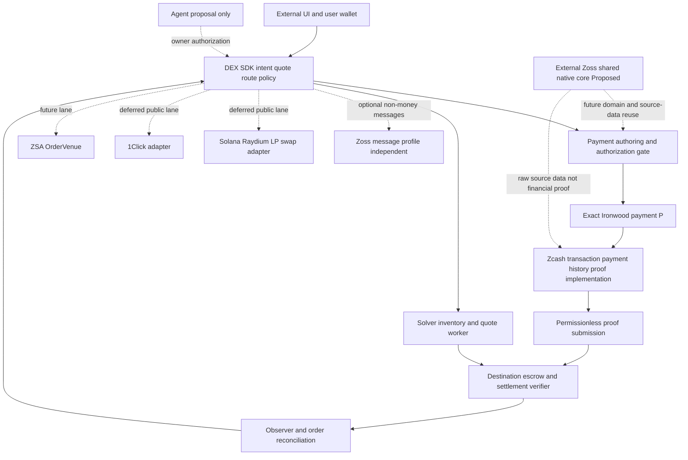

# DEX — architecture candidate và audit tổng thể

> **Authority/supersession update — 2026-10-02.** Preserve this 2026-10-01 audit's A1–A17 reasoning, source observations and symbolic traces; they are not newly executed exploits, release results or a competing architecture/gate register. Active behavior/ownership: [ARCHITECTURE](../ARCHITECTURE.md), [MODULES](../MODULES.md); actual source/cohort/runtime/prover checkpoint: [native status](../NATIVE-IMPLEMENTATION-STATUS.md); sole readiness/closure: [BLOCKERS](../BLOCKERS.md). [SERVER-INDEPENDENCE](../SERVER-INDEPENDENCE.md) owns route-specific manual rights/data/artifacts/company-off acceptance, and the [redesign spec](../superpowers/specs/2026-10-02-z2z-server-independent-architecture-design.md) owns the proposed expanded design, not implementation/action authorization.
>
> **Supersession map:** the exclusion-only/binary-transfer diagrams, artificial activation eligibility cutoff, SPV-versus-full-validator menu, direct-transfer-versus-credit choice and delegated-FVK/frame-only/no-import prose below are dated candidates. Selected native work requires local complete Q/no U FVK to S, earlier bound P/T admissibility, full validating source history/no SPV, authenticated proportional `U=floor(D*C/A)`, `S=D-U` with dust fixed S, atomic actual transfers/retry and stable one-real-note/one-obligation within the selected deployment. Every hostile T must independently reach terminal recovery/allocation and `C>A` needs actual S-authorized source excess return; permanently missing facts/capabilities remain blockers, not successful Pending. The standalone manual consumer is native core, not deferred SDK/UI. Proposed samechain bilateral owner rights do not solve arbitrary source witnesses, legacy ZEC custody exit or strict GD2. Original severities/models/results/permissions/dates remain historical; no finding closes through documentation approval.

**Retained audit context and body follow; its “current” maturity, menus and pointers are not a new present-state claim.**

Audit 2026-10-01, source research nền 2026-09-30. **Report trước cutover giữ findings/counterexamples; approval lúc đó chỉ P/Q research/layout docs**, chưa implementation. Authorization sau đó chỉ Ziquid frame; **current shared-core adoption 2026-10-01 chỉ docs**, không library/protocol/crypto/contracts implementation. Authority: [ARCHITECTURE](../ARCHITECTURE.md), [BLOCKERS](../BLOCKERS.md), [MODULES](../MODULES.md), [proof spec](../modules/zcash-proofs.md); mechanism evidence tại [SETTLEMENT-RESEARCH](SETTLEMENT-RESEARCH.md). Findings không closed bởi approval/frame. UI repo riêng; [Zoss architecture](../../../zoss/docs/ARCHITECTURE.md) shared native infrastructure + optional non-money profile, [blockers](../../../zoss/docs/BLOCKERS.md) giữ own readiness và message gates, [DEX integration](../../../zoss/docs/private_dex.md) giữ consumer seam; future library reuse Proposed/chưa dependencies/imports/API.

## 1. Verdict / quyết định cập nhật

**Architecture candidate được chọn làm research direction trong docs, chưa completed protocol specification/build-ready.** Effect/canonical-history/refund-proof/privacy/recovery/cost work vẫn Open. Complete-interval exclusion chỉ bottleneck absence branch, không necessity; positive-conflict §9 có thể thay bằng validated inclusion nếu real-input Q/general-conflict/payment-class gates đạt. Report-only recommendation là quyết định tại thời điểm audit; approval docs hiện supersede phần chưa cutover, không mark findings solved.

Recommendation mới có tiến bộ: không source joint-note escrow, không x/keyshare-reveal payout trigger, không timer refund từ missing callback. Nhưng nó **chuyển** bài toán recovery sang permissionless source evidence/proving. Missing evidence không theft proof mà có thể permanent stuck; user trả source rồi chỉ có conditional destination entitlement, chưa actual payout. Modularity không giải các prerequisites này.

Evidence provenance: v6 preauthorization/expiry facts từ [ZIP229](https://zips.z.cash/zip-0229), [ZIP374](https://zips.z.cash/zip-0374), [ZIP203](https://zips.z.cash/zip-0203), effect txid commitments [ZIP244](https://zips.z.cash/zip-0244); prototype flaws observed trong [Skyhook verified source](https://sepolia.etherscan.io/address/0x027D2aDCEce9f71F76A8807f654902cAD2078c6F#code), không executed exploit. Novel complete-exclusion/private statement construction là **INFERENCE/Proposed**, không được các ZIP chứng minh như existing protocol. Severity/build difficulty là audit judgment, không measured implementation result.

## 2. Architecture tổng thể gộp (Proposed)

Năm product lane vẫn độc lập: shielded settlement; optional Zoss **message profile**; public Solana LP/swap; public 1Click; future ZSA. Shared native core reuse là infrastructure seam, không monetary lane/trust upgrade hoặc message requirement. Autopilot deferred/no LP migration. Initial research scope Ironwood→local native EVM không cần Zoss EVM endpoint; Base staging authorization riêng, Solana adapter/resource/security evidence riêng. Financial source proofs đi trực tiếp DEX target verifier.

### 2.1 Module và owner

| Module | Owner / responsibility | Interface logic và không được làm |
|---|---|---|
| DEX client | TypeScript `packages/sdk` same monorepo, UI separate unnamed repo | Bind exact networks/assets/recipient/limits/disclosures; research route không executable claim hoặc silent public fallback. |
| Payment authoring | `crates/zcash`, wallet-local library integration | Prepare unsigned P, locally executable Q và sender witness; release exact P sau funded/finalized/binding gate. U keys/view authority/release record giữ wallet, không server signer. |
| Zcash settlement/proofs | `crates/proofs` circuits/witness/prover/verifier artifacts + `zcash` parsing/scanning/witness integration | Implement authenticated history/effects/payment relations; inclusion/conflict/classification/hiding facts, không generic RPC/quorum `verified=true`. Complete exclusion chỉ absence alternative, không selected mandatory engine. |
| Destination statement verifier | Logical verification module, target-specific; stateful accepted history one explicit owner | Accept exact inclusion/exclusion fact under pinned schema/program/history/policy; không economic instructions hoặc bool verified chung. Reference Rust không on-chain verifier tự động. |
| Destination settlement | DEX/app-owned asset-specific escrow, chain state authoritative | Consume fact+exact obligation; pay fixed U hoặc refund fixed S, terminal once. Không funds tại Zoss; không admin/timer fallback âm thầm. |
| Solver worker | DEX liquidity actor, durable transactional inventory reservations/funding refs | Quote/fund/reconcile, no double reservation across concurrency/restart. Reserved inventory không reconstructible observer cache; không LP share/source spend key. |
| Relayer/prover | Off-chain workers, permissionless submit | Không đổi beneficiaries/quote/payment; proof failure/retry không payment outcome. Witness privacy/retention/access separate public relay. |
| Observer/ledger | DEX off-chain process/cache | Reconcile actual chain/proof/order status; source truth không cache; restart/reorg và effect receipt persisted. |
| Zoss shared core / optional message profile | External common native infrastructure, responsibility map Proposed, chưa integration/export/dependency proof | Reuse domain/encoding/source acquisition/common chain clients khi thực sự identical; no memo/inbox/watchers/IVK/quorum/receipt/runtime requirement. Optional non-money profile riêng, không canonical financial verifier/settlement substitute. |
| Venue adapters | DEX-owned independent future integration | Raydium/1Click public và ZSA order giữ trust/asset semantics riêng; không generic fee/refund giả. |

**Module ≠ process ≠ repository. Current approved frame:** native Rust `crates/{protocol,zcash,proofs,chains,runtime}`, TypeScript `packages/sdk`, independent chain target slots cùng monorepo; UI/Zoss external. `protocol` app schema/rules; `zcash` source/PQ integration; `proofs` circuits/history strategy/artifacts; `chains` exact app clients; runtime durable state/workers. Contract slots `evm` config, `solana`/`near` empty workspaces ngoài root native build; EVM local candidate, Solana candidate, NEAR slot only. Frame exists, chưa implementation các roles. [MODULES §1.3](../MODULES.md#13-external-zoss-shared-core--proposed-library-reuse) ghi future common Zoss libraries dưới đúng DEX role, không relocation proof/economic repo hoặc implied exports. [Shared-library readiness](../../../zoss/docs/BLOCKERS.md#7-shared-library-readiness) không message G/Z hoặc DEX S/P closure.

### 2.2 Shared contract phải pin

Quote/commitment bind: protocol/schema version; source network/pool/branch; exact P/hiding commitment; exact recipient/value/ciphertext statement; source lower-bound checkpoint/interval and expiry H; destination network/deployment/code/verifier identity; external asset/amount/fixed U payee/fixed S refund recipient; unique quote/payment consumption. Checkpoint history finality policy và proof program/verifying key version cần included, không đổi in-flight order theo registry current.

Source range contract cần **checkpoint height/hash riêng**, first admissible payment height `L` riêng, inclusive last-valid `H` (ZIP203 cho H, cấm H+1), `H>0` và `L<=H`. Inclusion/exclusion phải scan SAME `[L,H]` trên SAME policy-approved history; source expiry không EVM timestamp. `h0` draft shorthand chưa protocol decision, không dùng đồng thời như checkpoint và first admissible height.

Public receipt/proof statement không leak source locator dưới privacy profile nếu candidate private. Private note/opening/proof witness không cùng public relay cache/log. Quote auth domain khác SpendAuth; validating output không authorize source transaction. No hidden unsigned artifact chứa user secret/dummy/real signature material đủ để S hoàn tất source payment.

**Independent witness custody before escrow funding:** S needs exact P identity and hiding-commitment opening plus complete minimal refund statement witnesses; U needs payout witnesses independently. Neither receives other party spend authority. Proof workers may require private openings, so delegate access changes observer privacy. U disappearing cannot be handled by a public relayer that only knows an opaque commitment. Unique quote/deployment identity must be authenticated in P effects/proof relation, not just a freely chosen public quote nonce or hiding commitment randomizer.

**State ownership:** wallet note reservations/P-release/private witness; solver transactional inventory/funding/Q custody; chain allocation/consumption; observer reconstructible view. Library chạy với caller-owned capability trong app-owned process, không daemon chung gom keys/viewing/witnesses/cross-app private cache. Four distinct ledgers nếu chọn messaging: source→receipt, destination receipt/app nonce, DEX payment→obligation uniqueness, terminal escrow consumption. **One-source→one-receipt namespace across routes/deployments Unresolved** tại [Zoss register](../../../zoss/docs/BLOCKERS.md); không per-route/global financial reinterpretation hoặc receipt tạo tự động từ data reuse. `SourceObservation` ≠ `QuorumAcceptedMessage` ≠ target `VerifiedSettlementFact`.

**In-flight upgrades:** new orders dùng verifier/proof version mới, funded old orders giữ old verification/recovery path. Pin address/version string không đủ nếu proxy/code/registry có thể đổi rules. Vì EvidenceBlocked có thể indefinite, **qua H không đủ cho một ngày an toàn để retire verifier v1**; bỏ proving/verifying support cũ có thể permanently lock funds. Admission pause không allocate money đúng bên; emergency authority là trust decision chưa approved.

Current shared-core adoption không thay lifetime findings: messaging roster/epoch/revocation/library/SDK release không retire funded DEX proof/verifier/history/private-witness/recovery path. Optional callback rollback retry same immutable receipt chỉ khi authorization vẫn valid, mỗi attempt verify; không financial recovery, cross-chain atomicity hoặc guarantee qua roster rotation. Common auth phải explicit domain/algorithm: Kerb wallet/Solana ordinary Ed25519, Arcis SHA3-512 Ed25519 certificates và native Zcash SpendAuth riêng, không generic interchangeable signature helper.

## 3. Flow end-to-end và trạng thái

1. U/S settle exact quote/effects bằng **unsigned/redacted** P/evidence. U giữ real-input signing authority.
2. S reserve/fund EVM escrow với exact commitment/obligation/checkpoint/expiry/verifier. **Simple candidate: funding arms obligation irrevocably**, không solver unilateral cancel/withdraw sau activation; refund chỉ valid exclusion. Một cancellable reservation + separate arm là design khác chưa chọn. U independent verify actual finalized irrevocable activation/binding/remaining interval.
3. Gate đạt thì U ký/release/broadcast P; gate fail thì abort trước source authorization. U không gửi signed P để solver “check” trước funding. Local no-sign gate bảo vệ honest U, không consensus lower timelock ngăn malicious U ký sớm; unsupported early payment không được reused cho order mới. Sau executable authorization release, UI Cancel không revoke P.
4. P mined trên accepted valid source history: effect+inclusion proof submit permissionless → destination payout fixed U. Source payment thực tế không bị undo chỉ vì EVM proof call fail.
5. P absent sau expiry: complete valid interval exclusion proof → escrow refund fixed S. Nếu proof gap/header ambiguous/cost không trả nổi/prover fail, pending evidence; không timer trả S.
6. Terminal phải observed destination commit/finality; quote consumption/payout/refund mutually exclusive. Source reorg sau terminal không tự lấy lại external asset; residual source/destination finality risk.

| State | Ý nghĩa / transitions | Stuck hoặc loss concern |
|---|---|---|
| PreparedUnsigned | Effects/evidence/quote, chưa share authorization | Abandon được; source chưa paid. |
| EscrowFundingPending | S đã gửi funding, chưa policy-final/checked | U không ký; S có thể chờ exclusion theo protocol nếu đã commit quote. Không assume instant cancel safe. |
| EscrowActive | Gate funded/finalized đúng; user có thể authorize | Nếu U biến mất, S vẫn cần refund evidence; option/lock capital cost. |
| PaymentAuthorized / Broadcast | Source transaction có thể mine; không còn assume user cancel | EVM có thể halt/reorg, source mine; source/user payout delayed risk. |
| PaymentObserved | P mined, awaiting finality/effect proof | Không claim Completed; source reorg/false effect/filter risk. |
| AwaitingPayoutEvidence | Actual source paid, proof chưa committed | Source irreversible theo assumed finality; external locked nếu evidence/prover/censorship. |
| AwaitingExclusionEvidence | No proven payment, H passed, no complete exclusion | S capital stuck; silence != refund authority. |
| EvidenceBlocked / DisputedHistory | Gap/fork/verifier/version/resource failure | **Nonterminal**, có thể indefinite. Administrative allocation would change trust model. |
| PaidUser / RefundedSolver | Exact destination terminal commit observed | Reorg finality residual; no second terminal effect/quote replay. |

Đây state requirements, chưa executable API/implementation. `EvidenceBlocked` phản ánh failure, không solve failure hoặc permit default confiscation.

## 4. Safety/liveness audit findings

| ID | Severity | Failure / finding | Treatment và remaining risk |
|---|---|---|---|
| A1 | Fundamental decision | Source P paid, proof/data unavailable forever → U không actual external payout; P absent, exclusion unavailable → S locked forever. | Candidate ưu tiên conditional anti-confiscation nhưng không finite-time unilateral recovery. Permissionless path chỉ useful khi available/affordable. Requirement/trust model phải quyết định trước adopting. |
| A2 | Critical prerequisite | Orphan/header-valid/lighter submitted fork omit P → S refund dù source đã paid. | Correct source chain validation/checkpoint/difficulty/work/finality + honest competing-history availability/anti-eclipse. Not absolute cryptographic globally canonical guarantee. |
| A3 | Critical prerequisite | Claimed txid list/root count can omit P through internal-node-as-leaf `[root]` ambiguity. | Complete VALID parsed raw-block/source-derived leaves/authenticated depth/count or sound validating circuit; raw hash root equality rejected. Full validation cost/state vs source-consensus assumption unresolved. |
| A4 | Critical prerequisite | cmx/recipient opening checked separately from supplied digest; included tx pays khác hoặc ciphertext undecryptable. | Bind all effect/hash/note/ciphertext/V3/receiver/value facts SAME exact P. Source valid-spend consensus alone không receiver decrypt proof. |
| A5 | Critical guard, specified | S gets executable P before escrow activation, broadcasts early, takes ZEC outside payout interval. | Unsigned/redacted exports; real-input authorization release only AFTER funded/finalized/binding/interval gate. Export artifact verification unimplemented. |
| A6 | Critical privacy research | Public P txid/signature/receiver/openings tie EVM and Zcash deterministically. | Hiding effect/inclusion/exclusion proof under same commitment, unique quote/consumption; not just cmx SNARK while txid stays public. Circuits unimplemented, side channels residual. |
| A7 | High build/economic | Refund exclusion interval needs all relevant blocks/bodies/proving; S funds first, invalid/unfundable unsigned P/free option/withholding can pin inventory. | Exact finite range policy/proof budget/admission/inventory caps cost not measured; such budgets don't create refund authority. No invented gas/time constants. |
| A8 | High contract design | Expiry advances while EVM funding finalizes; late authorization, fee replacement P' alters committed id, cross-quote replay/double terminal. | Recheck validity before signing; no changed P unless old source authorization not released and old escrow obligation safely closed; real replacement/cancel protocol unresolved. Bind nonce/order/proof/version/history and terminal once. |
| A9 | High operational | Shared cache says settled, source/destination reorg; new verifier/registry applied in-flight; malicious asset freeze/transfer return changes result. | Chain truth + persistent reconciliation, explicit finality/trust, per-order pinned verified program/policy, native local asset first. Pause cannot confiscate or override proof; token-specific later. |
| A10 | High fit | Public destination/source operator metadata or missing proving artifacts violate privacy/usefulness/execution criteria. | Organizer ruling + actual outcome/privacy demo, not disclosure-only exemption or public prototype relabeled private. |
| A11 | Critical recovery prerequisite | U gives only hiding commitment then disappears; S lacks P identity/randomness needed to prove hidden exclusion. | **Minimal independent recovery packages before funding:** S retains exact payment identity+commitment opening+quote/domain/interval/verifier witness, NO SpendAuth/source keys; U retains payout identity/opening/effect/ciphertext proof data independently. Relayer permissionless không witness discovery; delegated prover learns linkage/private facts. Packages validation/encryption/backup not implemented. |
| A12 | Critical uniqueness prerequisite | Same P hidden under fresh random commitments/quote IDs claims multiple escrows; nonce alone doesn't enforce payment uniqueness. | Authenticated unique quote/deployment binding INSIDE committed P effects and proven end-to-end, or constrained hidden-witness consumption/nullifier relation. Public deterministic H(txid) leaks link; free chosen tag varies. Exact privacy-compatible uniqueness construction still Open. |
| A13 | Critical validity prerequisite | V6 effect txid/root excludes actual signatures/proofs/anchors; alternate authorization body with same effects not authenticated by hashMerkleRoot alone. | Authenticate ordered auth digests/root through applicable hashBlockCommitments, validate state or declare honest-source-consensus SPV assumption. Parsing raw body ≠ semantic/contextual validity proof. |
| A14 | Critical bootstrap prerequisite | Full validating proof starts from arbitrary unauthenticated checkpoint state. | Pin/reconstruct/authenticate initial UTXOs, nullifier sets/trees/anchors, pool balances/history/upgrade state; header hash alone not state snapshot proof. Trusted state checkpoint must disclosed; full earlier validity chain or reconstruction expensive. No approach selected yet. |
| A15 | Critical activation guard | Escrow funded nhưng S vẫn cancel được; U signs, S cancel/refund, P mines → S cả hai. | Irrevocably armed/finalized funding before U authorization; simple scope no independent solver cancel. Two-stage reservation/arm needs separate protocol. Server “U chưa ký” không proof. |
| A16 | Critical terminal contract | Payout proof valid nhưng transfer recipient revert/OOG; order consumed hoặc payout window hết rồi solver refund. | Failed proof/transfer must leave retryable allocation, no payout submission deadline after valid source inclusion. Choose direct atomic transfer vs fixed-beneficiary withdrawal credit explicitly; credit not actual received funds, recipient/asset failure remains. |
| A17 | High range specification | Checkpoint boundary omitted P or inclusive H interpreted khác giữa proofs. | Distinct checkpoint vs first eligible L, H inclusive/nonzero, contiguous SAME interval/history/version. Last-valid expiry không implies earlier payment absent. |

**A8 trace exercised:** escrow commit P → user fee-bumps/re-signs P' → P' pays S → true absence(P) lets S refund original escrow. Wallet phải default **rebroadcast SAME authorized effects only**, không fee-bump/change expiry/inputs/outputs theo ví thông thường. Supporting replacement requires an explicit safe obligation-rebinding/cancellation protocol; instruction “same intent” không đủ. Nếu source authorization đã release, không assume old P revoked chỉ vì UI cancel. Case funding finalized sau H: U không sign, nhưng S vẫn cần evidence để recover; signing gate không refund gate.

## 5. Buildability và extendability assessment

| Workstream | Build difficulty (qualitative assessment) | Dependency / why |
|---|---|---|
| UI/quote/order worker and local authoring | Ordinary integration, still security-sensitive | Actual SDK/redaction/SpendAuth gate, persisted exact quote/asset/nonce; no magic signing on server. |
| EVM native escrow state skeleton | Bounded contract engineering, NOT safe without verifier | Storage/beneficiaries/consume-once/gas/reentrancy; verifier fact semantics drives contract. |
| Canonical source chain policy | **Hard protocol/security work** | Difficulty/time/work/checkpoints/competing forks/upgrades and false finality assumptions. |
| Full valid-block complete exclusion (absence branch only) | **Hard new verification work** | Finite absence statement possible, but sound parsing/tree/state/all-block completeness and worst-case witness. Not required if positive-conflict branch satisfies its gates. |
| Payment effect/ciphertext proof | **Hard cryptographic/SDK integration** | Sinsemilla/rseed/epk/encryption/amount/receiver/hash binding, validate private statement exact source format. |
| Hidden inclusion/conflict or exclusion + efficient verification | **Research-heavy** | Shared hiding commitment and real-input relation or interval transcript, no locator leak, circuit/prover/onchain limits not measured. Chosen zkVM does not automatically solve privacy/canonicality/FVK disclosure. |
| Executable Q + positive-conflict recovery | **Security-sensitive SDK/proof integration, feasibility unverified** | Complete independently usable self-spend packet, ALL self-output ownership/ciphertext checks, same-real-input/different-effect relation, general T evidence and cancellation/fee/branch lifetime. |
| Zoss common-library reuse | Separate proposed implementation/integration work, chưa dependency/import evidence | [Shared-library readiness](../../../zoss/docs/BLOCKERS.md#7-shared-library-readiness): real upstream acquisition/context/isolated caller-owned state/common clients; không consensus/proof/net-consideration/privacy circuit thay DEX. |
| Zoss optional non-money message profile | Separate integration/security work | Own G1–G6/Z1–Z8 còn Open: private provenance/opaque receipt/auth/replay/reorg/CPI. Không prerequisite của direct financial proof hoặc library-only consumer. |
| Cross-chain target portability | Non-mechanical | Rust reference logic may reuse; EVM/Base/Solana proof verification/runtime/budget/asset semantics differ. One exact target first, no plugin universal promise. |

Scale first by sharing **public chain validation/data work** across orders while isolating private witness/quote ownership; a shared interval validation witness may support batched proofs conceptually, but batching changes latency/privacy/effect failure semantics and is not chosen implementation. Bound resource workloads/cache/concurrency from measurements, not speculative distributed queues. Cold-start/backfill and a claim within expiry require explicit policy. Private witness caching/retention not shared by default with solver/public RPC.

## 6. Module architecture change impact

- **DEX settlement changes substantially** if adopted: source-only joint-refund-first gate no longer mandatory for direct exact payment; new gates include source verifier/effect, selected refund branch (executable Q/general conflict or complete exclusion), privacy/cost and authorization release. State machine/roadmap/quote/README claims/integration ownership must migrate together. Keep old construction as rejected/research history, not dual silent modes.
- **Zoss current docs role:** shared native infrastructure, **optional non-money message profile**, vẫn no funds/custody/financial allocation. Common domain/encoding/upstream acquisition/genuinely shared chain plumbing Proposed, không existing exported dependency hay universal consensus/proof engine. G/Z transport và shared-library acceptance riêng, không DEX S/P closure; local EVM/Base không inferred Zoss route support.
- **DEX proof module giữ internal:** `crates/proofs`/`zcash` implement app transaction/payment/history/classification/hidden-uniqueness relations, target contracts produce `VerifiedSettlementFact` sau actual verification. Common acquisition/context primitives có thể reuse nhưng financial proof bypass receipt, không proof→quorum conversion hoặc generic verified bool. Prior extraction suggestion không selected new repo/product.
- **Destination escrow DEX/app-owned**, not generic messaging core. New asset/destination or verified statement version requires proof/adversarial review, no one-line registry-only onboarding.
- Public Solana LP/1Click, future ZSA and agent proposal remain independent/deferred; no automatic migration and no bridge/custody/backing proof from listing.
- **Authoritative off-chain state** (wallet release/note reservation, solver inventory/pending fund) phải durable/transactional, không nhập observer cache. Public raw blocks reuse được; eligibility/finality rerun theo reorg/rules; private opening/FVK/quote mapping không shared cache/log.
- **Typed seam:** wallet/solver/circuit/target consume one versioned DEX encoding/relation; `SourceObservation`, `PaymentIncluded`, `ValidConflictingSpendIncluded`, optional `PaymentExcluded`, `QuorumAcceptedMessage` và `VerifiedSettlementFact` khác nhau. No generic bridge facade/trust-ordering/downgrade. Independent receiving-side signature/target proof checks intentional, không xóa vì nhầm duplication.
- **Repository layout đã thay đổi ngoài audit:** Zoss hiện có `docs/private_dex.md` và `docs/kerb.md`, không `INTEGRATION-*`; adapt current links/callers khi cutover, không phục hồi alias cũ. Audit không ghi đè user changes.

## 7. Decision gates — audit-time questions và current docs decisions

1. **Recovery requirement — docs decision resolved:** người dùng chấp nhận refund time chỉ estimate, không guaranteed finite deadline. Evidence/proving/chain-liveness assumptions và possible indefinite pending vẫn cần công bố/kiểm chứng; không timer/admin fallback đổi allocation. Safety và independently usable recovery capability vẫn gates, không bị ETA-only relax.
2. **Verifier strategy:** header/SPV + honest-valid-source/relay assumptions vs validating proof of blocks/state/history; initial checkpoint STATE authentication, actual authorization/body commitment and competing-history policy. Avoid hidden checkpoint operator trust or labeling a node's assertion a proof.
3. **Privacy and recovery-witness composition:** independent S refund/U payout witness custody before funding, same commitment/effect/history statement, constrained privacy-preserving payment uniqueness; public verifier experiment not private entry. Private hiding proof design cannot depend on missing counterparty secret at refund time.
4. **Engineering sequence/cost:** exact effect + executable Q/general-conflict statements first; evaluate complete exclusion separately if absence branch chosen. Complete witness + adversarial/lifetime cases + cost measurement; private proof implementation + audit; then target-specific staging. Do not spend early work on LP/autopilot/ZSA/plugin repos as substitutes.

Contract defaults recommend: funding immediately/irrevocably arms obligation; no solver cancel after armed; payment rebroadcast same effects only; no payout submission deadline for eligible included P. Exact `[L,H]`, terminal direct transfer vs credit, unsupported branch/interval and in-flight version lifetime require written spec; chưa tự coi resolved protocol từ report defaults.

**Audit-time recommendation:** report-only trước approval. Người dùng hiện duyệt positive-conflict recommendations và module docs; canonical cutover chỉ quyết định research direction/ownership/ETA. Các proof/witness/privacy/cost gates chưa Passed; không launch nhiều protocol repos quanh verifier chưa được verify.

## 8. Verification evidence và giới hạn

Offline abstract transition model executed in this audit: **16 authorization-gate combinations**, **128 settlement flag combinations**, explicit source-paid/no-witness and no-payment/expired/no-witness permanent-pending traces. Assumed sound same accepted history gives payout/refund exclusivity and terminal idempotence in the model; cryptographic/history/effect flags là assumptions, không evidence verifier đúng. Pending combination count không failure rate/probability/benchmark.

Additional offline traces: committed P→fee-bumped P' payment/absence(P) unsafe refund; source interval expired during EVM finality; solver prefunds but unavailable/unaffordable exclusion. **8 hidden-witness custody combinations** show public relayer không tạo missing payment identity/opening; same P under distinct randomized commitments/quote IDs bypasses quote-only consumption. Đây toy interface/state/hash counterexamples, không tests của SDK/circuit/contract thực.

Activation cancellation-after-authorization theft trace và failed-transfer retry guard đã exercise offline. Ba independent audit slices (recovery, proof buildability, module seams) tại thời điểm audit recommend report-only/no canonical adoption trước approval. Current docs approval supersede direction, không findings. Đã render Markdown report và kiểm local links/Mermaid syntax trong audit trước; không visual/browser protocol execution hoặc cryptographic/runtime acceptance. A1–A17 là reasoning/requirements, không deployed vulnerabilities hoặc solved implementation.

Prior research executed Merkle leaf substitution, reverted-claim secret leak, local-timeout/delayed-proof and withheld heavier history counterexamples; source/spec findings cited in SETTLEMENT-RESEARCH. No wallet/node/gRPC/program/prover/chain swap, full cost benchmark, signing/deploy/mainnet or funds actions. Report review/document rendering checks không protocol acceptance.

## 9. Positive-conflict alternative — không assume exclusion bắt buộc

Advisory được audit theo [Zebra v6.4.2 same-pool nullifier rule](https://raw.githubusercontent.com/ZcashFoundation/zebra/v6.4.2/zebra-state/src/service/check/nullifier.rs), ZIP229/374 preauthorization; construction chi tiết [SETTLEMENT-RESEARCH §4.2](SETTLEMENT-RESEARCH.md#42-positive-conflict-refund-candidate--audit-bổ-sung-2026-10-01). **Candidate/INFERENCE, chưa implemented/proven recovery.**

- U chuẩn bị P unsigned và fixed v6 self-spend Q, SAME **real owned Ironwood input** n. Q authorizations/prover package release cho S **trước prefunding**; P signatures private tới funded/finalized gate. Q self-output U/value/fee phải independently validated; source/master keys không share.
- P valid included → payout U. Q valid included với actual same real n → P impossible trên SAME accepted valid finalized history → refund S. Không cần toàn bộ interval absence cho branch này.
- Exact-Q-only **không đủ**: malicious U mine T khác spend n → P&Q invalid; S không có Q inclusion. Audit general `ConflictingSpendIncluded(T)` requires same committed real input+pool/network, T effect id != P, valid canonical inclusion/spent-state provenance. P khác authorization/anchor nhưng same effect id không phải conflict. Earlier T/checkpoint and ANY input/multiple-real-input cases need precise proof; first scope một real note.
- S có executable pure-shielded Q có thể cancel trước funding/deadline. Fixed Q trả U nên không principal theft, nhưng fee/availability/free-option grief; không pretend Q delayed. Timelock nếu desired cần real enforceable mechanism/UTXO/privacy analysis, không quy định off-chain.
- Same n bytes other pool không loại P. Shared dummy n không proof recoverable real payment input; both P/Q real note membership/ownership/value and Q output statement authenticated. Không source valid-block/finality proof thì orphan conflicting Q vẫn có thể refund sai.
- S independently retains Q/effect/proving/witness/cost capacity; permissionless relayer không tạo private witness. Invalid/expired Q, branch transition, any real input already spent, censorship/prover/source halt và hidden relation/uniqueness vẫn Open. Public n/txid ties chains; hiding conflict/inclusion proof mới, không Zoss opaque receipt substitute.
- **Packet/privacy correction từ pinned source audit:** every-action signatures/dummy signatures và binding material, output-note/ciphertext checks, FVK/alpha/rcv/witness/prover dependencies phải complete. API inspected dùng account FVK, chưa demonstrated note-scoped substitute; prover có viewing scope vượt note được chi, dù không spend authority. Hiding on-chain nullifier không che disclosure cho S/prover. Source revisions và evidence nằm trong research §4.2; không runtime workflow proof.
- **Eligibility/payment-class gap:** exact P mined trước activation/ngoài `[L,H]` consumes n, invalidates Q nhưng eligible-only payout và T!=P refund đều không apply. Wallet gate không source-enforce malicious U. Different-effect T/P' có thể vẫn trả S; conflict fact chỉ exclude exact P, không absence of all payments to S. Admission/allocation/identity semantics phải explicit trước claim adversarial complete swap; chưa resolved bằng Q.

**Module delta:** wallet adds two distinct exports `UnsignedPaymentP` và `ExecutableSelfSpendQ` + verified conflict certificate (conceptual contracts, chưa API); source-proof engine adds typed `ValidConflictingSpendIncluded`, destination escrow refund rule accepts that fact only after bound real-input relation and beneficiary/state/finality checks. Q broadcaster execution là solver worker action, không Zoss economic core. Absence engine can remain separately gated alternative, not mandatory upfront implementation.

**Priority recommendation được adopt cho docs:** verify positive-conflict construction trước whole-interval exclusion. Có conditional logic advantage, chưa measured complexity win hay finite-time guarantee. Existing canonical/effect/privacy/activation/uniqueness/retry/version findings still apply. Whole-interval completeness/cost chỉ absence branch; A3 authenticated leaf/depth/valid transaction parsing vẫn relevant positive inclusion. Canonical docs quyết định hướng; proof/privacy/cancellation/competing-spend/eligibility acceptance vẫn Open.

Offline exercised: **6 P/Q/T permutations** one accepted same-Ironwood-n transaction; exact-Q-only stuck when T first; other-pool equal-n coexistence; early Q fixed self-spend cancellation; evidence-unavailable refund pending. Symbolic source rule assumed, no node/crypto/chain/prover run.
